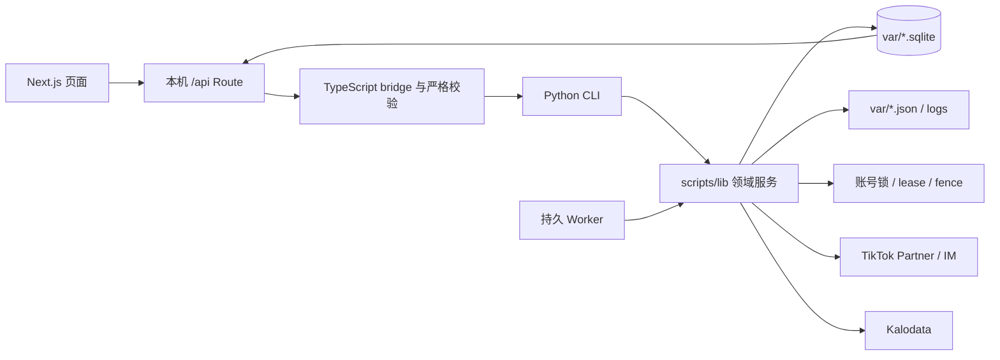

# BDHub-Agent 技术文档

状态：当前技术真相源。最后整理：2026-09-19。

本文回答“系统如何实现、模块如何协作、状态存在哪里、怎样运行和验证”。产品目标与业务规则见 [项目文档](PROJECT.md)，当前 Git/进程/数量和未解风险见 [Codex 接管状态](handoff/codex-takeover-20260919.md)。

## 1. 技术目标

系统必须满足以下工程属性：

- 外部写入有持久意图、幂等键、回执和核验，不因进程中断重复执行；
- 商品、达人、市场、机构、账号和活动绑定可追溯，不拼接互不相干的事实；
- 准备、发送、收信和服务是可恢复的独立阶段；
- 业务规则由确定性代码执行，模型只处理需要语义判断的少量任务；
- 页面展示来自真实台账，可对账且不能用 demo 数字冒充；
- 旧 BDHub 仅作为只读协议/身份运行时参考，新系统拥有独立代码和状态。

## 2. 技术栈

| 层 | 当前技术 |
| --- | --- |
| Web | Next.js 16、React 19、TypeScript 5.9 |
| UI | TailAdmin Next.js Free、自建业务组件 |
| Web API | Next.js App Router 本机 Route Handlers |
| 业务运行 | Python 3.13 CLI、worker、SQLite |
| 模型 | DeepSeek OpenAI-compatible provider，仅用于商品短名和受控语义任务 |
| 测试 | Python `unittest`、Node test runner、TypeScript、Next.js build |
| 服务地址 | `127.0.0.1:5198`，仅本机 |
| 当前 Python | 临时复用旧 BDHub `.venv/bin/python`，不修改旧环境 |

Node.js 要求 `>=22.18.0`。依赖由 `apps/web/package-lock.json` 固定。

## 3. 系统拓扑



固定调用方向：

```text
React feature
  → App Router route
  → server bridge
  → 固定 argv 的 Python CLI
  → scripts/lib 领域规则与 store
  → SQLite / 外部平台
```

React 组件不能直接读写 SQLite、启动任意命令或实现资格规则。Route 只接受白名单字段；bridge 同时校验请求和 CLI 返回结构，不把 stderr、凭据或原始私密数据返回浏览器。

## 4. 仓库结构

| 路径 | 职责 |
| --- | --- |
| `apps/web/src/app/` | 页面路由与本机 API |
| `apps/web/src/features/` | 业务页面、hooks、显示合同和交互 |
| `apps/web/src/server/` | CLI bridge、输入输出校验、错误映射 |
| `scripts/*.py` | 人工 CLI、worker、批次驱动和诊断入口 |
| `scripts/lib/` | 领域对象、规则、队列、台账、调度和平台适配 |
| `tests/` | Python 合同、状态机、故障与恢复测试 |
| `apps/web/tests/` | Route/bridge/UI 数据合同测试 |
| `config/` | 可提交业务参数及敏感配置样例 |
| `var/` | 本机真实 SQLite、进度、日志和证据，不入 Git |
| `vendor/` | 为独立运行引入的旧协议层；真实配置和数据不入 Git |
| `docs/` | 项目、技术、架构、实现证据和交接 |

## 5. 领域模块

### 5.1 货盘与 Campaign

| 模块 | 作用 |
| --- | --- |
| `global_source.py` / `collect-global-opportunity.py` | 全托来源分页采集、快照和断点 |
| `global_screen.py` / `global-screen.py` | 入池门槛、筛分版本和漏斗 |
| `global_selection.py` | 已选池写意图、逐项状态和回查 |
| `campaign_screen.py` | 非全托 Campaign 独立资格与方案选择 |
| `campaign_join.py` | 活动加入意图、联系资料、回执与核验 |
| `catalog_names.py` | PID 级商品短名缓存和模型调用 |

全托与 Campaign 共享后续线索/身份/发送池，但保留 `catalogSource`、活动和链接方案，不能在读取时折叠掉来源。

### 5.2 TapLink

| 模块 | 作用 |
| --- | --- |
| `catalog_links.py` | 单次创建意图与跨创建器防重复 |
| `catalog_prepare.py` | 旧链查询、复用、缺链、读卡和创建状态机 |
| `catalog-link-batch.py` | 可停止/恢复的批量读链与建链驱动 |
| `catalog_clean.py` | 链接清理候选与删除核验 |
| `link_naming.py` | 卡名模板与 PID 级短名读取 |

读链、建链、复用和清理必须使用同一持久账本。`readLimit`、`creates`、`lanes` 和 `qps` 是显式运行参数；`creates=0` 保持只读。未知创建/删除只核验原意图。

目标链接合同只认一个标准版本：`commission-1-to-2-v1` + `link-naming-v1`。标准材料键至少包含市场、来源、PID、Campaign、分佣规则指纹和命名规则指纹；每个当前商品方案投影一个唯一 `currentListId`，发送池只消费该字段。历史卡不参与候选排序、复用或发送；只有完全相同且已由本系统核验的标准卡可以幂等复用。

当前已由 `catalog_current_binding` 提供唯一前向绑定：普通旧卡只保留在准备/库存历史表，不再进入线索或发送；创建意图按商品方案、分佣规则和命名规则冻结，历史卡存在不再阻止补建标准卡。`scripts/backfill-current-bindings.py` 可以只读检查或从已核验意图中本地回填可证明完全一致的标准卡；回填不调用平台、不创建或删除链接。动态回填数量见当前交接页。

目标刷新合同按来源只有两条：Campaign 每日来源刷新时一并核验对应 TapLink；全托已选商品的 TapLink 每周统一核验一次。最后一次成功结果持续生效，达人查询、组批和发送不另做远程预检；确认失效的链接进入清理并在删除后回读。新建后回读属于写入结果结算，不属于周期核验。当前发送实现仍会调用 `cycle_send_runtime.fresh_card()`，与目标合同不一致；本轮只更新业务文档和演示页，后端实施时应移除该发送前门禁，并把平台明确拒卡收敛为单 PID 等待刷新。

### 5.3 线索与身份

| 模块 | 作用 |
| --- | --- |
| `leads_queue.py` | 首次/到期 PID 队列、额度和尝试台账 |
| `leads-run.py` | 复用 Kalodata provider 的实际读取驱动 |
| `creator_discovery.py` / `discovery_cohort.py` | handle Find、cohort、lease、blocked 重试和证据 |
| `profile_refresh.py` | OECID 画像刷新与持久任务 |
| `identity_queue.py` / `identity-batch.py` | 达人级身份分类、批量补齐和进度 |
| `identity_acceptance.py` | 账号级 QPS/lanes 验收与发布策略 |

身份按达人去重，线索按达人×商品保留。明确 `unresolved` 与尚未请求/技术 blocked 分开；只允许技术未提交项有界重试，明确未找到不自动重问。

线索合同已升级为 `leads-queue-v2`：每 PID 近 14 天、Kalodata `revenue DESC`，完整 page receipt 和全部正销量 `source_edge` 继续保留；`lead_query_head + lead_query_selection` 只发布当前最多 20 条。排序消费 `sourceRank`，并列时用 `units DESC, pid ASC`；原始 GMV 字符串只作证据，不跨币种直接比较。`scripts/backfill-current-leads.py` 可从本机历史 receipt 重建当前范围，不调用平台。

身份表应把 `市场 × OECID` 投影为稳定 `creatorId`，handle 变化只追加带观测时间的 alias。同一 OECID 改名时不得新建关系、重置冷却或丢失达人×PID 位置。

### 5.4 发送池、执行与收信

| 模块 | 作用 |
| --- | --- |
| `lead_pool.py` | 按当前时间重算位置、达人冷却和状态分层 |
| `send_batch.py` | 发送批次只读预检、容量、窗口和样例 |
| `cycle_review.py` | 候选复检、冻结与跳过原因 |
| `cycle_delivery.py` | 发送意图、组件状态、平台信号和额度预留 |
| `cycle_burst.py` / `cycle_executor.py` | 既有分批执行与外部调用协调 |
| `cycle_inbox.py` / `poll-cycle-inbox.py` | 只读收信水位、事件和待处理内容 |
| `cycle_service.py` | 服务案件、事实、人工接管与处理结果 |
| `cycle_stats.py` | 按北京时间聚合确认发送、回复和橱窗事件 |

当前 `/api/send` 只支持 GET 状态和 POST 保存 `count/widen/window`，没有 start 路由。`scripts/send-batch.py` 只有 `preview/status/save`；真正执行桥尚未完成。

`lead_pool.py` 与 `/api/lead-pool` 已使用 `bdhub.lead-pool.v2`：业务只投影 `sendable / waiting / inactive`，`sent` 单列历史；内部原因仍用于排障。达人排序和达人内部 PID 选择统一使用 `sourceRank → units DESC → pid ASC`，同一达人只有一个可发送槽位。发送预览按池子顺序复检；尚未接通的正式执行器仍需在冻结批次后完全消费该顺序，不能执行时重新挑选。

### 5.5 Agent 与语义能力

- `catalog_names.py`：批量商品短名；失败不自动无限重试。
- `outreach_drafts.py` / `draft_provider.py`：主动邀约草稿、模型用量和持久结果；不等于达人入站回复能力。
- `ReplyClassifier`（目标接口）：接收受限的事件上下文，返回五种动作、意图、消息证据和关联 episode；provider 可为 DeepSeek 或 Jev。
- `ReplyPolicyGuard`（目标模块）：检查多意图、附件、PID/listId 唯一性、模板版本和人工条件，并把不满足的结果强制收敛为 `human`。
- `ReplyTemplateRegistry`（目标模块）：只提供版本化的 `sample_self_service`、`collaboration_ack`、`link_usage` 三条人工确认模板。

模型输出不能直接进入 transport，也不能写达人、PID、冷却、拒联或案件状态。身份、金额、资格、额度、去重、暂停、授权和外部结果继续由代码和台账执行。

当前 `cycle_agent.py` 仍输出佣金/关系事实工具需求，`cycle_reply_facts.py` 和 `cycle_auto_reply.py` 仍保留事实型自动回复路径，`cycle_service.py` 仍使用 60 秒 debounce。这些是现有实现，不是目标合同；后续需由 [达人发送池与 AI 回复策略](architecture/creator-pool-and-reply-policy-v1.md) 的五动作分类、固定模板和集中批处理替换。真实自动回复继续关闭。

## 6. 数据与状态

### 6.1 主要 SQLite

| 文件 | 主要事实 |
| --- | --- |
| `var/global-source.sqlite` | 全托来源 run/page/product/detail 和当前 head |
| `var/global-selection.sqlite` | 商品选入 run/item |
| `var/campaign-screen.sqlite` | Campaign 筛分与方案 |
| `var/campaign-join.sqlite` | 加入活动意图和回执 |
| `var/catalog-links.sqlite` | 链接准备 item、reuse、readback、intent 和卡片 |
| `var/second-cycle.sqlite` 的 `cycle_product_name` | PID 短名缓存 |
| `var/kalodata-leads.sqlite` | PID 查询时间、attempt、page 和状态 |
| `var/creator-discovery.sqlite` | handle 发现 batch/item/cohort/request |
| `var/creator-identities.sqlite` | 稳定 OECID、别名与来源 |
| `var/creator-profile-refresh.sqlite` | 画像刷新 job/request/heartbeat |
| `var/batch-tasks.sqlite` | 任务卡、成员、来源、材料和事件 |
| `var/second-cycle.sqlite` | plan、关系、发送、收信、服务和回复事实 |
| `var/it-conversations.sqlite` | IT/ACC6 会话索引 |
| `var/matching*.sqlite` | 独立匹配研究数据集和结果 |

新增当前投影：`catalog-links.sqlite.catalog_current_binding*` 保存唯一标准卡；`second-cycle.sqlite.lead_query_*` 保存每 PID 当前 20 条范围，`source_edge_index` 为历史证据提供规范化索引。原准备记录、page receipt 和 `source_edge` 都不删除。

表结构当前由各 `scripts/lib/*.py` 的 schema 初始化维护，还没有统一 migration registry。新增表/字段必须提供幂等升级和旧库兼容测试，不能只靠删除本地 DB 重建。

### 6.2 状态原则

- SQLite 是业务事实；JSON progress 只用于显示正在运行的步骤，不替代最终台账。
- `var/` 不入 Git，也不能由源码完整恢复；备份和迁移需要单独设计。
- 所有 ID、PID、OECID、Campaign ID 和 listId 按字符串处理。
- 外部响应保存必要摘要、哈希和引用；凭据、Cookie、完整私密正文不进入普通日志。
- 动态资格和当前平台事实带观测时间；历史快照不自动覆盖更新事实。

### 6.3 目标回复上下文模型

回复上下文按事件建模，不保存一段会覆盖历史事实的自由关系摘要：

| 对象 | 主键/关键字段 | 作用 |
| --- | --- | --- |
| `outbound_episode` | `episode_id, creator_id, pid, sent_at` | 一次已确认外发及当时的 Offer、`listId`、佣金版本和消息证据 |
| `inbound_turn` | `turn_id, creator_id, message_id, occurred_at` | 每条达人入站消息的不可变原文、类型和会话位置 |
| `turn_episode_link` | `turn_id, episode_id, evidence, confidence` | 记录入站消息可能对应哪个 PID/外发 episode；不确定时允许多个候选 |
| `service_case` | `case_id, creator_id, action, state` | 聚合需处理的 turn、相关 episode/PID、人工原因和关闭证据 |
| `reply_classification` | 输入哈希、provider/model、政策版本、结构化输出 | 保存 DeepSeek/Jev 影子结果和用户审核，不直接执行发送 |

分类器只读取当前未处理 turn、少量相邻 turn、候选 episode、达人全局控制和政策版本。原始事件是事实源；任何模型摘要只是可重建缓存。新增表/字段必须提供幂等升级、旧库回填与多 PID 会话测试。

## 7. 幂等、并发与未知结果

### 7.1 外部写入

每次选入、加入活动、建链、删除或发送必须先保存唯一意图，再调用平台，最后保存回执和只读核验。状态至少区分：

```text
pending → started/submitted → confirmed
                         ↘ failed_known
                         ↘ result_unknown
```

`result_unknown` 不具备自动重试资格。恢复流程只能查询原意图和原账号的实际结果。

### 7.2 锁、lease 与 fence

- 账号级平台操作使用排他锁，避免同一身份并发抢占。
- worker claim 使用持久 lease/fence，过期 worker 不能提交迟到结果。
- 页面启动作业前以真实进程表确认存活，配置同时只允许一个同名作业。
- stop 写入停止请求，worker 在安全点退出；不能 kill 后把 in-flight 当未提交。
- 多 lane 共享同一账号 QPS 预算，不能每个子任务独立累加上限。

### 7.3 当前 SQLite 风险

`batch-preparation-worker` 曾持有 `batch-tasks.sqlite` 写事务 23.9–74.3 秒。当前身份路径以有界等待和重试缓解，但不是根治。若引入 WAL 或缩短事务，必须先验证活任务、回滚语义、并发读写和崩溃恢复。

## 8. API 与 Web 合同

所有 `/api/*` 仅接受本机请求，变更类请求验证 Origin/Host、JSON 大小、字段白名单和数值范围。通用原则：

- 多一个字段也拒绝，不将未知字段静默传给 CLI；
- CLI 使用固定 argv 和 cwd，不通过 shell 拼接用户输入；
- child stderr 和异常只映射成稳定错误码，不暴露路径、凭据或原始响应；
- Web decoder 再次检查总数恒等式、枚举、ID 格式和最大行数；
- API 返回 `available=false` 与真实数字 `0` 分开；读取失败不能显示成业务 0。

主要入口：

| API | 当前用途 |
| --- | --- |
| `/api/global-source` | 货盘状态和手动作业 |
| `/api/catalog-screen` | 筛分配置与结果 |
| `/api/campaign-*` | Campaign 读取、筛分、加入和链接 |
| `/api/catalog-jobs` | 货盘作业状态/启动/停止 |
| `/api/leads-queue` | Kalodata 查询队列与运行 |
| `/api/identity-queue` | 达人级 OECID 分类与补齐 |
| `/api/lead-pool` | 发送池分层 |
| `/api/send` | 发送预检和设置保存；当前无 start |
| `/api/inbox` | 收信 worker、今日/历史统计和待人工 |
| `/api/jobs` | 手动作业与定时意向 |

`/flow-demo` 是纯前端业务沙盘：判断函数位于 `apps/web/src/features/demo/`，页面运行时不调用任何 `/api`、SQLite、CLI、平台或模型。PID 生命周期页内的数量是 2026-09-19 只读台账静态快照，达人案例为虚构数据；两者都不作为实时运行证据。页面只展示两条 TapLink 周期：Campaign 每日随来源核验、全托已选每周核验；两次刷新之间以上次成功结果为准，不做发送前远程预检，确认失效的链接进入清理。达人页必须说明每 PID 近 14 天最多 20 条、OECID 改名归并、统一 `sourceRank` 排序和三种业务结果，不能继续把佣金优先或六层内部枚举表现为现行规则。实测耗时必须注明样本、并发与非 SLA 边界；同时与 `schedulerReady=false`、作业开关关闭的当前运行事实分开。

## 9. 账号与外部系统

### TikTok

- ACC9：意大利货盘读取和 TapLink 准备主账号。
- ACC6：意大利商品选入、OECID/Profile、IM 和收信主账号。
- 两账号属于同机构/市场并共享同一 IM sender 语义；不能据此把新联系额度翻倍。
- 当前身份刷新/登录维护仍由旧 BDHub 服务负责；新项目不复制凭据、不启动第二套维护 worker。

### Kalodata

- 激活码仅保存在本机 `config/kalodata-identity.json`（0600），Git 只提交样例。
- 读取复用既有生产身份和 browser lock，不复制 Cookie 到仓库。
- 每日额度、认证和浏览器锁是明确停止条件；查询失败不写成功时间。

### 旧 BDHub

`/Users/bjn00003/BDHub/01-BDSystem-V2` 只读。兼容 Python 环境和 vendored 协议可被新项目调用，但不得修改旧代码、配置、数据库、服务或任务状态。

## 10. 配置管理

| 文件 | 内容 |
| --- | --- |
| `config/catalog-screen.json` | 全托筛分门槛 |
| `config/catalog-link-policy.json` | TapLink 分佣与复用策略 |
| `config/link-naming.json` | 卡名模板与长度 |
| `config/leads-queue.json` | 查询周期、批大小和失败上限 |
| `config/identity-run.json` | OECID 批大小和 cohort |
| `config/link-prepare*.json` | 链接读取/创建运行参数 |
| `config/send-batch.json` | 发送预检数量、窗口和越界档 |
| `config/jobs.json` | 可选定时意向；默认关闭 |
| `config/market-accounts.json` | 市场账号角色和维护目标 |
| `config/*.example.json` | 敏感本机配置样例 |

业务配置不得另建第二来源。敏感配置、邮箱、激活码、Cookie 和身份文件不入 Git。

后续回复实施应新增一个版本化政策入口，统一保存五种动作、模板版本、provider 选择和集中批处理周期；不得把这些值散落在 prompt、React 组件和 worker 常量中。API key 继续只放本机敏感配置。

## 11. 运行方式

### Web

```bash
cd /Users/bjn00003/BDHub/BDHub-Agent/apps/web
npm ci
npm run dev
```

生产模式本机预览：

```bash
npm run build
npm run start
```

两种模式都监听 `127.0.0.1:5198`，不能同时运行。重启前先核对 PID、cwd 和当前 worker 依赖。

### Python

```bash
cd /Users/bjn00003/BDHub/BDHub-Agent
PYTHONDONTWRITEBYTECODE=1 \
  /Users/bjn00003/BDHub/01-BDSystem-V2/.venv/bin/python \
  scripts/<entry>.py
```

手动作业统一优先走页面或 `scripts/job-run.py`，因为它保存配置、检查同名进程并在安全点停止。不要同时另开同一底层 CLI 绕过作业锁。

### 数据迁移与本地回填

```bash
PYTHONDONTWRITEBYTECODE=1 \
  /Users/bjn00003/BDHub/01-BDSystem-V2/.venv/bin/python scripts/migrate-agent.py check

PYTHONDONTWRITEBYTECODE=1 \
  /Users/bjn00003/BDHub/01-BDSystem-V2/.venv/bin/python scripts/backfill-current-bindings.py check

PYTHONDONTWRITEBYTECODE=1 \
  /Users/bjn00003/BDHub/01-BDSystem-V2/.venv/bin/python scripts/backfill-current-leads.py check
```

`check` 均只读。正式应用依次执行 `migrate-agent.py apply`、两个 backfill 的 `apply`；它们只修改本机 SQLite，不调用平台。应用前使用 SQLite backup API 备份三个相关数据库。

## 12. 测试与验证

### Python

全量：

```bash
PYTHONWARNINGS=ignore PYTHONDONTWRITEBYTECODE=1 \
  /Users/bjn00003/BDHub/01-BDSystem-V2/.venv/bin/python \
  -m unittest discover -s tests
```

按文件：

```bash
PYTHONDONTWRITEBYTECODE=1 \
  /Users/bjn00003/BDHub/01-BDSystem-V2/.venv/bin/python \
  -m unittest discover -s tests -p 'test_send_batch.py'
```

### Web

```bash
cd apps/web
npm test
npm run typecheck
npm run build
```

### 文档

```bash
PYTHONDONTWRITEBYTECODE=1 \
  /Users/bjn00003/BDHub/01-BDSystem-V2/.venv/bin/python \
  scripts/check-docs.py
```

该检查验证主文档存在且非空，并检查所有 Markdown 本地链接。

### 分层报告

验证结果必须区分：

1. 单元/合同测试；
2. TypeScript 与构建；
3. 本机 API 和页面回读；
4. 只读真实数据/接口；
5. 真实平台写入与回执；
6. 业务结果。

任何上一层成功都不自动证明下一层。

## 13. Git 与发布

- 开发使用 `codex/` 分支，按继承基线、文档、功能和修复拆成逻辑提交。
- `var/`、`outputs/`、`.next/`、`node_modules/`、凭据和本机敏感配置不入 Git。
- 当前仓库没有远端；本地提交/标签不能替代异机备份。
- 部署只针对新项目 5198；先测试和构建，再确认当前 PID/cwd，替换实例后回读相关 API。
- 代码变更不自动重启 worker、恢复发送、开启自动回复或改变持久任务状态。

## 14. 当前技术债与演进方向

- 当前增量 migration registry 只覆盖 `catalog-links.sqlite` 和 `second-cycle.sqlite` 的本轮新投影；其他 SQLite schema 仍分散在领域模块。
- `batch-tasks.sqlite` 长事务影响并发读取；需独立完成事务/WAL 设计与验证。
- Python 测试仍有未关闭 SQLite connection 的 `ResourceWarning`。
- Web Node 测试存在 module type warning；Next.js 构建有上游 deprecation warning。
- 发送预检尚未接持久批次、start/stop 和执行器。
- 线索、身份和发送池读侧已经切到当前 20 条、统一排序和三结果投影；正式 `cycle_bulk` 执行仍需冻结完整位置并禁止运行时重新选品。
- 回复链仍是 60 秒 debounce、事实工具和旧分类合同，尚未迁移到事件级上下文、五动作、固定模板和 provider adapter。
- 本机 `var/` 缺正式备份、恢复和跨机器迁移方案。
- 新项目仍依赖旧 Python 环境与部分协议层；最终需要独立依赖和凭据管理。

## 15. 技术文档变更规则

- 模块职责、调用链、数据模型、API、运行、部署、配置或测试方式变化：同步更新本文。
- 业务目标、范围、规则和验收变化：更新 [项目文档](PROJECT.md)，不要只改技术实现。
- 当前进度、动态数量、Git 提交、进程和临时故障：更新当前交接页，不写入本文成为常量。
- 细节设计、实验、压测和事故复盘保留在 `architecture/`、`implementation/`、`research/` 或 `archive/`，并从本文按需链接。
