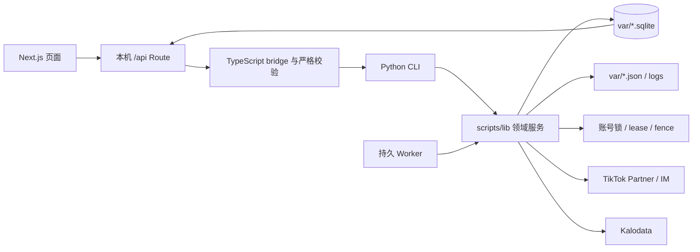

# BDHub-Agent 技术文档

状态：当前技术真相源。最后整理：2026-09-23。

本文回答“系统如何实现、模块如何协作、状态存在哪里、怎样运行和验证”。产品目标与业务规则见 [项目文档](PROJECT.md)，当前 Git/进程/数量和未解风险见 [Codex 接管状态](handoff/codex-takeover-20260919.md)。

## 1. 技术目标

系统必须满足以下工程属性：

- 外部写入有持久意图、幂等键、回执和核验，不因进程中断重复执行；
- 商品、达人、市场、机构、账号和活动绑定可追溯，不拼接互不相干的事实；
- 准备、发送、收信和服务是可恢复的独立阶段；
- 业务规则由确定性代码执行，模型只处理需要语义判断的少量任务；
- 页面展示来自真实台账，可对账且不能用 demo 数字冒充；
- 旧 BDHub 仅作为只读账号配置、身份文件、锁和历史数据库来源；协议代码固定从本仓库 `vendor/bdhub` 加载，新系统拥有独立代码、环境和状态。

## 2. 技术栈

| 层 | 当前技术 |
| --- | --- |
| Web | Next.js 16、React 19、TypeScript 5.9 |
| UI | TailAdmin Next.js Free、自建业务组件 |
| Web API | Next.js App Router 本机 Route Handlers |
| 业务运行 | Python 3.13 CLI、worker、SQLite |
| 模型 | DeepSeek OpenAI-compatible provider，仅用于商品短名和受控语义任务 |
| 测试 | Python `unittest`、Node test runner、TypeScript、Next.js build |
| 服务地址 | `127.0.0.1:5198`，仅本机 |
| 当前 Python | 本项目 Python 3.13 `.venv/bin/python`；不再借用旧 BDHub 环境 |

Node.js 要求 `>=22.18.0`。Web 依赖由 `apps/web/package-lock.json` 固定；Python 直接依赖写在 `requirements.txt`，完整已安装版本写在 `requirements.lock`。

## 3. 系统拓扑



固定调用方向：

```text
React feature
  → App Router route
  → server bridge
  → 固定 argv 的 Python CLI
  → scripts/lib 领域规则与 store
  → SQLite / 外部平台
```

React 组件不能直接读写 SQLite、启动任意命令或实现资格规则。Route 只接受白名单字段；bridge 同时校验请求和 CLI 返回结构，不把 stderr、凭据或原始私密数据返回浏览器。

市场注册表由 `config/markets.json` 提供 14 个固定 key。IT/BR/MY/UK 已有已核实的运行元数据；其余市场为 `planned`，未知 locale、账号和全托能力保持 `null`。页面复用同一组件；planned 市场仅显示未验收状态，服务端动作在 registry 门禁处拒绝。所有市场级 Route 必须显式接收单个 `market`，写请求还要核对 URL 与 body 的 market；CLI 和返回结构再次校验市场。BR/MY 的全托 Tab 是明确空态，不启动全托读取。

首页和货盘可读取 `market_read_head` 指向的不可变 `market_read_generation`，过期或缺失时才回退到当前本机台账聚合。同市场的并发 GET 由 Web `singleflight` 合并为一次 Python 读取；商品明细在展开后按 30 条服务端分页读取。调度器在 stage 终态后投影该市场的 operations 快照，货盘/链接阶段另投影 catalog 快照；投影失败单列错误，不改动 workflow 的业务结果。

首页的持续发送阶段只读 `continuous_send_runtime` 与确认数，不重建完整发送候选；发送工作台仍执行完整候选复检并展示真实例子。货盘首页从已发布 `campaign_screen_run` 读取摘要，并以当前 `catalog_head.snapshot_id` 校验来源；不匹配时返回 `screen_stale`，完整动态筛分留在非全托 Tab。这样首屏不会每次重新解析全量 Offer，发送和资格判断仍走原领域服务。

## 4. 仓库结构

| 路径 | 职责 |
| --- | --- |
| `apps/web/src/app/` | 页面路由与本机 API |
| `apps/web/src/features/` | 业务页面、hooks、显示合同和交互 |
| `apps/web/src/server/` | CLI bridge、输入输出校验、错误映射 |
| `scripts/*.py` | 人工 CLI、worker、批次驱动和诊断入口 |
| `scripts/lib/` | 领域对象、规则、队列、台账、调度和平台适配 |
| `tests/` | Python 合同、状态机、故障与恢复测试 |
| `apps/web/tests/` | Route/bridge/UI 数据合同测试 |
| `config/` | 可提交业务参数及敏感配置样例 |
| `var/` | 本机真实 SQLite、进度、日志和证据，不入 Git |
| `vendor/` | 为独立运行引入的旧协议层；真实配置和数据不入 Git |
| `docs/` | 项目、技术、架构、实现证据和交接 |

## 5. 领域模块

### 5.1 货盘与 Campaign

| 模块 | 作用 |
| --- | --- |
| `global_source.py` / `collect-global-opportunity.py` | 全托来源分页采集、快照和断点 |
| `global_screen.py` / `global-screen.py` | 入池门槛、筛分版本和漏斗 |
| `global_selection.py` | 已选池写意图、逐项状态和回查 |
| `campaign_screen.py` | 非全托 Campaign 独立资格与方案选择 |
| `campaign_join.py` | 活动加入意图、联系资料、回执与核验 |
| `catalog_names.py` | PID 级商品短名缓存和模型调用 |

全托与 Campaign 共享后续线索/身份/发送池，但保留 `catalogSource`、活动和链接方案，不能在读取时折叠掉来源。

全托首次接入和每 30 天的发现刷新使用 `category_l1_v1`：先读取官方一级类目树，再对每个类目独立保存 `next_page / reported_total / unique_count / terminal_reason`，每个分区必须在 endpoint 末页满足 `unique_count = reported_total`。`global_source_product_category` 保存分区成员，`global_source_product` 跨类目按 PID 去重；全部分区完成后才更新同一 `global_source_head`，运行中或任一分区 partial/blocked 时继续展示上一版完整 head。两次类目刷新之间的周更使用普通不分类目查询。IT 2026-09-21 真实运行覆盖 28 类、2,134 页、31,809 个唯一 PID，耗时 3,524.088 秒。

UK 2026-09-21 已停止的首轮类目读取由用户明确接受为部分快照：`global_source_run.state=accepted_partial`、`coverage/reason=operator_accepted_partial`，并把当时 64,089 个唯一商品、4,280 页、13/30 个完整类目和接受时点写入 `global_source_operator_acceptance`。这类 head 可以继续筛选和选入，但 API 与页面不得投影为完整覆盖；冻结选入队列清零后的周更使用普通查询，达到 30 天再使用类目刷新。当前产品注册表只有 IT/UK 支持全托，BR/MY 明确不适用。

普通周更和类目快照共用一个 `scope_hash`，但普通接口有 10,000 结果窗口。`GlobalSources.finish_session()` 在当前 head 为类目快照或组合快照时，原子发布 `coverageOverlay` 派生 run：复制原覆盖的 PID、类目成员及部分接受证据，只用周更同 PID 的新商品事实覆盖旧 payload；周更范围外 PID 继续留在原始周更 run，不写进覆盖 head。派生 run 保留原始类目接受终态与完成类目数，`coverageOverlay` 保存原基线、周更 run、重叠和范围外数量。月度 cadence 只计算原始类目 run，不让派生 run 的发布时间重置 30 天。当前 head、原类目快照、普通周更可各自只读分页；筛分与选入必须按 `source_run` 关联，不能取全库最新一条拼成一个漏斗。`reconcile-global-coverage.py` 仅在备份后为已被普通周更替换的旧 head 做一次本机回补，不调用平台。

普通查询在末页出现少量跨页重复 PID 时，`global_source_query_repair_page` 记录按原 request payload 复读的重复页邻域、响应摘要及新发现的 PID。`--repair-partial-query` 仅追加原 run 的缺漏成员；如无缺漏，`--accept-stable-query-duplicates` 还要求所有重复页精确重现、没有新增，且差额在原有稳定重复行门槛内，才把终态改为 `endpoint_end_stable_duplicate_rows_N`。状态分别呈现返回行数、唯一商品数、稳定重复行数；未验证的 `partial` 保留旧完整 head，稳定验证后才可按原覆盖基线发布周更 overlay。两个 CLI 动作均只读取平台，不发商品卡或消息。

类目 endpoint 的 `reported_total` 是行数，不保证 PID 唯一。若完整末页出现少量重复行，`global_source_partition_repair_page` 先保存重复页邻域补洞回执；必要时完整复读该类目。只有完整复读新增 0，或重复页精确复现，且重复差额不超过 `max(5, reported_total/1000)` 时，才以 `endpoint_end_stable_duplicate_rows_*` 结束，并在状态中单列 `stableDuplicateRows`。普通 partial 不能发布 head、筛分或选入；唯一例外是用户明确执行的 `accept_partial_snapshot`，它以独立终态和覆盖标签发布，不能冒充 completed。

全托 catalog stage 随后在该市场固定货盘账号执行 `selection prepare → verify/reconcile unresolved → execute-fast --native-listing`；正式配置每轮 300 PID、8 lanes/8 QPS、每个 listing/readback group 最多 100 PID，批末统一回读并循环到 pending 为 0。TikTok 当前前端 SDK 虽声明 `/pick_up/batch_select`，但 2026-09-21 UK 页面没有批选 UI，EU 后端 v1/v2/v3 均返回非 API HTML，尚不能作为正式写端点；当前已验证的 `/pick_up/select` payload 仍只接受一个 PID/Campaign。选入请求先落持久意图；验证码明确拒绝或登录失效只有在“已选池缺失＋当前 listing 未选入＋同账号验证/新代次”三项证据齐全时才重放同一冻结请求。登录失效由 workflow 自动串行重登供给账号并确认能力代次继承；网络歧义或 code0 未回读不重发；批后两次间隔回读及最多两次验证码恢复仍缺失时记 `skipped_unknown`，后续 generation 也不重新入队。UK 真实完整轮次约 61–75 confirmed/分钟，平台验证耗时仍是主要瓶颈。

### 5.2 TapLink

| 模块 | 作用 |
| --- | --- |
| `catalog_links.py` | 单次创建意图与跨创建器防重复 |
| `catalog_prepare.py` | 旧链查询、复用、缺链、读卡和创建状态机 |
| `catalog-link-batch.py` | 可停止/恢复的批量读链与建链驱动 |
| `catalog_clean.py` | 链接清理候选与删除核验 |
| `link_naming.py` | 卡名模板与 PID 级短名读取 |

读链、建链、复用和清理必须使用同一持久账本。`readLimit`、`creates`、`lanes` 和 `qps` 是显式运行参数；`creates=0` 保持只读。未知创建/删除只核验原意图。

目标链接合同只认当前市场登记的标准版本：统一分佣为 `commission-1-to-2-v1`，命名为 IT 的兼容 `link-naming-v1` 或对应的 `link-naming-{market}-v1`。标准材料键至少包含市场、来源、PID、Campaign、分佣规则指纹和命名规则指纹；每个当前商品方案投影一个唯一 `currentListId`，发送池只消费该字段。历史卡不参与候选排序、复用或发送；只有完全相同且已由本系统核验的标准卡可以幂等复用。

市场内容由 `config/market-content.json` 与 `config/markets.json` 联合校验：IT=`it/it-IT`、BR=`pt/pt-BR`、MY=`ms/ms-MY`、UK=`en/en-GB`。各市场有独立 `link-naming*.json`、商品短名 prompt、二发模板和 Agent 固定模板。`cycle_product_name.locale` 是读取门禁；非 IT 只接受 `shortName/mention`，不读取 `shortNameIt/mentionIt` 或 `it-IT` 行，缺少本地化短名时以 `link_naming_localized_short_name_missing` 停止。非 IT 在首次读卡前先为 seed 的 pending 商品生成短名；`source_title=PID` 或短名包含 PID 的缓存固定无效并可精确清理。中文 `translationZh/shortNameZh` 只进入运营辅助展示，不进入达人正文。

多市场执行使用同一持久合同但所有入口都携带 `market`：全托选入分别写 `global-selection-{market}.sqlite`，Kalodata 分别写 `kalodata-leads-{market}.sqlite`，当前绑定仍汇总在带 market 主键的 `catalog_current_binding`。Kalodata provider 用 BR=`BR/BRL`、UK=`GB/GBP` 构造 header 与 referer；线索 edge 保存对应币种，发送池只在同市场内比较。TikTok Find 返回的 UK `selection_region=GB` 在脱敏摘要层映射为 canonical `uk`。OECID/Profile 由固定通信账号读取，精确 Find 可以独立发布，Profile 失败不得冒充 OECID 失败或阻止已验证的发送链。

当前已由 `catalog_current_binding` 提供唯一前向绑定：普通旧卡只保留在准备/库存历史表，不再进入线索或发送；创建意图按商品方案、分佣规则和命名规则冻结，历史卡存在不再阻止补建标准卡。每次完整 Campaign screening 结束后，`CatalogBindings.reconcile_current_offers()` 把不再 current 的绑定改为 `inactive`、Offer 指纹变化的绑定改为 `waiting_refresh`，精确相同且重新合格的绑定可恢复 `active`，每次状态变化写 `catalog_current_binding_event`。`scripts/backfill-current-bindings.py` 可以只读检查或从已核验意图中本地回填可证明完全一致的标准卡；回填不调用平台、不创建或删除链接。

Campaign 每 2 天完整刷新，全托按周刷新；货盘 generation 发布后统一计算应有标准链接。新建后即时回读失败的单 PID 被隔离，整批写请求结束后执行一次公共回读，再按 30/120 秒两次轮询；仍未找到记 `skipped_unknown`，原 `catalog_link_intent` 保持 unknown 且永不重复 POST。只有平台回读确认整张列表 invalid 的链接才由周一清洗建立删除意图；仅不符合内部期限/佣金门槛的卡只本地停用，不删除。BR/UK 尚未完成各市场单条 DELETE canary，调度器固定跳过其平台清理。删除整批收口后一次重读完整列表；仍存在记 `failed_known`，不重复 DELETE。持续发送只用本地 `catalog_current_binding` 校验 Offer 指纹与 `currentListId`，不调用 `fresh_card()`。

`operations_scheduler.py` 按市场读取不可变 `workflow_run/workflow_stage_run`。同一市场仍按上游 generation 串行；不同市场按 `workflow:{market}` 与货盘/通信账号资源槽并行，Kalodata 使用全局两槽 semaphore。`workflow_stage_claim/workflow_resource_slot` 在短事务中原子领取，保存 owner/fence/300 秒 lease；执行中每 30 秒续租，只有确认 owner 进程已结束才释放过期槽并从原 checkpoint 恢复。到期候选按上次成功最早、已有断点、market key 排序。新项目只读 Kalodata HTTP session 持共享 `LOCK_SH`，旧项目和登录器的 `LOCK_EX` 仍会阻止并发；每市场继续使用独立 region、currency、queue、checkpoint 和 SQLite。全托命令由 `full_catalog_collection_mode()` 决定首次/月度 `--by-category` 或周更普通查询。若当前 head 是用户接受的部分快照且对应选入队列仍有 pending，catalog stage 先续跑该冻结队列、不重新采集。标准主链只由各市场 `market_automation_setting` 总开关授权，`config/jobs.json` 保存共享北京时间，`config/operations-policy.json` 保存 2 天/30 天/双市场/10 条审核等稳定策略；全托、持续发送和 Agent 保留各自独立开关。

调度器遇到失败的到期主链，保留原 run，间隔至少一小时以新 attempt 重试，至多三次自动补试；每次仍复用原有选入/建链/发送持久意图。全托开始新读取前先查同 market/account 仍 `collecting` 的来源 run，按其原读取模式继续原页码断点，即使本次周期已切换普通周更也不把原类目 run 留作阻塞。子进程启动先登记真实 child PID，再允许固定 argv 执行；父进程死亡而子进程仍存活时资源槽保持占用。长任务等待期间每30秒继续监督收信、发送、Agent 和账号维护。市场 sender 的普通失败有5分钟启动退避，未知发送结果不自动重启；维护 worker 失主若尚未发布新身份，5分钟后以新持久意图补试一次。仅把脱敏错误码写入 workflow，原 stderr 不进页面。

外层批处理报告必须汇总每个内部 pass 的 `platformWrites`，阶段 item count 取最终队列 summary，不能把重复 pass 相加。Kalodata 的 B 类完成数读取视频 generation 的 `counts.completed`；额度耗尽仍发布已完成的 A/B 数和断点。OECID 阶段先循环 `IdentityBridge.freeze/dispatch` 到当前 head 无未交接 source edge，再本地复用既有终态证据，最后运行精确 batch；`pending>0`、`queue_stalled` 或技术 blocked 一律 `needs_human`，不得发布 OECID generation 或提前进入发送池。

Campaign 货盘阶段固定执行 `status/verify unresolved → join-all --confirm → campaign-collect --screen`；默认联系邮箱只在本机配置读取，不进入 argv。`join-all` 以最多 100 个活动为一个持久批次，验证码成功后只重放同一 Campaign 加入请求一次，unknown 阻断后续采集。TapLink 阶段对 IT 执行 `seed/read → names → create`，对非 IT 执行 `seed → localized names → read → create`，短名缺口非零时 fail closed。非 IT OECID cohort 若中途 blocked，只落库 code0 且身份精确匹配的前缀目标，其余目标保持 pending；16201010 触发 communications 账号最多两次自动重登，不得把整批丢弃或把 blocked 写成 unresolved。账号在同 market/account/institution 下重登时，已验证的逐能力 canary 随新身份代次继承；新验证的 blocked/failed 仍优先。持续发送空池为 `waiting_pool` 常驻等待，不退出形成重启循环。

### 5.3 线索与身份

| 模块 | 作用 |
| --- | --- |
| `leads_queue.py` | 首次/到期 PID 队列、额度和尝试台账 |
| `leads-run.py` | 复用 Kalodata provider 的实际读取驱动 |
| `kalodata-video-evidence.py` / `kalodata_video_evidence.py` | 按发布时间完整翻页读取精确 PID 视频、解析作者并生成零销量探索证据；不改变发送池 |
| `kalodata-video-crawl.py` / `kalodata_video_scan.py` | 对全部标准链接 PID 做可断点 30 天视频扫描、作者缓存和 B 类当前投影 |
| `rebuild-current-leads.py` | 经确认清空当前查询缓存与 head，保留历史 evidence、selection 和已发送记录 |
| `creator_discovery.py` / `discovery_cohort.py` | handle Find、cohort、lease、blocked 重试和证据 |
| `profile_refresh.py` | OECID 画像刷新与持久任务 |
| `identity_queue.py` / `identity-batch.py` | 达人级身份分类、批量补齐和进度 |
| `identity_acceptance.py` | 账号级 QPS/lanes 验收与发布策略 |

身份按达人去重，线索按达人×商品保留。明确 `unresolved` 与尚未请求/技术 blocked 分开；只允许技术未提交项有界重试，明确未找到不自动重问。

OECID 批次固定带 `--skip-judged`，身份库中已经 resolved/unresolved 的 handle 不再进入远端请求。同一 handle 的既有终态会由 `IdentityBridge` 本地复用到当前 source edge：resolved 必须保留原始不可变发现证据且不得存在身份冲突，unresolved 只复用明确精确 miss；复用不会伪造新的发现回执。全量重建的驱动器每轮都会从当前 `lead_query_head` 待补 handle 与未结 `cycle_identity_outbox` 的交集生成若干精确 `discovery_<id>` 白名单，再以重复的 `--only-batch` 参数凑成最多 50 位的 cohort，不能让历史未结 outbox 抢占当前批次。`cycle_identity_outcome` 只在精确成功、精确 miss 或明确技术 blocked 后更新；账号挑战不得冒充 miss。

当前 head 的身份交接固定以 `lead_query_head → lead_query_selection → source_edge` 的索引顺序执行；这里使用 `CROSS JOIN` 固定 SQLite 循环次序，避免查询规划器按每个 PID 扫全部历史 edge 并在写事务内重复解析 JSON。ACC6/ACC9 已为 `project_owned` 后，Find/Profile 探针的 startable 判定只读本项目 `account_runtime_setting + published identity generation + capability observations`；旧 8787 账号池的停用状态不再反向关闭新项目账号。

Pure HTTP 验证依赖 `Pillow==12.3.0`、`opencv-python-headless==4.14.0.94` 和 NumPy；缺少图像依赖时背景图与拼图虽能下载，求解器仍会在识别前失败。账号内多个 Find lane 共用一次串行验证结果：首个 lane 求解滑块，把验证后的 session Cookie/fp同步给其他 lane，再分别重放原业务请求；重放再次挑战时才重新求解。报告只保存 `runtime/captcha_get/template_size/image_decode/contour/verify_http/network/solver` 等脱敏错误类别，不保存异常原文、Cookie或验证载荷。

正式身份补齐每轮支持 10、20 或 50 位，当前默认 50；50 只用于摊薄每轮账号准备、认证和进程启动开销，不改变已发布的单账号聚合上限 12 QPS / 9 lanes，也不增加账号或绕过验证。吞吐以真实 cohort 的 targets、终态、耗时和验证计数核算，不能用配置值代替实测。

当前真实验证证据：ACC6 单目标首次 Find 返回 `verificationRequired=true + systemError3=true`，项目求解器一次成功，原请求重放后 HTTP 200/code0且无验证头；`captcha_success_count=1`、`replay_code0=1`、身份文件未变、旧业务库写入0、真实发送0。随后当前 outbox 共判定50个 handle：36 resolved、14 unresolved；结果已回填发送池。

线索合同已升级为 `leads-queue-v2`：每 PID 近 14 天、Kalodata `revenue DESC`，完整 page receipt 和全部正销量 `source_edge` 继续保留；`lead_query_head + lead_query_selection` 只发布当前最多 20 条。排序消费 `sourceRank`，并列时用 `units DESC, pid ASC`；原始 GMV 字符串只作证据，不跨币种直接比较。`scripts/backfill-current-leads.py` 可从本机历史 receipt 重建当前范围，不调用平台。

零销量视频证据是已确认但尚未接入真实发送池的 B 类输入：商品视频表按 `create_time DESC` 逐页读取，直到越过发布时间窗口或自然结束；窗口内所有达到播放量门槛的视频都调用详情解析作者，不使用“播放量前 20 条”，也不设置固定页数/视频数业务上限。列表没有作者，详情返回 Kalodata creator ID 与 handle；来源关联优先用稳定 creator ID，OECID 仍只接受当前精确 handle 的身份结果。重复页、日期不可解析、作者缺失、平台额度耗尽或中断都必须停止并保留明确状态，不得把不完整结果冒充正式统计。实测与成本见 [零销量视频证据](implementation/kalodata-zero-sale-video-evidence-20260920.md)。

身份表应把 `市场 × OECID` 投影为稳定 `creatorId`，handle 变化只追加带观测时间的 alias。同一 OECID 改名时不得新建关系、重置冷却或丢失达人×PID 位置。

### 5.4 发送池、执行与收信

| 模块 | 作用 |
| --- | --- |
| `lead_pool.py` | 按当前时间重算位置、达人冷却和状态分层 |
| `lead_priority.py` | A/B 合并、最高单条视频和最终发送顺序的纯函数合同；真实池由 `lead_pool.py` 按同一规则实现 |
| `cycle_review.py` | 从当前发送池领取前的身份、Offer、材料、关系和去重复检 |
| `cycle_delivery.py` | 发送意图、组件状态、平台信号和额度预留 |
| `process_liveness.py` | 项目 worker/claim 的 PID 存活判定；僵尸子进程不算可运行 |
| `cycle_executor.py` | 卡片→文字、回执与原意图只读恢复 |
| `continuous_send.py` / `continuous-send-worker.py` | IT 持续发送控制、逐条快照、窗口、跨日恢复与进程统计 |
| `market_send_control.py` / `market_send_canary.py` / `market-send-worker.py` | BR/MY/UK 同一不可变 delivery 的市场发送、能力首条验证、逐写停止/材料复检与原组件回查 |
| `cycle_inbox.py` / `poll-cycle-inbox.py` / `poll-market-inbox.py` | 四市场只读会话发现、水位、入站事件和待处理内容 |
| `cycle_service.py` | 服务案件、事实、人工接管与处理结果 |
| `cycle_stats.py` | 按北京时间聚合确认发送、回复和橱窗事件 |
| `template_library.py` | 二发模板、人工模板和 Agent 时间窗的版本化合同 |
| `conversation_workbench.py` | 会话队列、完整时间线、草稿和人工操作读写模型 |
| `run-agent-replies.py` / `market_agent_reply.py` | 独立窗口内的 V2 多轮 Agent 执行、持久回复意图和原意图回查 |
| `operations_workflow.py` | 自动运营开关、不可变 workflow run、阶段屏障、generation 和断点 |
| `account_identity.py` | 账号身份代次、72 小时维护意图、能力观察和原子发布 |
| `project_account_identity.py` | 项目自有可见浏览器重登、只读凭据自动填充、候选 profile/HTTP/IM 联合验证 |
| `collaboration_status.py` | 四态合作事件、人工优先当前投影与 showcase 自动升级 |

账号维护开始前持有当前项目 profile 的租约，等使用原代次的账号作业排空；候选身份保存在隔离目录。联合验证后发布新代次，释放租约并检查收信 checkpoint 是否继续前进。维护 worker 的失主回收由 scheduler 独立执行，不能等下一个 worker 才进入 `claim_next()`。重登成功不自动证明此前 `not_tested` 的发送或 Agent 能力已验证。

`/api/send` 的 GET 只读当前控制、窗口、24 小时额度、池余量、真实话术例子和进程；POST 只接受 revision 化的保存、发送、停止与原 unknown 核验。多一个字段即拒绝。保存、GET、构建和重启都不启动 worker；只有用户“发送”、显式自动发送开关或已启用调度器在窗口内启动相应市场发送 worker。

BR/MY/UK 正式外发逐次读取保存的北京时间窗口、当前停止/启动状态、账号维护状态和 `catalog_current_binding` 的 active、Offer 指纹、`listId` 与卡片 payload。卡与文字各有独立 requestRef，先恢复 `ready/running/unknown` 原 delivery；发起过的平台组件只读精确回查，回查未确认不改用新话术/新账号重发。`/api/send` 的 reconcile 在关闭窗口时也可核验原意图且不新写。会话创建意图若仍 `inflight` 且无精确回执，则停在需核验状态；若已 `received` 且原 requestRef、回执中的 CID 和同达人会话身份均匹配，可只确认原会话意图，再沿同一 delivery 继续未开始的卡文，不再次调用创建接口。MY 的首次真实 sender 在页面“发送”请求后走一条 canary，卡和文字均确认后才把同账号 `message_send` 能力发布为 verified；未完成前自动调度不能代替这次页面启动。

持续发送按 `lead_pool.v3` 当前顺序领取一位达人，复检后把 creator/OECID、PID、Offer、`currentListId`、模板 revision、最终正文、关系控制 revision 和确定性 claim key 写入不可变 `cycle_delivery.snapshot`。执行只用本地 `catalog_current_binding` 核对材料，不远程刷新卡；`cycle_delivery` 唯一键、24 小时预留和同达人 active delivery 共同防重复。unknown 使进程进入 `waiting_reconciliation`，恢复只运行原 delivery 的 `verify_only`，不会领取下一位或重发。用户对 IT “建会话结果未知、卡和文字均未开始”选择隔离后，逐条原意图仍须只读核验并满足零匹配证据，才能将该达人隔离：原会话请求与零回执保留，delivery 标记 `quarantined_unknown`，该达人进入人工案件，其余达人可继续；页面仍把它计作未决，不改成失败或成功，也不对该达人重发。建会话若返回无法确认的业务码，仅保存脱敏码与响应哈希；不把非零码自动推断为明确失败。

滚动 24 小时新联系达到本地 500 位时，发送 worker 保留已冻结意图并进入 `waiting_capacity`，按窗口和额度释放周期继续检查，不以每几秒重启探测。容量预检在建会话与发卡前进行；最终预留仍在不可变意图的短事务中复核。现有单账号串行发送、逐组件回查和写门禁是当前正式实现；每市场 30 位/分钟是目标而不是已验收速度，实测以完整文字回查确认计数。更高并发通道在 2026-09-23 的 BR/UK 有界真实试验中未提高到目标，未作为常驻执行模式保留。

显式运维 canary 可带 `authorizedNowRequestId` 绕过日常时间窗一次，但仍使用同一不可变 delivery、材料/关系/额度门禁、ACC6 写锁和逐组件回查；普通 start 永远遵守 16:30–24:00。实时预检按当前关系政策执行：未结 pending/人工案件、未知消息、未回复累计 5 条以及达人级 24/48 小时冷却会阻止发送；历史已解决回复或橱窗不永久封锁。卡加文字需要两个剩余额度，发卡前即核验；若历史遗留卡已确认但文字尚未尝试、又触及五条限制，仅把文字结算为未发送并保留部分触达证据。明确未提交的预检拒绝把 delivery 与两组件结算为 cancelled，保留审计但不重复领取；任一组件开始后禁止取消已提交部分。2026-09-21 真实 canary 最终完成 1 位达人，卡和文字均 confirmed、unknown 0。

收信投影的 `outbound_episode` 固定比较 delivery/达人/OEC/PID/Offer/listId/冻结正文等不可变字段；同一次交付从“卡已确认”推进到“卡+文字已确认”不能因可变 `cycle_delivery.state` 改动而报冲突。只读收信持续轮询中，账号暂忙属于正常资源等待；发送 worker 保留原页面授权并短退避后继续。确认 unknown 或不能解释的范围错误才停领取。worker 存活判断同时核对进程状态，`ps` 的僵尸 PID 不阻止受控恢复。

四市场收信认证时短暂持有对应账号 profile 租约，拿到独立 IM token 且核对身份文件后释放，再扫描只读会话；每次 IM 读取前仍复核维护状态和身份文件指纹，外发则从认证到组件回查一直持有租约。BR/MY/UK 收信在账号正忙时最多等待 5 秒抢占两次发送之间的空档，仍忙则显示 `waiting_account` 并在 3 秒后复试。外发进程仅在本进程内短暂复用同账号、同身份文件指纹的 IM 认证结果（最长 60 秒；BR/MY/UK 还绑定当前代次）；每位达人仍重开只读核验会话，逐项重新检查当前状态与平台回执。确认发送后约 0.25 秒领取下一位，空池、账号暂忙和窗口外仍退避；四市场外发单会话沿已验证的 3 QPS IM 请求预算运行，卡片、文字写门禁和原意图精确回查不变。发送进程内的 `lead_pool` 仅缓存同一不可变货盘 head 的合格 PID 集合 30 秒；来源、关系和实际候选每次重算，领用与写入仍以当前 Offer、绑定和平台历史复检。调度器在某市场已授权发送或启用 Agent 时也维持该市场收信，即使自动货盘运营开关关闭。

发送话术由 `cycle_materials.py` 和 `market-content.json` 的 16 个跨市场固定模板投影。IT 的 `send_message_template*` revision 继续支持系统模板编辑、自定义和归档；BR/MY/UK 使用相同内部模板键的本地化固定正文。`send_template_review*` 保存当前内容 fingerprint 的 pending/approved/rejected 审核；任一市场固定正文或 IT revision 变化后 fingerprint 变化，该条自动回到 pending。`operations_workflow.save_setting()`、`continuous_send.mutate_control()` 和市场真实发送 runtime 都要求当前批准数至少为 10。候选领取查询该 plan+creator 历史 `cycle_delivery.snapshot.message.template`，只选尚未使用的 approved 模板，全部耗尽时不重复轮转。所有正文只允许 `{creator_handle}`、`{product_name}`、`{creator_commission}`，后二者必需；market、language、locale、模板键、revision 与最终正文共同进入交付合同，禁止跨市场回退。

`lead_pool.py` 与 `/api/lead-pool` 使用 `bdhub.lead-pool.v3`：业务只投影 `sendable / waiting / inactive`，`sent` 单列历史；Web 合同同时保留 A/B 来源证据、数值 GMV、代表视频和来源计数。B-only 位置从 `video_lead_current` 保留代表视频 source，不伪造 A 类 `source_edge`；`paid/rejected` 在确定性门禁中排除达人全部 PID。

已确认的排序合同已由 `lead_priority.py` 用合成数据验证并接入 `lead_pool.py`：A 类整体优先，按同市场数值 `GMV DESC → units DESC → sourceRank → pid`；B 类只取同一达人×PID中播放量最高的一条达标视频，按 `views DESC → releasedAt DESC → pid`。A/B 同对合并为 A，同达人仍只有一个发送槽；身份、回复、冷却、拒联与商品门禁继续生效。真实顺序以本轮全量重建完成后的当前投影为准，不能用模拟数量代替；详见 [排序模拟](implementation/lead-priority-simulation-20260920.md)。

历史 `cycle_bulk/cycle_bulk_freeze/cycle_bulk_candidate` 和 `send-batch-worker.py` 只读保留用于结果追溯；`send-batch.py freeze/start/stop/reconcile` 固定返回 `legacy_frozen_send_retired`，不能成为新授权。

`/api/inbox?days=7|14|30` 返回同一收信控制器的北京日统计；结果页画确认触达达人、有回复达人和加橱窗达人三条趋势线。未确认卡片与异常单列，不计入成功。bridge 与纯展示模型复核期间 totals 等于每日行求和、`today` 等于同日期行；不可用、空数据或恒等式不成立时不显示成业务 0。

IT 收信每轮从 IM 最近会话保留部分热点名额，其余从最旧 checkpoint 公平补扫；默认12个/30秒。BR/MY/UK 默认每轮20个/10秒、只读 IM 请求预算2 QPS，分别保存状态与分页发现游标，最近会话与旧 checkpoint 同轮调度，市场/账号各自独立；新会话只有精确匹配现有关系后才落本市场事件。冷 checkpoint 也必须重新匹配本 plan 的当前关系；加橱窗合作状态投影显式使用收信 plan，不能回落到 IT。首次 checkpoint 若已存在本项目确认发送，以该次文字开始时间作历史边界，之后的达人回复形成真实 pending；否则初次导入仍标记历史。收信事件与正文分别写 `inbox_event`、`inbox_content*`，再投影当前 turn；发送端在逐写前仍核对当前消息与关系，收信 worker 存活不代表覆盖新鲜。

点击日期后，GET `/api/inbox?date=YYYY-MM-DD&offset=0&limit=50` 调用 `cycle_stats.day_detail()` 只读同一 SQLite，单页上限 100、偏移上限 5000。明细只投影投递、实时回复、加橱窗、历史已确认服务回复和当日新建人工案件的白名单字段；不下发原始 delivery snapshot、平台 payload、receipt、confirmation 或身份凭据。`total` 必须等于当日这些明细类型的统计求和，分页游标、日期和字段长度在 CLI/bridge 两层校验；确认文字跟随商品卡展示，不重复算成第二条触达。

### 5.5 Agent 与语义能力

- `catalog_names.py`：批量商品短名；失败不自动无限重试。
- `draft_provider.py`：商品短名和回复影子分类可复用的受控模型 provider；已退役的一发草稿队列不再位于 Web/worker 运行路径。
- `ReplyClassifier`：接收受限的事件上下文，返回五种动作、意图、消息证据和关联 episode；provider 可为 DeepSeek 或 Jev。
- `ReplyPolicyGuard`：检查多意图、附件、PID/listId 唯一性、模板版本和人工条件，并把不满足的结果强制收敛为 `human`。
- `ReplyTemplateRegistry`：只提供版本化的 `sample_self_service`、`collaboration_ack`、`link_usage` 三条 Agent 固定模板；它与二发批量模板、人工回复模板完全分离。

当前 V1 回复实现由 `reply_events.py`、`config/reply-policy.json`、`template_library.py` 和 `run-agent-replies.py` 组成：事件层把已确认外发投影为 `outbound_episode`，把达人入站正文投影为不可变 `inbound_turn`，并保存最多三个 `turn_episode_link` 候选；政策文件固定五种动作和三条模板 key，`agent_reply_template*` 保存可编辑正文 revision；设置表保存 Agent 开关、回复窗口和缓冲约束。分类输出必须引用真实 message ID 与原文片段，`link_usage` 还必须只有一个关联 PID/listId，否则确定性守卫改为 `human`。

DeepSeek 是当前 Agent 分类器，人工 `turn_review` 存在时人工结论优先；TypeSafe Jev 保持影子 challenger。Jev 使用官方 System One 合同 `POST https://api.typesafe.ai/v1/systemone`，固定模型 `jev-1.13.0`；API key 只从本机 `config/typesafe.json`（0600、Git 忽略）或 `TYPESAFE_API_KEY` 读取。收信 worker 不再调用旧 `cycle_agent.py`，也不执行旧 `process_due()`；它只保存事件并立即冻结达人。旧事实工具、60 秒服务代码和既有评估记录只保留历史兼容。

Agent 与二发没有优先级关系，只有互斥窗口：默认北京时间 `15:00–16:00` 集中回复、30 分钟缓冲、`16:30–24:00` 持续二发。等待发送窗口不阻塞 Agent；实际 `cycle_delivery_part in (inflight,accepted)` 才阻塞回复 dispatch，随后仍复用同一 ACC6 写门禁。Agent 每轮最多分类 20 个 pending turn、发送或恢复 1 个持久 `service_reply`；恢复 `inflight/accepted/unknown` 只读回查原意图，不创建新发送。

`run-agent-replies.py --authorized-now <request-id>` 是用户明确要求立即处理当前合格队列时的一次性运维入口，不能与常驻 `--worker` 同用；它不改变日常窗口，每次仍只发送/核验一个持久意图。Agent durable setting 是常驻恢复的唯一开关，operations scheduler 不再依赖已退役的 jobs 子开关来重启 Agent worker。

`cycle_scheduler.PERIODS` 同样不再包含 `reply_facts`：既有 `cycle_schedule` 历史行保留，但 claim、running/recover 判断和状态投影只接受当前五个供给阶段，`run-second-cycle.py` 也不再为该旧阶段生成命令。这样以后启动供给调度器也不会意外恢复事实型回复路径。

模型只选择受控动作，不能生成自由正文或直接构造 transport 参数。`no_reply`、固定模板和 `human` 的状态变化由确定性代码执行；身份、金额、资格、额度、去重、暂停、授权和外部结果继续由台账保证。当前 Agent 开关为关闭；GET、构建、发布和服务重启都不会启动回复 worker。

### 5.5.1 多轮回复 V2（2026-09-23）

上述五动作/固定模板是历史 V1 合同。V2 的生效指南来自 `config/agent-reply-guide-v2.txt` 或 append-only `agent_reply_guide_revision`；`agent_reply_v2.py` 从目标消息时刻以前的入站、已确认二发 episode 和已确认服务回复构建市场隔离上下文，编译完整提示词并通过现有 DeepSeek adapter 返回 `reply/no_reply/request_detail/handoff` 结构。校验消息证据、正文、等待和人工理由；模型输出只形成决策，不提供账号、PID 写入或 transport 参数。每次调用在 `agent_reply_decision_v2` 保留真实输入、输出/错误、指南版本、模型和关联 `service_reply`，失败最多三次，不把模型异常当作人工案件或发送成功。

试聊由 `scripts/agent-replies.py simulate` 和 `/api/agent-replies` 调用相同提示词/模型与结构校验，上一轮 `request_detail` 的 `previousWaitFor` 随多轮试聊保留；仅持久化本机试验记录，平台写入为 0，不改真实 pending/case/control。`trace` 只返回本机已保存的输入、判断和关联发送 ID，不暴露密钥。BR/MY/UK 使用同市场账号的 `market_agent_reply.py` transport 与独立 worker 状态，正式发送经过该市场 Agent 页面首条验证→首条回执→页面继续三阶段；首条成功才发布 `agent_reply` 能力，外发 unknown 只回查原 `service_reply`。代码通路接通不等于三市场已经取得真实平台验收。已存的旧 `turn_review` 和固定模板可供历史追溯，不作为 V2 执行真值。

正式 worker 在原 `15:00–16:00` 窗口调用 V2，重新核对最新 turn、pending/control revision、人工案件和消息上下文后，才使用 `AutoReplies.prepare_generated` 冻结唯一正文。`service_reply` 新 kind 分别为 `agent_generated_v2`、`agent_request_detail_v2`、`agent_handoff_v2`；仍走现有发送门禁、持久 request ref、accepted/unknown 原意图回查。澄清或联系方式确认送达后，pending 进入 `waiting_clarification/waiting_contact`，继续阻止二发；下一条若只是礼貌确认、尚未提供请求的信息，`no_reply` 仍维持原等待状态。人工交接先落 case/达人级锁，再准备唯一确认消息；接管后常规 AI 回复停止。`control_event` 保留两次唯一页面动作：`agent-v2-first-send` 启动首条真实回复验证，首条确认后 worker 停在 `pilot_complete_waiting_resume`；`agent-v2-full-run` 由用户检查回执后继续。普通 Agent 开关开启不绕过首次启动。由于新执行器尚未完成真实平台 canary，当前 durable Agent 开关保持关闭，开发与 Web 发布不自动恢复。

人工解除通过 `resolve_manual` 原子校验最新 turn、case/pending/control 与合作状态 revision，选择 `normal/paid/rejected` 并推进 cursor。普通完成解除人工锁，仍需重新经过完整二发门禁；`paid/rejected` 保留普通二发排除。带 request ID 的重复提交幂等，外部写入数为 0。当前会话队列统一为 `human/agent/waiting/completed/all`，其中等待达人补充单列，已处理 Agent 回复归本轮已结束；待办时长只用于未处理事项。

## 6. 数据与状态

### 6.1 主要 SQLite

| 文件 | 主要事实 |
| --- | --- |
| `var/global-source.sqlite` | 全托来源 run/page/product/detail 和当前 head |
| `var/global-selection.sqlite` | 商品选入 run/item |
| `var/campaign-screen.sqlite` | Campaign 筛分与方案 |
| `var/campaign-join.sqlite` | 加入活动意图和回执 |
| `var/catalog-links.sqlite` | 链接准备 item、reuse、readback、intent 和卡片 |
| `var/second-cycle.sqlite` 的 `cycle_product_name` | PID 短名缓存 |
| `var/kalodata-leads.sqlite` | PID 查询时间、attempt、page 和状态 |
| `var/creator-discovery.sqlite` | handle 发现 batch/item/cohort/request |
| `var/creator-identities.sqlite` | 稳定 OECID、别名与来源 |
| `var/creator-profile-refresh.sqlite` | 画像刷新 job/request/heartbeat |
| `var/batch-tasks.sqlite` | 早期指定数量任务卡、成员、来源、材料和事件；Web 已退役，仅作历史追溯 |
| `var/second-cycle.sqlite` | plan、关系、发送、收信、服务和回复事实 |
| `var/it-conversations.sqlite` | IT/ACC6 会话索引 |
| `var/matching*.sqlite` | 已退出生产构建的独立匹配研究历史数据；仍纳入备份 |

新增当前投影：`catalog-links.sqlite.catalog_current_binding*` 保存唯一标准卡；`second-cycle.sqlite.lead_query_*` 保存每 PID 当前 A 类范围，`source_edge_index` 为历史证据保存数值 GMV、币种及规范化索引；`kalodata_video_run/evidence/head` 保存完整视频证据，`kalodata_video_generation/scan_job/scan_page/scan_item` 保存全量 B 类断点，`kalodata_video_author_cache` 避免重复查作者，`video_lead_current` 保存每个达人×PID最高单条视频；`workflow_*` 保存自动主链的 run/stage/generation/checkpoint；`account_identity_generation/account_maintenance_intent/account_capability_observation` 保存账号身份代次；`creator_collaboration_*` 保存四态合作投影；`continuous_send_*` 保存持续发送控制与运行状态；`taplink_reconcile_attempt` 保存 unknown 批后只读轮询。`cycle_bulk*`、原准备记录、page receipt、`source_edge`、已发送记录和旧回复评估都不删除。

`scripts/lib/schema_migrations.py` 当前以增量 registry 管理 `catalog-links.sqlite` 和 `second-cycle.sqlite`；自动工作流、账号身份与合作/持续发送分别使用 v11、v12、v13 三组 additive migration。其他历史表仍由各领域模块初始化。新增表/字段必须继续提供幂等升级和旧库兼容测试，不能靠删除本地 DB 重建。

早期 `batch-tasks.sqlite` 与 `cycle_bulk*` 均为历史台账。Web 的旧任务、冻结、候补与 worker 唤醒入口已删除；历史数据库继续只读保留并纳入备份。当前发送只走 `continuous_send_control/runtime` 与不可变 `cycle_delivery`。

### 6.2 状态原则

- SQLite 是业务事实；JSON progress 只用于显示正在运行的步骤，不替代最终台账。
- `var/` 不入 Git，也不能由源码完整恢复。`state-backup.py` 按 `config/state-backup.json` 的显式清单使用 SQLite online backup API 复制当前 33 个数据库，捕获已提交 WAL 而不复制 `-wal/-shm`，并为每库保存 SHA-256、大小、`quick_check` 与 schema 元数据。清单之外的新数据库会让备份失败，避免静默漏备；`*-before-*.sqlite` 历史快照明确排除。
- 备份目录和文件分别为 0700/0600。备份包含达人、消息和业务台账，仍属于敏感业务数据；TypeSafe、Kalodata、Campaign 凭据和运行日志固定不纳入。恢复只能写入不存在或空的目标 `var`，绝不覆盖当前状态，并生成恢复回执。跨机器切换需先停止所有写 worker、创建最终备份、复制整个备份目录、在新机器空目录恢复，再单独配置凭据并运行 migration check；多数据库快照不是跨库单事务。
- 所有 ID、PID、OECID、Campaign ID 和 listId 按字符串处理。
- 外部响应保存必要摘要、哈希和引用；凭据、Cookie、完整私密正文不进入普通日志。
- 动态资格和当前平台事实带观测时间；历史快照不自动覆盖更新事实。

### 6.3 回复上下文模型

回复上下文按事件建模，不保存一段会覆盖历史事实的自由关系摘要：

| 对象 | 主键/关键字段 | 作用 |
| --- | --- | --- |
| `outbound_episode` | `episode_id, creator_id, pid, sent_at` | 一次已确认外发及当时的 Offer、`listId`、佣金版本和消息证据 |
| `inbound_turn` | `turn_id, creator_id, message_id, occurred_at` | 每条达人入站消息的不可变原文、类型和会话位置 |
| `turn_episode_link` | `turn_id, episode_id, evidence, confidence` | 记录入站消息可能对应哪个 PID/外发 episode；不确定时允许多个候选 |
| `service_case` | `case_id, creator_id, action, state` | 聚合需处理的 turn、相关 episode/PID、人工原因和关闭证据 |
| `reply_classification` | request ID、输入哈希、provider/model、政策版本、结构化输出 | 保存 DeepSeek/Jev 影子结果，不直接执行发送 |
| `reply_review` | classification ID、revision、正误、正确动作、备注 | 旧 provider 级审核兼容记录，不再作为当前真值入口 |
| `turn_review` | turn ID、revision、正确动作、备注 | 当前唯一人工真值；与 provider 解耦、append-only，可同时评估 DeepSeek/Jev |
| `turn_review_application` | request ID、turn/review/control/pending revision、动作和结果 | 用户单独确认后把真值映射到当前案件；不可变、幂等、平台写入固定为 0 |
| `review_reply_candidate` | turn/review revision、固定模板 key/text、状态 | 三种模板动作只形成 `reviewed_ready` 候选，保持达人冻结，不发送 |
| `conversation_draft` | `plan_id, cid, revision` | 人工回复草稿；乐观 revision 防止覆盖另一窗口的更新 |
| `service_reply` | request ref、kind、正文/卡片、控制 revision、回执和 proof | 人工与 Agent 共用的持久单次发送意图；unknown 只恢复原意图 |

分类器只读取当前未处理 turn、少量相邻 turn、候选 episode、达人全局控制和政策版本。原始事件是事实源；任何模型摘要只是可重建缓存。新增表/字段必须提供幂等升级、旧库回填与多 PID 会话测试。

## 7. 幂等、并发与未知结果

### 7.1 外部写入

每次选入、加入活动、建链、删除或发送必须先保存唯一意图，再调用平台，最后保存回执和只读核验。状态至少区分：

```text
pending → started/submitted → confirmed
                         ↘ failed_known
                         ↘ result_unknown
```

`result_unknown` 不具备自动重试资格。恢复流程只能查询原意图和原账号的实际结果。

### 7.2 锁、lease 与 fence

- 账号级平台操作使用排他锁，避免同一身份并发抢占。
- worker claim 使用持久 lease/fence，过期 worker 不能提交迟到结果。
- 页面启动作业前以真实进程表确认存活，配置同时只允许一个同名作业。
- stop 写入停止请求，worker 在安全点退出；不能 kill 后把 in-flight 当未提交。
- 多 lane 共享同一账号 QPS 预算，不能每个子任务独立累加上限。

### 7.3 当前 SQLite 风险

`batch-preparation-worker` 曾持有 `batch-tasks.sqlite` 写事务 23.9–74.3 秒。当前身份路径以有界等待和重试缓解，但不是根治。若引入 WAL 或缩短事务，必须先验证活任务、回滚语义、并发读写和崩溃恢复。

## 8. API 与 Web 合同

所有 `/api/*` 仅接受本机请求，变更类请求验证 Origin/Host、JSON 大小、字段白名单和数值范围。通用原则：

- 多一个字段也拒绝，不将未知字段静默传给 CLI；
- CLI 使用固定 argv 和 cwd，不通过 shell 拼接用户输入；
- child stderr 和异常只映射成稳定错误码，不暴露路径、凭据或原始响应；
- Web decoder 再次检查总数恒等式、枚举、ID 格式和最大行数；
- API 返回 `available=false` 与真实数字 `0` 分开；读取失败不能显示成业务 0。

主要入口：

| API | 当前用途 |
| --- | --- |
| `/api/global-source` | 货盘状态和手动作业 |
| `/api/catalog-screen` | 筛分配置与结果 |
| `/api/campaign-*` | Campaign 读取、筛分、加入和链接 |
| `/api/catalog-jobs` | 货盘作业状态/启动/停止 |
| `/api/leads-queue` | Kalodata 查询队列与运行 |
| `/api/identity-queue` | 达人级 OECID 分类与补齐 |
| `/api/lead-pool` | 发送池分层 |
| `/api/operations-home` | 首页主链、异常与三个 revision 化开关 |
| `/api/workflow` | workflow 状态、立即运行与安全停止 |
| `/api/send` | 持续发送设置、发送/停止、unknown 原意图核验和进程状态 |
| `/api/template-library` | 二发模板、人工模板、Agent 固定模板和互斥窗口；所有 mutation 使用字段白名单与 revision |
| `/api/conversations` | 待人工/AI 待处理/待达人补充/本轮已结束互斥队列、会话详情、原文中译、草稿、人工文本/商品卡与手动解除接管；图片发送入口当前明确禁用 |
| `/api/agent-replies` | 当前模型/endpoint/指南/编译提示词只读状态、指南 revision 保存、多轮试聊、历史 turn 影子重放与本机调用记录；无平台发送命令 |
| `/api/reply-review` | 事件级样本、双模型影子分类、turn 标准动作和受控案件应用；无发送动作 |
| `/api/inbox` | 收信 worker、今日/最近 14 日统计、可分页日明细和待人工 |
| `/api/jobs` | 手动作业与定时意向 |
| `/api/market-accounts` | 按市场读取固定双账号职责、能力证据、启停与刷新/重登维护意图 |
| `/api/market-catalog` | 逐市场 Campaign/全托状态；支持全托市场的商品明细只读搜索与分页；无全托市场返回 `unsupported` 空态 |

Web 不再构建 `/flow-demo`、浏览器演示页、旧 local runtime、second-pilot、second-live trial、second-outreach history、matching 或 outreach-drafts 路由。对应 SQLite 作为历史数据保留，未从备份清单移除。

运营首页 canonical route 为 `/{market}`；合作工作台为 `/{market}/workspace/send` 和 `/{market}/workspace/history`。会话为 `/{market}/conversations`、`/{market}/conversations/templates` 和 `/{market}/conversations/agent`，默认 view=`human`；旧 `/ops/reply-evaluation` 重定向到 Agent 高级评测区。运行设置为 `/{market}/ops/kalodata`、`/{market}/ops/jobs`、`/{market}/ops/accounts`。

会话页在 AppShell 中使用无最大宽度布局，并在桌面按 `队列 / 时间线与编辑器 / 达人与事项` 占满剩余视口。详情只投影白名单经营字段；人工事项确认直接结算当前 case/pending 且不发送消息。`creator_collaboration_event/current` 保存 `normal/collaborated/paid/rejected`，状态 mutation 同时校验 collaboration 与 relationship revision；showcase 只升级系统默认，人工选择优先。达人库顶部的“已查询/查得到/搜索不到”：IT 保留 `/api/identity-queue` 的互斥 handle 口径；BR/MY/UK 从本市场 `lead_query_head → lead_query_selection → source_edge_index` 当前范围与身份结果读取，resolved 优先于 unresolved。“有回复/已加橱窗”从 live `inbox_event` 按 `creator_id` 去重，历史补录不计入。达人详情的平台 Profile 字段仅从 `creator-identities.sqlite.identity_observation.fields` 读取；另从当前线索关联该 `creator_id`，最多展示 8 条 PID、币种、14 天窗口和原始数值 GMV，不合并成平台画像总 GMV。

会话时间线把 `inbox_event.kind=showcaseNotifications` 投影为“达人已将商品添加到橱窗”，不把它送入回复分类器。队列状态投影 `human / agent / waiting / completed`；已确认普通回复从旧 Agent 队列归入本轮结束，待联系人资料或澄清归入 waiting。持久 pending 即使早期短冻结时间已过，仍属于 AI 待处理，不能因 `relationship.inbox_until` 到期永久跳过。

## 9. 账号与外部系统

### TikTok

- IT：ACC6 通信＋ACC9 货盘。
- BR：ACC1 通信＋ACC2 货盘；只有 Campaign，无全托。
- MY：ACC8 通信＋ACC5 货盘；只有 Campaign，无全托。
- UK：ACC11 通信＋ACC4 货盘；Campaign＋全托。
- 每市场两账号属于同机构/市场；通信/货盘角色固定且账号不跨市场复用。多登录账号不能据此把机构或 sender 额度翻倍。
- 项目按全局单并发维护队列执行 72 小时身份维护；显式重登直接启动可见 Playwright 浏览器，运行时只读读取旧账号文件中的已保存用户名/密码并自动填充，但不复制凭据或旧 profile。候选 profile、headers 与 IM 证据写入 `var/account-identities/<account>/generations/`，浏览器、HTTP、IM 只读验证全部通过后才由 `account_identity_generation` 原子发布。失败候选删除，上一代发布身份继续生效。
- `legacy_runtime.configure_vendored_bdhub()` 仍只从本仓库加载协议代码；账号 loader 仅在数据库存在完整 `project-browser/http/im:<candidate>` 发布代次且对应本地文件齐全时，把该账号运行路径投影到项目自有 profile/headers，否则继续读取旧只读基线。

### Kalodata

- 激活码仅保存在本机 `config/kalodata-identity.json`（0600），Git 只提交样例。
- 读取复用既有生产身份和 browser lock，不复制 Cookie 到仓库。
- 每日额度、认证和浏览器锁是明确停止条件；查询失败不写成功时间。
- 2026-09-20 两个历史混币 PID 的实时读取均为同页 50/50 欧元，且其中一组新旧 creator ID/handle 重合 50/50；历史混合符号来自采集会话展示口径，不是达人集合换市场。当前继续使用同请求内 `revenue DESC` 产生的 `sourceRank`，不得跨采集批次直接比较 `revenueRaw` 绝对值；详见 [实时GMV探查](implementation/kalodata-gmv-live-probe-20260920.md)。
- 商品视频列表支持 `create_time DESC` 和分页，但列表不含作者；`/video/detail` 可取得稳定 Kalodata creator ID、handle、发布时间、播放量、销量、GMV 与 AD/AI 标签。五个 PID 的完整 30 天只读样本解析 225 条视频、86 条播放量 ≥1,000 的视频，得到 19 个当前零销量候选对，其中 12 个已有 OECID；该样本不是全池外推，详见 [零销量视频证据](implementation/kalodata-zero-sale-video-evidence-20260920.md)。

### 旧 BDHub

`/Users/bjn00003/BDHub/01-BDSystem-V2` 只读。`legacy_runtime.configure_vendored_bdhub()` 会先移除旧源码目录，再强制从本仓库 `vendor/bdhub` 加载协议模块，并只把 `bdhub.config.ROOT` 指向旧目录读取现有账号配置。若进程已加载非 vendor 的 `bdhub`，运行立即失败；不会混用两套代码。旧配置、身份文件、账号锁和历史数据库不得修改，凭据也不复制进新仓库。

## 10. 配置管理

| 文件 | 内容 |
| --- | --- |
| `config/catalog-screen.json` | 全托筛分门槛 |
| `config/catalog-link-policy.json` | TapLink 分佣与复用策略 |
| `config/link-naming.json` | 卡名模板与长度 |
| `config/leads-queue.json` | 查询周期、批大小和失败上限 |
| `config/identity-run.json` | OECID 批大小和 cohort |
| `config/link-prepare*.json` | 链接读取/创建运行参数 |
| `config/send-batch.json` | 历史默认模板/窗口兼容输入；当前执行设置发布到 `continuous_send_control` |
| `config/reply-policy.json` | 五种回复动作和三条 Agent 固定模板；不保存人工或二发自定义模板 |
| `config/state-backup.json` | 当前 SQLite 明确清单与历史快照排除规则 |
| `config/typesafe.example.json` / 本机 `config/typesafe.json` | TypeSafe 官方 endpoint、固定 Jev 模型和本机 API key；真实文件 0600 且不入 Git |
| `config/jobs.json` | 十个真实运营作业的北京时间；Agent 独立开关保留在作业页 |
| `config/operations-policy.json` | Campaign 2 天 cadence、全托 30 天类目刷新、Kalodata 双市场上限和二发模板审核下限 |
| `config/market-accounts.json` | 市场账号固定角色、项目身份权威和维护目标 |
| `config/markets.json` | 14 市场 key、运行状态、已核实 locale/currency/timezone/账号与 Campaign/全托能力；未知值保持 `null` |
| `config/market-content.json` | 各市场二发、Agent 固定回复、TapLink 短名 prompt 与 language/locale 绑定 |
| `config/link-naming.json`、`config/link-naming-{br,my,uk}.json` | 市场独立卡名模板、版本、长度和 locale；禁止跨市场回退 |
| `config/*.example.json` | 敏感本机配置样例 |

业务配置不得另建第二来源。敏感配置、邮箱、激活码、Cookie 和身份文件不入 Git。

回复政策由 `config/reply-policy.json` 固定五种动作和初始模板；`agent_reply_template*` 保存三条正文 revision，`agent_reply_setting` 保存开关、回复时间和缓冲，`continuous_send_control` 保存二发窗口与模板。最终正文冻结在 `service_reply` 或 `cycle_delivery`；provider 连接配置继续只放本机敏感配置。

## 11. 运行方式

### Web

```bash
cd /Users/bjn00003/BDHub/BDHub-Agent/apps/web
npm ci
npm run dev
```

生产模式本机预览：

```bash
npm run build
npm run start
```

两种模式都监听 `127.0.0.1:5198`，不能同时运行。重启前先核对 PID、cwd 和当前 worker 依赖。

### Python

```bash
cd /Users/bjn00003/BDHub/BDHub-Agent
python3 -m venv .venv
.venv/bin/python -m pip install -r requirements.lock
PYTHONDONTWRITEBYTECODE=1 .venv/bin/python scripts/<entry>.py
```

Web bridge、作业启动器和子 worker 都固定使用仓库内 `.venv/bin/python`；缺少该环境时应明确失败，不回退旧项目或系统 Python。协议模块固定来自 `vendor/bdhub`；旧 BDHub 只提供尚未迁移的只读账号事实，它的源码和虚拟环境都不再是本项目运行依赖。

手动作业统一优先走页面或 `scripts/job-run.py`，因为它保存配置、检查同名进程并在安全点停止。不要同时另开同一底层 CLI 绕过作业锁。

持续发送 CLI 仅用于诊断或页面 bridge；真实 start 仍应从页面明确点击：

```bash
.venv/bin/python scripts/continuous-send.py status
.venv/bin/python scripts/continuous-send.py save --json '<revisioned-setting>'
.venv/bin/python scripts/continuous-send.py start --json '<revisioned-request>'
.venv/bin/python scripts/continuous-send.py stop --json '<revisioned-request>'
```

`status` 只读；`save` 只写本机设置；`start` 会启动真实发送 worker，不能用于构建或部署验收。旧 `send-batch.py` 的冻结与启动动作固定退役。

回复事件回填和只读状态：

```bash
printf '%s' '{"action":"backfill"}' | .venv/bin/python scripts/reply-review.py
printf '%s' '{"action":"status","limit":12}' | .venv/bin/python scripts/reply-review.py
printf '%s' '{"action":"batch_classify","providers":["deepseek","jev"],"limit":30}' \
  | .venv/bin/python scripts/reply-review.py
```

`backfill` 只读取本机既有发送、收信和案件证据并写新投影，`platformWrites=0`、`modelCalls=0`。批量影子分类只写模型评估，不创建回复 intent；页面并列展示 DeepSeek/Jev 的完整动作、置信度、原因和固定模板候选，中文理解固定取 DeepSeek 的翻译字段，不被 Jev 占位文案覆盖。审核队列优先展示两模型分歧且尚未审核的 turn；用户必须显式选择独立的五动作标准答案，模型一致也不会预选，写入 append-only `turn_review` 后自动滚到下一项。已审核真值可通过当前 revision 追加修订，旧 revision 和既有业务应用不被改写。三条固定模板直接从 `config/reply-policy.json` 投影到状态接口，选择模板动作时始终可见，不依赖某个模型是否碰巧选择它。结构化 `humanReason` 在 Python 落库与 Web 解码两层统一限制为 500 字符，避免合法长原因让整个审核队列不可读。系统再用同一份 turn 最新真值计算两个 provider 的准确率、误自动处理（真值为 `human`）和误转人工；模型自己的输出不能成为真值。

审核与业务状态是两个动作。`apply_review` 还必须携带当前 review、relationship control 和 inbox pending 三个 revision：历史样本、消息已编辑、控制已变化或非当前案件全部拒绝。`no_reply` 只有在该达人没有更新未处理 turn 和开放案件时才推进 cursor 并解除冻结；`human` 创建/复用人工案件并保持冻结；三种模板只写固定候选并保持冻结。任何分支都不调用 transport，`automaticReply=false`、`platformWrites=0`。

模板与会话只读回读：

```bash
printf '%s' '{"action":"status"}' | .venv/bin/python scripts/template-library.py
.venv/bin/python scripts/conversation-workbench.py list --view human --limit 30
.venv/bin/python scripts/job-run.py status --name agentReply
```

前两条只读本机台账，第三条只看 Agent worker 进程。不要把 `run-agent-replies.py` 当作状态命令：开关已启用且处于回复窗口时，它会进入真实回复执行链。

状态备份与空目录恢复：

```bash
.venv/bin/python scripts/state-backup.py inventory
.venv/bin/python scripts/state-backup.py create --label manual
.venv/bin/python scripts/state-backup.py verify --backup <backup-directory>
.venv/bin/python scripts/state-backup.py restore --backup <backup-directory> \
  --target-var <empty-target-var> --confirmed
```

`inventory`、`verify` 只读；`create` 只写新的 Git 忽略备份目录，不修改源数据库。`restore` 必须显式确认且只接受空目标，因此不能就地覆盖当前 `var/`。真实跨机器切换前必须停掉所有会写 SQLite 的 worker；恢复后先补齐本机敏感配置，再执行 `migrate-agent.py check` 和只读业务回读。

### 数据迁移与本地回填

```bash
PYTHONDONTWRITEBYTECODE=1 \
  .venv/bin/python scripts/migrate-agent.py check

PYTHONDONTWRITEBYTECODE=1 \
  .venv/bin/python scripts/backfill-current-bindings.py check

PYTHONDONTWRITEBYTECODE=1 \
  .venv/bin/python scripts/backfill-current-leads.py check
```

`check` 均只读。正式应用依次执行 `migrate-agent.py apply`、两个 backfill 的 `apply`；它们只修改本机 SQLite，不调用平台。应用前使用 SQLite backup API 备份三个相关数据库。

## 12. 测试与验证

### Python

全量：

```bash
PYTHONWARNINGS=ignore PYTHONDONTWRITEBYTECODE=1 \
  .venv/bin/python \
  -m unittest discover -s tests
```

按文件：

```bash
PYTHONDONTWRITEBYTECODE=1 \
  .venv/bin/python \
  -m unittest discover -s tests -p 'test_send_batch.py'
```

### Web

```bash
cd apps/web
npm test
npm run typecheck
npm run build
```

### 文档

```bash
PYTHONDONTWRITEBYTECODE=1 \
  .venv/bin/python \
  scripts/check-docs.py
```

该检查验证主文档存在且非空，并检查所有 Markdown 本地链接。

### 分层报告

验证结果必须区分：

1. 单元/合同测试；
2. TypeScript 与构建；
3. 本机 API 和页面回读；
4. 只读真实数据/接口；
5. 真实平台写入与回执；
6. 业务结果。

任何上一层成功都不自动证明下一层。

## 13. Git 与发布

- 开发使用 `codex/` 分支，按继承基线、文档、功能和修复拆成逻辑提交。
- `var/`、`outputs/`、`.next/`、`node_modules/`、凭据和本机敏感配置不入 Git。
- 当前仓库没有远端；本地提交/标签不能替代异机备份。
- 部署只针对新项目 5198；先测试和构建，再确认当前 PID/cwd，替换实例后回读相关 API。
- 代码变更不自动重启 worker、恢复发送、开启自动回复或改变持久任务状态。

## 14. 当前技术债与演进方向

- 当前增量 migration registry 只覆盖 `catalog-links.sqlite` 和 `second-cycle.sqlite` 的本轮新投影；其他 SQLite schema 仍分散在领域模块。
- 历史 `batch-tasks.sqlite` 曾有长事务；当前 UI 已停止唤醒旧准备 worker。若未来为迁移/追溯再次运行它，仍需先完成事务/WAL 与恢复语义验证。
- Python 全量测试夹具已显式关闭 SQLite connection；`-W default` 下 1081 项通过且未关闭数据库 `ResourceWarning` 为 0。
- Web package 已显式声明 ESM，Node 测试不再产生 module type warning；Next.js 构建仍有上游 `module.register()` deprecation warning。
- 持续发送 start/stop、窗口等待、逐条不可变 delivery、跨日恢复和 unknown 原意图核验已接通；账号级平台日额度原生信号仍未取得，不能用本地 500 闸门冒充。
- 历史 `cycle_bulk*` 只读保留用于追溯；旧 CLI 与动态选人回退均已退役，新执行不读取旧授权。
- 35 条意大利 turn 已完成人工真值审核：DeepSeek 28/35（80.00%，误自动处理 2、误转人工 3），Jev 22/35（62.86%，误自动处理 3、误转人工 1）；双模型一致也仍有 2 条误自动处理。DeepSeek 暂作 Agent 分类器、Jev 保持 challenger，人工 `turn_review` 优先。真实回复 transport、持久意图和回查合同已经接入，但 Agent 设置仍为 `enabled=false`，本轮真实发送为 0；详细证据见 [最终人工评测](implementation/reply-model-evaluation-20260920.md)。
- SQLite 备份、校验和空目录恢复工具已完成；当前首份基线仍只在本机，尚未配置异机副本、保留周期或自动调度。
- 项目 Python 环境、依赖锁、协议源码和 IT/BR/MY/UK 八账号的新身份发布目录已独立；保存的登录账号密码仍只在运行时从旧账号配置只读使用，不复制进新仓库。其它市场仍需逐项迁移和验收。
- 2026-09-21 起旧 BDHub 已将 ACC6/ACC9 停用并移出全部旧业务池。新项目的账号 overlay 只继承旧配置中的账号元数据与保存凭据读取能力；`enabled`、固定角色、业务池、profile/headers 和身份维护完全由新项目台账覆盖，避免旧项目停用状态反向关闭新项目。
- vendored `pure_http_canary.py` 依赖同目录 `pure_http_runtime_manifest.json` 校验旧 `data/runtime` 的逐文件哈希；JSON 清单属于协议闭包，缺失时所有 OECID cohort 会在网络请求前以 manifest 无效失败。当前清单已随 vendor 提交，runtime/身份文件本身仍只读留在旧 BDHub。

## 15. 技术文档变更规则

- 模块职责、调用链、数据模型、API、运行、部署、配置或测试方式变化：同步更新本文。
- 业务目标、范围、规则和验收变化：更新 [项目文档](PROJECT.md)，不要只改技术实现。
- 当前进度、动态数量、Git 提交、进程和临时故障：更新当前交接页，不写入本文成为常量。
- 细节设计、实验、压测和事故复盘保留在 `architecture/`、`implementation/`、`research/` 或 `archive/`，并从本文按需链接。
