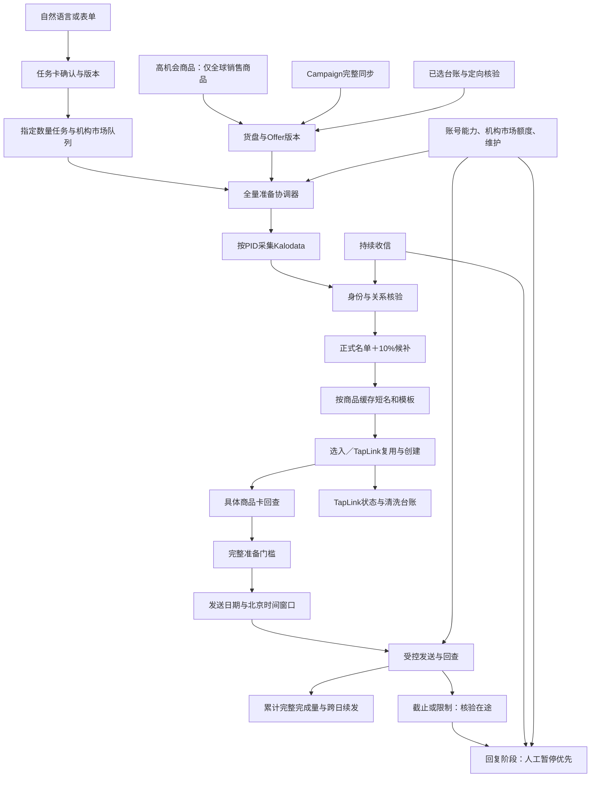

# 指定数量批次架构与实施蓝图

当前产品基线：[PRD](../PRD.md)。本轮实现与验证：[B.17](../implementation/batch-preparation-foundation-v2.md)。本架构覆盖旧的边发边补策略。本文“已实现”均注明是代码/本地验证还是平台验收，不把设计当运行事实。

## 架构关系

## 核心对象与边界

| 对象 | 身份与职责 |
| --- | --- |
| Task | institution＋market＋taskId；明确target、scope、time window、规则版本、确认哈希；跨日累计 |
| Preparation run | 同一Task版本的一次全量准备，进度按PID／达人／材料分别计数；不是新发送授权 |
| Member | Task＋OEC唯一；正式/候补角色、选定PID、来源与材料引用；查不到身份不伪造 |
| Product material | 市场机构、PID、来源活动、拟佣金版本、短名/模板版本；同商品语义不按达人重复调用模型 |
| Link binding | 上述材料对应的具体listId、来源与成员证据、实际达人佣金、账号适用范围、平台状态 |
| Delivery | 引用成员与冻结卡文；同一人卡/文独立意图，回查成功才结算，未知占住目标名额直至核验 |
| Scope phase | 机构×市场统一sending/draining/replying/idle，人工pause另列；不等同账号进程状态 |
| Account | 登录身份、真实机构市场、能力、维护与租约；身份解析和卡片可见性逐一验证后分配 |
| Result | 完整确认、单卡、拒绝、未知、咨询中断等独立统计；平台500新额度与任务N不混用 |

角色名称、模板名称都不授予工具权限。模型不能直接将任务状态改成已发送，不能自填平台回执。旧系统已用账号仅以只读方式核对和复用当前身份，不能跨账号复制Cookie/签名状态。

## 全量准备与TapLink

准备协调器先按目标＋候补确定人数，再驱动足够PID采集/核验。任务名单不足就继续准备，计划时间到了也不自动发送小样；只有用户显式“先发就绪部分”才例外，并保存确认版本和原目标。

TapLink是必须完成的准备工序，不是发送时临时创建：

1. 汇总名单实际用到的Offer，按材料键去重。
2. 查询正确机构市场及账号适用范围的现有卡片。
3. 已存在且绑定、实际佣金和可用性一致则复用；不能只按PID复用。
4. 对缺失项目先按需要选入，回查后批量建卡；每项单次提交、持久意图和回查。
5. 单项未提交且当前条件变差可失效/替换，其余商品继续；任何结果未知先核验，不制造新意图绕过。
6. 正式与候补都齐备才冻结准备结果。发送前动态资格核验仍保留；准备不等于预先获得平台发送额度。

未知结果不能通过释放名额、切账号或用候补“补成功数”绕开。确认未发或明确失效才能补位。已确认部分保留，若不能完成整组则作为部分触达单列。

## 调度与公平性

同机构市场默认先完成旧任务，优先级手动调整；新任务可排队准备，但成员预留与发送频次不能互相冲突。不同机构市场独立运行。以可验证平台范围判断错误：账号故障只影响该账号，市场新联系额度耗尽只限制新达人；符合条件的已解锁达人可继续。

发送日期和窗口用Asia/Shanghai计算，跨午夜后归属前一天开始的窗口；显示市场当地时间时处理DST。到窗口末尾停止新提交，在途先核验。下一窗口已备齐且条件允许时续发，不清零已完成数量。新任务的未来开始日期不能被午夜时间判断提前触发。

接收新消息不因发送阶段停止。咨询、拒联和人工接管立即改变关系控制；回复发送在阶段切换后进行。用户当前暂停回复是独立的最高优先级开关，任何调度计划都不能自动打开它。

## 旧版能力承接

- 货盘：commerce_sources / commerce_selected / catalog规则工作区；高机会仅全球销售要独立补齐来源覆盖，并经过真实验收。
- TapLink：分佣引擎、具体来源创建、持久意图、后台列表回查和清洗；当前新项目cycle_card_creation等已有IT适配。
- 达人库：旧CreatorLibraryPage的经营指标与筛选、批量标签、联系方式、MCN、详情和维护；新系统稳定OEC、别名、来源与关系隔离结合。
- IM：原生卡文、收信、已加橱窗证据与TAP延迟补查；样品记录不充当采用/解锁证据。

## 当前实现状态

| 部分 | 状态 | 实际边界 |
| --- | --- | --- |
| 新PRD、任务/准备/TapLink架构 | 已完成本轮设计 | 不是平台验收 |
| 固定目标规格、确认哈希、10%候补、完整准备门槛 | 已实现并离线验证 | batch_tasks.py；未接新的真实发送调度器 |
| 跨午夜/开始日期、同scope排队、人工部分放行与回复暂停优先 | 已实现基础判定并测试 | 判定返回platformDispatchAuthorized=false，不能直接作为真实发送许可 |
| 真实数据准备容量预检 | 已实现 | 只读意大利现有货盘/身份/关系/卡片；输出缺口，无建链/发送 |
| 工作台预检入口与速度曲线 | 本轮实现 | 任务列表/自然语言创建/完整账号中心仍待接入 |
| IT TapLink单项创建、复用、回查、未提交失效 | 已有平台实测 | 仍需接全量任务材料清单与多账号能力归属 |
| 原IT固定批次卡文发送 | 已有真实回执 | 属于历史试验执行器，不作为新全量批次验收 |
| Campaign／已选池读取 | 已实现IT切片 | 全市场迁移、已选增量台账及对账策略未齐 |
| 高机会→仅全球销售来源 | IT首轮查询已采完并核对 | 10000 PID/667页；其他市场、刷新策略与任务选入联动仍待验收，见B.18 |
| 完整任务状态机＋素材准备Worker＋发送适配 | 进行中 | 不能从容量预检直接启用 |
| 多账号调度、批次阶段互斥、接续UI | 待实现/验收 | 不用账号数量推导额度增加 |
| AI自动回复 | 当前手动暂停 | 保持enabled=0 |
| TapLink清洗迁移与使用保护 | 已设计，旧版可参考 | 不自动删除当前有效/使用不明链接 |

## 实施顺序与完成判据

1. 固化产品契约、清理当前入口旧口径；实现可测试的任务与全量准备门槛、真实容量预检。
2. 接主力全托发现、选入台账、TapLink材料批量准备，扩足同PID线索及明确身份；接受足量任务后能自行完成N＋候补。
3. 将任务的成员/材料快照接到现有受控发送器，增加事务性的目标名额预留、真实回执结算、未知恢复及跨日窗口；不只靠事后计数防超发。
4. 验证并接多账号能力与scope阶段调度；新市场/账号接口行为逐项验证，不把旧账号存在当作可发证据。
5. 按任务列表、任务详情、独立货盘、达人库、账号中心重整UI；自然语言仅生成任务卡，确认后才执行。
6. 全托源、3000/5000准备、时段/跨日/故障/拒联/未知/候补、真实速度统一验收。未经全部验收不宣称新版已完成。

剩余技术调查：高机会分页覆盖与停止证据、已选定向查询批量上限及对账成本、跨账号卡片可见/会话身份、平台额度重置锚点与实际返回码。日常任务具体日期/时间由创建时指定，不由助手替用户编造。

主力源最新实现：[B.18](../implementation/global-opportunity-source-v1.md)。

2026-09-14规则更新：全托不要求库存数，缺失/0/低库存不阻塞，见[库存政策变更](../implementation/full-managed-no-stock-gate.md)。选入仅在当前任务的TapLink准备需要时进行，不为取库存提前扩张已选池。
