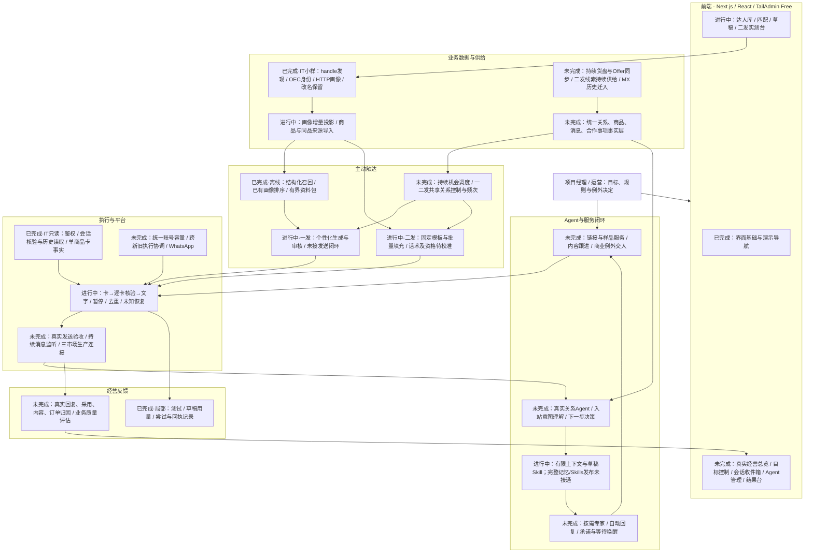
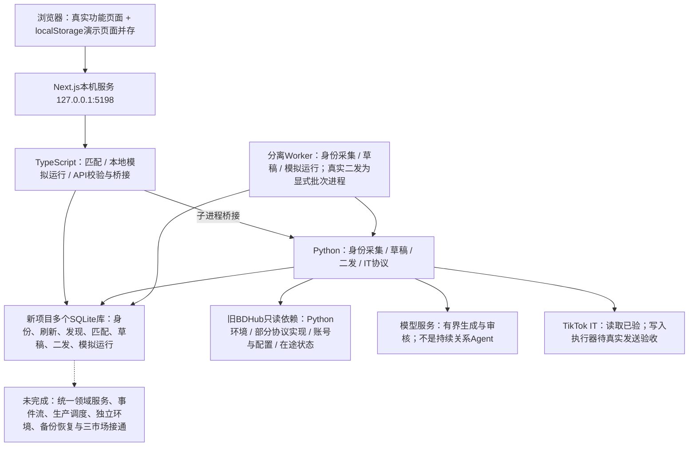

# BDHub-Agent 当前架构与产品校准

> 历史审计：本文固定在 2026-09-13 代码基线，不再作为“当前架构”入口。当前产品与技术分别见 [项目文档](../PROJECT.md) 和 [技术文档](../TECHNICAL.md)。

核查日期：2026-09-13。代码基线：a49c5d3。本文是现状审计与待答问题，不修改业务政策、不启用任务。状态依据为当前代码、API入口及对应验收记录；历史测试结果不是本次重新运行结果。

## 状态口径

- 已完成：所注明范围内已实现并有验证；“离线/本地/读取”不能推导生产闭环完成。
- 进行中：已有可复用实现，但关键集成、业务定稿或真实验收未完成；不表示后台此刻正在执行开发任务。
- 未完成：仅设计、演示或尚无实现。演示页面完成与对应业务功能完成分别标记。
- 图中箭头描述目标数据/责任流，不代表所有连接已接通。下表给出实际连接范围。

## 全系统业务架构

## 当前技术落地结构

多个SQLite库是当前功能试验的隔离方式，不是用户已批准的最终存储架构。关系控制在模拟运行、草稿及二发各有局部实现，尚未形成贯穿所有流程的统一控制。无须以重写数据库为前提，但必须先确认业务对象和流程再整合。

## 模块验收与缺口

| 模块 | 当前真实状态 | 尚未完成 / 不能据此推导 |
|---|---|---|
| UI基础 | TailAdmin Free、主题、组件、演示七路由已实现 | 演示经营目标、Agent配置、结果不是生产控制 |
| 达人入池 | IT支持handle、主页链接、OEC；批量队列、刷新、身份与改名小样已验 | 持续外部名单发现、MX/BR真实新系统接入未验 |
| 商品与Offer | 5商品测试源；Freegrin单卡与成员事实真实读取 | 千至万商品持续同步、Offer生命周期、运营货盘入口未完整实现 |
| 一发匹配 | 多类目与经营指标分析、结构索引、有界资料包、离线容量基准 | 排序参数未经业务效果认可；历史数千画像不全是当前已验身份；生产候选供给未接通 |
| 二发来源 | 48个来源达人、50同品边；31当前收件身份有核验链 | 固定来源切片，不是持续扩池；历史销量归属不等于当前身份已证明 |
| 一发个性化 | 生成/独立检查/版本/费用适配已实现 | 现有真实模型小样来自二发改模板之前，不能当完整一发闭环验收；未接正式发送 |
| 二发模板 | 三套v3模板、字段填充；先前v2批量31人零模型调用 | v3未由用户认可；当前只用佣金优势作推广理由，是否应为门槛未确认 |
| 关系Agent | 本地确定性Planner可恢复；有架构合同 | 自然语言关系判断、真消息上下文、自动回复、专家调用均未贯通 |
| Skills与记忆 | 一发意向邀约Skill及有界模型事实组装已落地 | 全场景注册、按需加载、历史证据检索、发布/回滚与业务评估未完成 |
| 平台执行 | IT真实鉴权、203/608/301读取及Freegrin事实已验；卡文顺序/恢复代码与离线测试完成 | 真实发送0；单人端到端及规模运行未验；旧被否定批次暂停且未批准 |
| 入站与合作 | 模拟事件、事项、接管/交还/唤醒可演示 | 实时IM监听/补回、真实人工消息、回复服务及合作推进未接入 |
| 链接/样品 | 读取既有单卡事实 | 创建链接、申请/审批/物流及对应动作授权未迁入新系统 |
| 结果与费用 | 局部用量、尝试、回执与离线报告 | 真实经营漏斗、内容/订单/机构收益归因、全系统费用控制未完成 |
| 运维与独立性 | Mac本机Next/Python/Node与独立SQLite；局部重启恢复已验 | 独立环境/凭证、自动运维、全量备份恢复、统一账号调度、正式部署未完成 |

## 必须先校准的偏差

1. 现有推进偏重单次草稿和试点执行，尚未把“一次设定后持续经营”作为真实主流程接通。
2. 入口通过mode/dataset分散，是开发切片的体现，未必符合运营每天的工作顺序。
3. 二发是否必须是历史同品达人、是否要求佣金优势、遇已读未回如何处理，没有完整业务确认；不能把现实现当答案。
4. “一个关系Agent负责达人”是确认的方向，目前不是生产运行事实。生成器加审核器不是完整关系Agent。
5. 一些阶段文档保留“尚无模型/数据库”等当时口径，与后续切片不一致。本文集中标注当前状态，不默默改写历史验收。

## 第一轮10问（按架构影响排序，均待用户回答）

1. **首个正式版本的验收目标是什么？** 在“二发持续覆盖”“一发匹配成效”“回复后推进合作”中，哪个结果必须先做到才算值得使用？请给一个你认可的业务结果，而不只是发送成功。
2. **一发、二发的业务定义是什么？** 二发是否仅指“有该商品历史带货记录的达人推新BJN链接”，还是也包括已联系未回复、已有合作换品等？请给一条典型例子及一条不属于二发的反例。
3. **系统可以经营的货盘由谁决定？** 人工选定商品池后持续经营，还是自动从全部货盘选品？哪些商业条件或商品特征才是真正的硬门槛？
4. **大量商品与达人的匹配优先顺序是什么？** 请排序同品成交证据、类目经营表现、总体带货能力、已有合作关系及指定商品推广需求；是否允许一个达人同时收到多款？画像年龄、价格带、内容形式沿用已确认的参考口径。
5. **一次没回复之后，什么时候允许再次联系？** 无回复、已回复未合作、已拿样未出内容、正在沟通另一款分别如何安排？这决定统一关系队列，而不是只决定发送间隔。
6. **固定模板应该怎么管理推广理由？** 没有佣金优势/热点/销量复苏依据时是否仍可二发？希望你按商品或活动一次写好模板，还是先批量给你几个版本，认可后自动填充复用？不引入逐达人生成。
7. **日常自主执行的授权单位是什么？** 你已确认范围内自动执行；这个范围在产品里应是一项持续经营计划、一批商品、某个市场账号，还是每一批名单？到哪种变化时才需要重新找你？
8. **自动回复第一批必须处理哪几类真实问题？** 请给最常见的三类，以及每类你希望怎么处理；特别区分只解释/给已有链接与允许查样品、办理业务、承诺条件的范围。
9. **你每天打开系统，主工作台应该围绕什么组织？** 是“今天推广哪些商品”、是“哪些达人与回复需要处理”，还是“经营计划进展及少量异常决定”？其他详情可作为下钻，不预设你逐达人逐稿操作。
10. **当处理能力不足时，系统应如何取舍？** 模型预算尚未确定；超过预算、账号可用容量不足或待回复积压时，优先保回复与现有合作、优先二发覆盖，还是暂停新增等你决定？请给日费用范围与可接受人工处理量，未知可先留空。

## 后续答复处理

按用户原话记录答案 → 给出对应流程与架构影响 → 标注保留/修改/撤销 → 回写已确认决策和PRD → 再问第二轮更具体的问题。第二轮再处理消息合并、商品与达人来源、模板编辑/版本、异常提示、真实回复案例、历史迁入、指标分母与部署，不用技术框架选择抢占业务问题。

已确认的三市场、TikTok优先、未来WhatsApp、二发模板/一发个性化、稳定OEC、自控长期数据、TailAdmin Free不重复当成未决问题。

## 证据入口

- 当前产品与技术：`docs/PROJECT.md`、`docs/TECHNICAL.md`；历史需求与决策来源：`docs/PRD.md`、`docs/DECISIONS.md`。
- 实际API与服务：`apps/web/src/app/api/`、`apps/web/src/server/`、`scripts/lib/`。
- 稳定身份与匹配：`docs/implementation/creator-discovery.md`、`registry-profile-matching-sync.md`、`existing-profile-auto-analysis.md`。
- 模拟运行：`docs/implementation/local-runtime-v1.md`。
- 草稿早期记录：`docs/implementation/italy-outreach-drafts.md`；后续真实小样与二发规则由`italy-second-system.md`覆盖。
- 二发当前实现与验收：`docs/implementation/italy-second-system.md`、`var/second-live-validation-20260912.json`。
- 正式目标架构（非已完成证明）：`docs/architecture/system-design.md`、`agent-runtime.md`。
