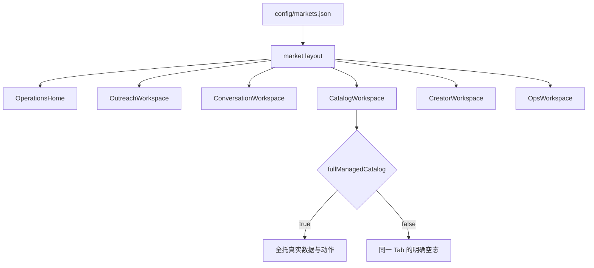
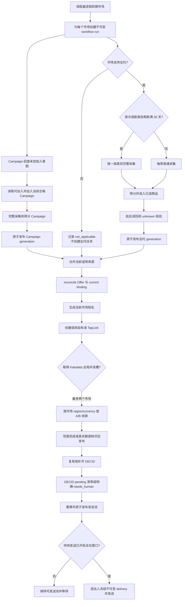
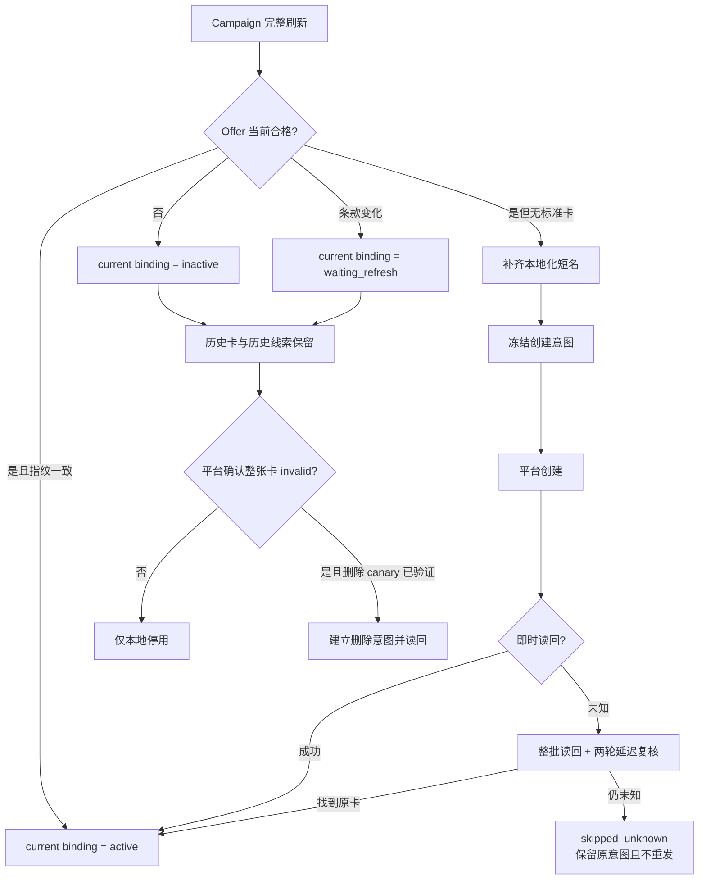
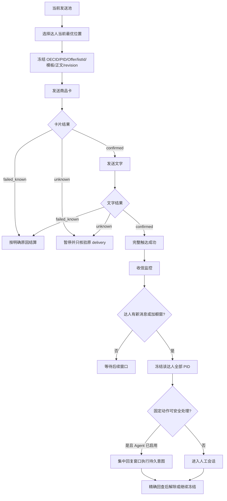

# 全市场统一前端与自动运营整理计划 v1

状态：需求已确认，待独立实施任务执行。日期：2026-09-22。

本文是下一轮开发的执行合同。它将全市场页面统一、market 隔离、流程图、调度并发、前端性能、潜在缺陷、文档整理和发布验收放在同一份计划中。当前业务规则仍以 [项目文档](../PROJECT.md) 为准，当前技术事实仍以 [技术文档](../TECHNICAL.md) 与运行台账为准。

## 1. 已确认的产品决定

1. 目标市场全部使用同一套页面、组件、页面内容和操作结构，以当前意大利页面为原型，不再维护 IT 与非 IT 两套实现。
2. 市场页面唯一允许的结构性能力差异是 `fullManagedCatalog`：
   - 支持全托：显示真实全托数据、采集状态和调度状态；
   - 不支持全托：仍显示相同的“全托商品”Tab/区域，但内容为明确空态“该市场暂无全托商品”，不隐藏页面，也不创建全托采集任务。
3. Campaign、TapLink、Kalodata、OECID、发送池、会话、达人和运行设置在所有市场保持同一信息架构；实际数据、账号和运行状态按市场隔离。
4. 当前保留的 16 条二发话术全部审批通过。市场只做本地语言翻译，不改变原意，不新增用户可见的语义 ID 或分类体系。同一达人不重复使用已经进入发送意图或已经尝试发送的话术。
5. 完整流程图使用仓库内 Markdown + Mermaid，既作为后续 AI 的执行上下文，也作为人工检查清单。
6. 下一轮实现使用 Codex 中新的 `BDHub-Agent` 本地项目与新的独立任务；旧 BDHub 继续只读。
7. 本计划阶段只写文档和创建实施任务，不修改业务代码、运行开关、外部平台数据或正在运行的任务。

## 2. 范围与完成定义

### 2.1 目标市场

前端和市场合同一次覆盖以下 14 个 canonical market：

```text
be, br, de, it, jp, my, mx, nl, ph, sg, th, uk, us, vn
```

新增市场必须在注册表中填写 locale、language、currency、time zone、platform region、通信账号、货盘账号和 `fullManagedCatalog`。未知字段不得从 IT 或相邻市场回退。尚未完成账号或写能力验收的市场仍使用同一页面结构，但真实动作由确定性 capability 门禁禁用；不能用占位数据冒充成功。

### 2.2 本轮完成后应达到

- 14 个市场的同一路由渲染同一组件树；添加新市场不再新增一套页面组件。
- 所有市场级 GET、POST、CLI 和数据库查询显式携带并校验 `market`。
- 无全托市场的全托页面为稳定空态，调度器不排队、不运行、不制造失败告警。
- 多市场主链可并行推进；Kalodata 同时最多两个市场，其余阶段按真实账号/数据库资源锁运行，而不是全局串行等待一个市场完成。
- 首页、合作工作台、达人页和货盘页的主要数据在本机导航后快速出现；性能验收使用可复现指标，而不是主观判断。
- 当前文档只保留一套产品真相、一套技术真相和一个动态交接入口；被替代方案明确归档或标注失效。
- 已发现的 market 泄漏、意大利硬编码、错误翻译目标和详情查询缺口全部有回归测试。

### 2.3 本轮不做

- 不改变二发话术的业务含义。
- 不开启真实持续发送或 Agent 自动回复。
- 不在代码发布时自动开启市场、账号、全托更新或外部写入。
- 不删除历史 SQLite、外部写入意图、旧链接、发送历史或 unknown 证据。
- 不修改 `/Users/bjn00003/BDHub/01-BDSystem-V2`。

## 3. 当前审计结论

### 3.1 已有基础

- `/{market}` 首页、主导航和运行设置已经初步 market-scoped。
- 当前注册表启用 IT、BR、MY、UK；IT/UK 支持全托，BR/MY 不支持全托。
- Campaign 两天刷新、全托周更/月度类目刷新、Kalodata 最多两市场并发已有部分实现。
- 当前 IT/BR/MY/UK 的 16 条二发模板均为 `16/16 approved`；2026-09-22 只读回读时四市场持续发送均为关闭。
- 现有页面路由 HTTP 首包很快，慢点主要来自浏览器挂载后的 Python CLI 聚合读取。

### 3.2 前端仍有两套实现

| 领域 | 当前分叉 | 目标 |
| --- | --- | --- |
| 货盘 | IT 使用 `CatalogWorkspace` 四 Tab；其他市场使用纵向 `MarketCatalogWorkspace` | 一个 `CatalogWorkspace market definition`，四 Tab 永久一致 |
| 合作工作台 | IT 使用 `SecondOutreachWorkspace`；其他市场使用简化 `MarketOutreachWorkspace` | 一个完整发送/历史工作台 |
| 会话设置 | IT 有人工模板与 Agent 设置；非 IT 两个入口都回退成 `MarketContentPanel` | 三个入口在所有市场功能与布局一致 |
| 达人 | 批量添加、身份阶段和部分 API 仅 IT 可用 | 同组件、同状态口径、按 capability 控制真实动作 |
| 货盘全托 | BR/MY 直接隐藏全托区域 | 保留同一 Tab，显示“不支持/暂无全托商品”的空态 |

完成统一后，删除分叉组件前必须用 `rg`、路由测试和生产构建证明没有正式入口引用；不因名称像“旧页面”就删除后端能力。

### 3.3 已发现的 P0 market 隔离缺陷

| 缺陷 | 当前证据 | 修复方向 |
| --- | --- | --- |
| 会话 mutation 丢失 market | `server/conversations/bridge.ts` 只有 list/detail 传 market，保存草稿、人工发送、卡片、合作状态等默认落到 IT | 所有 command 签名包含 market，Route 到 CLI 全链校验 |
| 草稿翻译目标写死 IT | `ConversationWorkspace` 对任意市场都提交 `target: "it"` | 从市场注册表读取达人可见语言；中文只作运营辅助 |
| 人工/Agent 模板接口未带 market | 非 IT 设置页未复用 IT 功能，`/api/template-library` 多处默认 IT | 所有读写带 market；模板表/plan/locale 同时约束 |
| 持续发送接口写死 IT/ACC6 | `send-contracts.ts` 与 `server/send/bridge.ts` 固定 `market:"it"`、`account:"acc6"` | 由 market 注册表解析通信账号并校验返回 |
| 会话统计与结果历史默认 IT | `useInboxMonitor`、`StatsCalendarPanel`、`CycleServicePanel`、`ReplyReviewPanel` 请求没有 market | URL、body、CLI、SQL 全链增加 market |
| 达人详情缺少 market | detail 请求只有 creatorId；store 查询范围硬编码且遗漏 MY/UK | detail 使用 `market + creatorId`，数据库双重匹配 |
| 市场类型为手写 union | `IdentityMarket`、页面 marketNames 与 validation 都是固定枚举 | 从注册表生成/校验，测试覆盖 14 市场 |
| 作业设置请求未带 market | `JobsPanel` 读取 `/api/jobs`、`/api/send`、`/api/template-library` 默认市场 | 作业状态和 mutation 显式 market；共享政策与市场运行分开 |
| IT 货盘 hooks 不可复用 | Campaign、全托、短名、链接与身份 hooks 多数请求不带 market | 统一 hook 参数和 API 合同，不复制组件 |
| “可用=false”与 0 易混淆 | 不支持或未接入时部分页面隐藏/显示 0 | 统一 `availability: supported / unsupported / unavailable / ready` |

这些问题必须先于新增市场执行能力修复。仅把页面 URL 改成 `/{market}`，但底层仍默认 IT，不算完成。

### 3.4 性能基线

2026-09-22 本机 5198 页面稳定状态的导航观测：

| 页面 | 稳定时间 |
| --- | ---: |
| IT 首页 | 1.78 s |
| IT 合作工作台 | 1.95 s |
| IT 会话 | 0.37 s |
| IT 货盘 | 0.74 s |
| IT 达人 | 1.54 s |
| UK 货盘 | 1.51 s |
| BR 货盘 | 0.93 s |
| MY 货盘 | 1.05 s |

只读 API 三次暖态抽样显示：`operations-home` 约 1.35–1.65 s、`send` 约 1.25–1.37 s、UK `market-catalog` 约 0.93–1.11 s；而页面 HTML TTFB 约 0.01–0.06 s。说明首要瓶颈不是 Next 页面壳或静态资源，而是浏览器挂载后的聚合读取、重复 CLI 启动和多份重叠查询。

Chrome DevTools MCP 当前未配置，因此这组数字不是 LCP/CLS/TBT。实施阶段 P0 必须补正式 trace；不能拿“稳定时间”冒充 Core Web Vitals。

## 4. 目标架构

### 4.1 市场注册表是唯一入口

统一 `MarketDefinition` 至少包含：

```ts
type MarketDefinition = {
  key: string;
  label: string;
  shortLabel: string;
  locale: string;
  templateLanguage: string;
  currency: string;
  timeZone: string;
  platformRegion: string;
  accounts: {communications: string; supply: string};
  capabilities: {campaignCatalog: true; fullManagedCatalog: boolean};
};
```

约束：

- Campaign 是所有目标市场的共同能力，不用页面分叉表示。
- `fullManagedCatalog` 是唯一影响货盘页面内容的结构性能力位。
- 账号能力验证状态不写进静态注册表；它来自持久台账，只决定动作能否执行，不决定页面是否存在。
- TypeScript、Python、路由、调度器和测试读取同一份 `config/markets.json`，不得各自维护市场列表。
- 用户可见语言、TapLink 短名、卡名、二发模板和 Agent 固定模板从同一 market definition/content bundle 解析；不允许回退 IT。

### 4.2 单一前端组件树



实施要求：

- `CatalogWorkspace`、`OutreachWorkspace`、`ConversationWorkspace`、`CreatorWorkspace` 和 `OpsWorkspace` 都接收同一个 `market`/definition。
- 页面 title、Tab、卡片顺序、空态、表格字段和操作位置一致。
- 删除 `market === "it" ? A : B` 页面分派；兼容重定向只处理旧 URL，不决定业务实现。
- 非 IT 空数据必须展示该市场真实空态，不能读取 IT 数据，也不能用“功能建设中”占位替代真实状态。

### 4.3 页面合同

#### 运营首页

- 保留自动运营总开关、全托更新开关、持续发送开关。
- 不支持全托时，全托开关所在位置保持，状态显示“不适用”，控件不可操作。
- 主链阶段、异常、上次成功、下次执行、断点和平台写入数按当前 market 读取。

#### 合作工作台

- 所有市场统一“发送 / 结果与历史”两个 Tab。
- 发送页统一显示 16 条本地化二发模板、审批结果、真实例子、发送池、窗口、进程和 unknown 原意图核验。
- 结果页统一显示 7/14/30 天趋势和日明细。
- 当前 16 条模板的业务内容已审批；受控翻译不新增第二轮业务审核。正文或语义后续变化仍产生新 revision 并重新审批。

#### 会话

- 所有市场统一“会话 / 人工回复模板 / Agent AI 回复设置”。
- 会话保持队列、时间线、编辑器、达人/事项三栏。
- 人工模板和 Agent 固定模板按 market/locale 隔离。
- “中→市场语言”由注册表决定；达人原文翻译成中文仅供运营查看。

#### 货盘

- 永久保留四个 Tab：全托商品、非全托商品、达人线索、新建链接命名。
- `fullManagedCatalog=false` 时，全托 Tab 显示统一空态，不触发全托 API、worker 或调度。
- Campaign、TapLink、Kalodata/OECID 和发送池使用 IT 页已有的完整字段与动作，不退化为统计摘要页。

#### 达人

- 所有市场统一五项顶部统计、列表、详情、别名、画像和刷新状态。
- detail API 必须同时校验 market 和 creatorId。
- 批量添加/身份补齐入口在没有对应写能力时保留位置并显示不可用原因，不隐藏整个功能。

#### 运行与设置

- 所有市场统一 Kalodata 身份、作业与定时、机构账号设置三个 Tab。
- 共享北京时间和 cadence 政策与市场运行状态分开显示。
- 无全托市场仍显示全托作业行，但状态固定“不适用”，不可保存或启动全托任务。

## 5. 完整自动运营流程图

### 5.1 多市场主链



关键屏障：

- Campaign 与适用的全托来源各自完整发布后才进入 TapLink。
- 无全托市场没有全托屏障，不能因“不支持”阻塞 Campaign。
- Kalodata 可跨市场并行，但同一市场的 region、currency、队列、断点和数据库不能混用。
- OECID 未收口不能发布“完成”的发送池 generation。

### 5.2 Campaign 商品与 TapLink 生命周期



### 5.3 发送与回复闭环



## 6. 多市场调度与并发方案

### 6.1 资源模型

| 资源 | 并发规则 |
| --- | --- |
| Campaign/全托/TapLink | 按市场货盘账号排他；不同市场账号可并行 |
| IM/收信/OECID/发送 | 按市场通信账号写门禁；只读收信与实际 dispatch 分开 |
| Kalodata | 全局 semaphore=2；市场内保持独立 region/currency/checkpoint |
| 账号维护 | 全局串行；候选身份验证完成后原子发布 |
| SQLite | 短事务、持久 lease/fence；共享库查询必须带 plan/market |
| 外部 unknown | 不占新写重试名额，只进入原意图核验队列 |

### 6.2 公平性与恢复

- 到期市场按 `上次成功最早 → 当前断点 → market key` 稳定排序，避免大市场长期占满资源。
- 一个市场额度耗尽或 needs_human 不阻塞其他市场。
- 进程重启从持久 run/stage/checkpoint 恢复，不重新创建同一写意图。
- 同一市场不得同时运行两个主链；不同市场只有在真实共享资源冲突时等待。
- 调度器每次启动先读取活进程、锁、lease 和运行台账，不根据 JSON 进度文件单独判断任务是否存在。

### 6.3 cadence

- Campaign：每 2 天完整刷新。
- 支持全托的新市场：首次执行一级类目完整刷新。
- 支持全托的已上线市场：每周普通刷新；距上次成功类目刷新满 30 天时执行一级类目刷新。
- 不支持全托：调度器直接 `not_applicable`，不调用采集 CLI。
- 多市场错峰只改变调度时间，不改变业务 cadence 或完成口径。

## 7. API、CLI 与数据迁移

### 7.1 API 统一规则

- 所有市场级 GET 必须且只能有一个 `market`；不再默认 IT。
- 所有市场级 POST body 必须有 `market`，且 body market 与 URL/当前页面 market 一致。
- Route、bridge、CLI 各层都校验 market，不能只依赖前端。
- response 固定返回 market、locale、availability、数据 observation time 和 read-only/write 摘要。
- 缺失 market、未知 market、账号不属于 market、plan 不属于 market 均 fail closed。
- 旧无 market 接口只允许短期 308 重定向或明确 400；不得静默落 IT。

### 7.2 数据迁移

- 使用 additive migration，不删表、不重建真实数据库。
- 审计所有业务表的 scope：显式 market 列或可证明的 plan→market 外键必须至少有一个；查询必须使用该 scope。
- 达人详情主查询使用 `market + creatorId`；别名、画像和互动统计沿同一 market/OECID 范围。
- 模板、审核、草稿、Agent 设置、发送控制、统计和回复评测必须按 market/plan 隔离。
- migration 提供旧 IT 行回填、重复执行、旧库读取兼容和错误 market 反向测试。
- 应用 migration 前使用现有 online backup；恢复测试只写空目录。

### 7.3 删除与兼容

以下候选只能在共享实现上线并完成引用证明后删除：

- `MarketCatalogWorkspace.tsx`；
- `MarketOutreachWorkspace.tsx`；
- 仅为 IT/非 IT 分叉存在的适配层和重复合同。

保留兼容重定向和历史 SQLite。删除前必须列出正式 route、server bridge、CLI、worker、测试和文档引用；任何被正式流程复用的后端能力继续保留。

## 8. 前端性能优化

### 8.1 正式测量

实施任务先配置或连接 Chrome DevTools MCP，采集：TTFB、FCP、LCP、TBT/INP、CLS、关键请求瀑布、脚本/样式体积和 accessibility snapshot。测试页面至少包括 IT 首页、合作工作台、货盘、达人，以及 UK 货盘和一个无全托市场货盘。

### 8.2 已确认的优先方向

1. 建立轻量 `market dashboard read model`：调度器/领域层在状态变化时写可验证快照，页面 GET 只读该快照与少量当前状态，不在每次刷新时重新执行多个重聚合。
2. 每个页面只发一个首屏聚合请求；下方明细在展开或切 Tab 时加载。
3. 同市场、同 revision 的请求在客户端去重，保留最后一次成功结果并后台刷新，避免切 Tab 后白屏。
4. 轮询在页面隐藏、请求未完成或 worker 状态稳定时降频；禁止同一 API 的重叠轮询。
5. Python CLI 仍是业务边界，但 status 命令要使用单次进程、固定 JOIN、只读 snapshot 和有界 payload；不把业务规则搬进 React。
6. 共享页面组件后按 Tab 动态加载重型面板，避免所有市场一次装载全部货盘和会话代码。
7. 大表格保持服务端分页/虚拟化边界，不向浏览器下发完整历史台账。

### 8.3 性能验收目标

在同一本机、暖服务、相同真实数据下：

- 页面 HTML TTFB p95 ≤ 200 ms；
- 普通状态 GET p95 ≤ 500 ms，首页等聚合 GET p95 ≤ 800 ms；
- 六个主页面导航到首屏真实数据稳定 p95 ≤ 1.2 s；
- 页面切换期间保留壳和上次成功数据，不出现整页空白；
- 无新增重叠轮询或相同状态的重复 Python 进程；
- LCP、CLS、TBT/INP 以正式 trace 记录基线与改后值，若已经达标则不做无收益优化。

## 9. 实施阶段

### P0：接管与冻结基线

- 读取 `AGENTS.md`、主文档、当前 handoff、Git diff、活进程、workflow 和持久台账。
- 不停止或重复启动仍在运行的 MY TapLink/主链任务；先确认它的最终状态。
- 记录 16 条模板审批、四市场开关、当前服务 PID 和数据库 migration 状态。
- 建立只读页面/API/性能基线，创建状态备份并独立 verify。
- 把当前大量未提交改动按已有工作与本轮工作分开，不 reset、checkout 或覆盖。

完成证据：基线清单、备份回执、活任务清单、失败测试清单。

### P1：市场合同与 P0 隔离修复

- 注册 14 个市场元数据；未确认 locale/账号/全托能力的市场先 fail closed，不读取 IT 回退。
- 将市场类型、名称、语言、账号和能力读取收敛到 registry。
- 修复会话 mutation、翻译、模板、发送、收信、统计、达人详情、作业和 Campaign hooks 的 market 全链。
- 增加 additive migration 与跨市场负向测试。

完成证据：任何 BR/MY/UK 请求都不访问 IT plan/账号/模板/数据库行；缺 market 请求稳定拒绝。

### P2：共享前端组件

- 以 IT 页面为唯一原型，参数化货盘、合作工作台、会话、达人和设置。
- 非全托市场保留全托 Tab 和明确空态。
- 所有市场共享 Tab、卡片、表格、空态和动作位置。
- 功能对齐后删除分叉组件，保留兼容 URL。

完成证据：14 市场路由矩阵和组件/DOM 合同测试通过；不存在业务页面 `market === "it" ? ... : ...` 分派。

### P3：调度与多市场并发

- 把 market workflow 变成可并行 DAG；实现持久资源 semaphore 与公平调度。
- 固定 Kalodata 全局最多两个市场并发。
- 全托能力 false 时不生成任务；true 时按首次/月度/周更 cadence。
- 验证暂停、额度耗尽、账号维护和 unknown 不阻塞无关市场。

完成证据：合成时钟和故障测试证明并发上限、公平性、断点恢复与无重复写入。

### P4：性能读模型与页面加载

- 先 trace，再实现首屏聚合 snapshot、请求去重、懒加载和轮询退避。
- 对最慢的首页、合作工作台、达人和 UK 货盘逐项复测。
- 每个优化提交附改前/改后相同口径，不为 0 ms 收益改代码。

完成证据：达到 8.3 目标，或对未达项目给出真实瓶颈与可复现证据。

### P5：项目清理与文档收敛

- 更新 `PROJECT.md`：全市场统一页面、无全托空态、16 条已审批话术。
- 更新 `TECHNICAL.md`：registry、market API、共享组件、调度 semaphore、性能读模型。
- 更新 `market-rollout-standard-v1.md`：planned 市场可以有统一页面，但无能力证据不得执行。
- 对旧 `automated-operations-workflow-v1.md` 标注仍有效部分和被本计划替代部分，不复制第三套规则。
- handoff 只记录当前 Git、运行状态、数量和未解问题；不继续堆永久规则。
- 清理无引用页面/合同/测试和本轮临时截图；保留历史证据并更新文档索引。

完成证据：文档检查、无断链、权威顺序清晰、代码与文档市场集合一致。

### P6：验证、发布与回读

- Python 按阶段测试后跑全量；Web 跑 Node tests、typecheck、production build。
- 对 14×页面路由矩阵做 HTTP/DOM/空态检查。
- 对关键 API 做 market mismatch、缺 market、unsupported full-managed、unknown 和 revision 冲突测试。
- 重启前核对 PID/cwd；只替换 5198 Web 和明确需要的新代码服务，不重启仍在运行的业务 worker。
- 发布后只读回读四个已上线市场；新增市场真实写 canary 与自动开关由单独授权执行。

## 10. 测试矩阵

### 10.1 前端与路由

对 14 个市场自动生成以下路由测试：

```text
/{market}
/{market}/workspace/send
/{market}/workspace/history
/{market}/conversations
/{market}/conversations/templates
/{market}/conversations/agent
/{market}/catalog
/{market}/creators
/{market}/ops/kalodata
/{market}/ops/jobs
/{market}/ops/accounts
```

断言：导航完整、Tab 相同、market 标签正确、空数据不回退、无全托 Tab 可见但不发全托请求。

### 10.2 API 与数据

- 每个市场级 API 的正确 market、缺失 market、重复 market、未知 market、URL/body 不一致。
- creatorId 属于另一市场时返回 not found/409，而不是跨市场详情。
- 模板、草稿、Agent 设置、发送控制、统计和合作状态不跨 market。
- `unsupported`、`unavailable` 和真实 `0` 三者解码与显示不同。
- migration 在旧 IT-only、当前四市场和空库副本上重复执行结果一致。

### 10.3 调度与外部写入

- 14 市场同时到期时 Kalodata 活跃数始终 ≤2。
- 一个市场 quota exhausted、needs_human 或账号维护时，其他市场继续推进。
- 无全托市场全托调用数严格为 0。
- 选入、加入 Campaign、建链、删除、发送的 unknown 均只核验原意图。
- 测试和构建平台写入 0、真实发送 0。

## 11. 验收标准

以下条件全部满足才算完成：

1. 14 个目标市场使用同一套主页面和页面内容；没有 IT/非 IT 双实现。
2. 无全托市场显示明确空态，相关 worker/API 调用为 0，页面其他内容完全保留。
3. 所有市场级动作显式 market-scoped；跨市场负向测试通过。
4. 16 条二发模板在所有已配置语言中可见且保持已审批语义，没有重复轮转给同一达人。
5. Campaign 失效、Offer 变化、TapLink 停用/删除和发送池退出符合流程图，历史证据不丢失。
6. 多市场可并行推进，Kalodata 最多两个市场，并有公平与恢复证据。
7. 最慢页面达到性能目标，或未达部分有 trace 支持的明确原因和后续项。
8. Python、Web、TypeScript、Next build、文档、migration、备份/恢复检查全部通过。
9. 发布后四个现有市场只读回读一致；没有意外开启真实发送、Agent、账号重登或外部写入。
10. `PROJECT.md`、`TECHNICAL.md`、handoff、市场标准与代码不存在互相冲突的当前规则。

## 12. 提交与交付顺序

建议拆为以下逻辑提交，避免把当前未提交的市场闭环改动与新一轮重构混在一起：

1. `docs: lock multimarket unification contract`
2. `fix: enforce market scope across read and write APIs`
3. `refactor: share market workspaces and unsupported empty states`
4. `feat: schedule markets with bounded shared resources`
5. `perf: add dashboard read models and request dedupe`
6. `docs: reconcile canonical project and runtime records`

每个提交先跑相称测试；全量测试和生产构建只在跨模块合并点及发布前重复。最终报告分开列出代码/测试、本机服务、只读数据、真实平台写入和业务结果。
