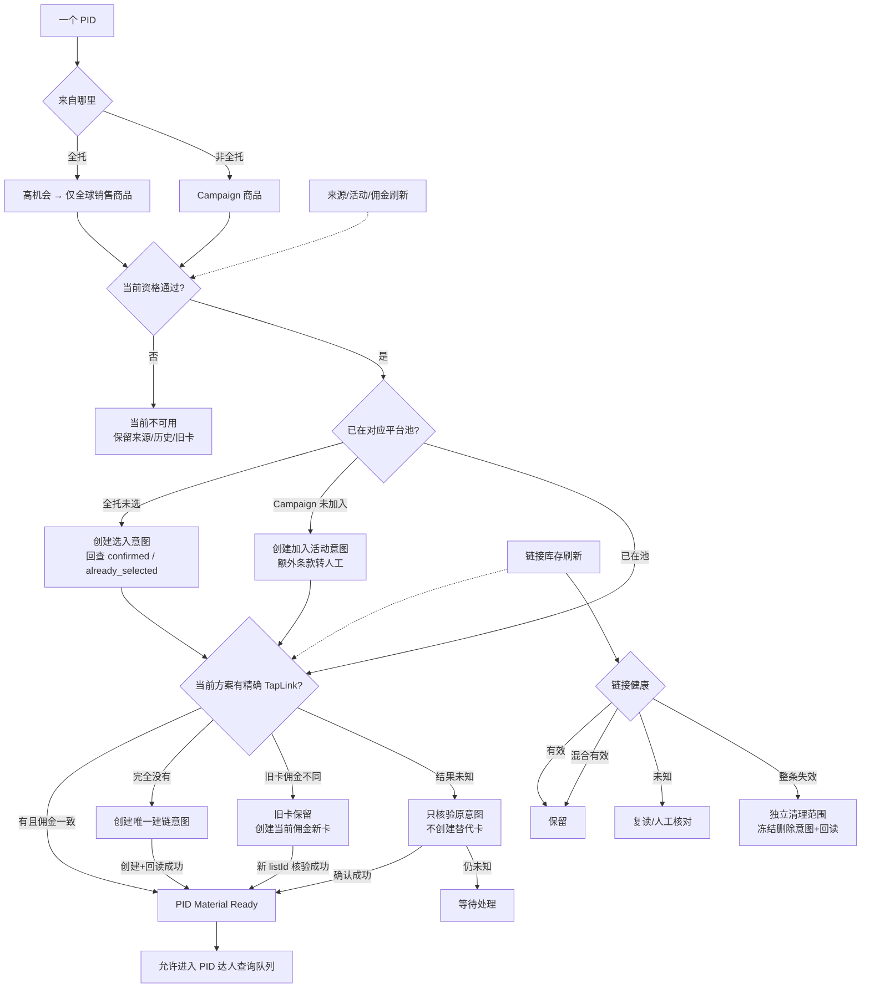

# PID 生命周期树

状态：业务方案草案 v1。数据快照：2026-09-19 只读台账。

本文件只讨论 PID，不讨论达人排序、冷却或发送执行。PID 主链只有三个业务结果：

- `material_ready`：当前合格、已在对应平台池、精确 TapLink 可用；可以查询达人线索。
- `waiting_action`：等待选入/加入活动、建链、重建或原意图核验。
- `inactive`：当前商品不合格或失效；历史事实保留，后续刷新可恢复。



## 当前数据快照

### 来源和筛选

- 全托：10,000 个来源 PID；当前门槛筛出 2,291，筛除 7,709。
- Campaign：当前快照 2,697 个去重 PID；选中 449，held 2,248。
- 全托已选池建链台账：3,450 个 PID，包含历史已选商品，因此不等于当前 2,291 个合格 PID。
- Campaign 新加入台账：18 条 joined；既有已加入活动来源另由当前 Campaign 快照体现。

### 链接准备

- 全托：已核验 1,098；可复用 1,193；复读中 1,154；缺链 4；待判断 1。
- Campaign：已核验 420；可复用 152 个 PID；缺链 259；读取不完整 2；待判断 6。
- 已核验新建链接意图：1,519。

这些状态是技术处理细节，面向业务只映射为：`material_ready`、`waiting_action` 或 `inactive`。

## 刷新规则

刷新不增加新的业务状态。它只更新事实，然后让同一个 PID 重新回答资格与链接两个问题：

```text
PID Material Ready
  = 当前 Offer 仍合格
  + 当前 TapLink 对这个 Offer 仍精确可用
```

### 来源刷新

- 全托主动采集或可选定时生成完整新快照；不完整快照不切换当前 head。
- Campaign 设计为每日完整刷新，也允许手动触发。
- 每次刷新都重新回答“当前资格通过吗”，不是生成一套新的永久状态。
- Campaign 加入时剩余期限大于 45 天不形成永久资格；刷新到 `<=45` 天时退出 `material_ready`。

### 方案与链接刷新

- 活动、佣金、期限变化后重新选择当前 Offer。
- 旧卡创建时的佣金不会自动变化。旧卡 12%、当前方案 13% 时进入待重建；旧卡保留，新发送只使用核验后的新 `listId`。
- “链接有效”必须同时证明：正确账号/市场可见冻结的 `listId`；成员中存在精确 PID；来源与 Campaign 绑定匹配；卡上达人佣金等于当前 Offer 且高于公开佣金；商品可用、未治理、`unavailable_type` 可接受；Campaign 库存规则通过；不存在未解决的 `unknown/result_unknown`。
- 链接按动作后回读、进入达人查询前的鲜度门禁、组批前平台复读、发送前 `fresh_card()` 四个节点核验。
- `unknown/result_unknown` 只核验原意图，不换账号、不新建替代卡。

### 刷新时钟

| 时钟 | 触发与周期 | 结果 |
| --- | --- | --- |
| 事实变化 | 选入、加入 Campaign、建卡或删除后立即回读；Offer/规则变化立即重算 | 成功读回才推进；未知保留原意图 |
| 日常来源 | 全托当前手动主动采集，可选定时；Campaign 设计为每日完整刷新 | 完整快照切换后重算资格 |
| 时间门槛 | Campaign 剩余期限在每次读取时按当前时间计算，至少每日重算 | 到 `<=45` 天立即退出未发送范围，不必等远端字段变化 |
| 日常链接 | **建议**当前材料每日增量复读 | 提前发现卡、成员、治理、库存或佣金变化 |
| 达人查询前 | **建议**最后一次平台链接证据不超过 24 小时 | 过期先降为 `waiting_action` 并复读，不带陈旧链接继续查询 |
| 正式组批 | 每个批次只复读本批 PID | 变化项退出批次并具名说明 |
| 逐条发送 | 每个达人发送前执行 `fresh_card()` | 现场核验冻结 `listId`；失败或未知立即停止该动作 |
| 健康清理 | **建议**每周完整扫描，或容量告警时手动提前触发 | 只形成独立清理范围，不自动删除旧卡 |

其中“每日链接复读、24 小时查询门禁、每周完整清理”是待用户确认的建议值，不是已生效配置。当前 `config/jobs.json` 的定时开关全部关闭，调度器也尚未实现；页面不得把这些目标周期显示成后台正在运行。

## 选入与加入活动

- 全托 `selected pool` 与当前业务资格分开。已选商品后来不合格时仍留在平台已选池，但不进入 `material_ready`。
- Campaign `joined` 与当前活动资格分开。活动失效、库存不足、期限不足或佣金不合格时退出 `material_ready`。
- 写入前保存唯一意图；回执和平台读回共同决定完成。重复点击沿用原意图。

## 链接清理旁路

当前链接库存：2,067 张列表 / 2,067 个成员记录。历史清理快照扫描 1,908 张，其中 1,786 有效、122 整条失效；历史台账有 122 条已核验删除记录。

当前 A 规则：PID 主流程不自动删除任何旧卡。清理必须是独立动作，并满足：

1. 明确清理范围；
2. 完整读取列表及成员；
3. 健康分类有证据；
4. 冻结删除意图；
5. 删除后读回确认；
6. 未知删除不重复执行。

有效、混合有效和未知链接不进入自动删除。历史删除结果不等于当前主流程获得删除授权。

## 当前实现差距

- 真实 `lead_pool` 尚未把 `material_ready` 作为位置入口，历史线索可能绕过当前 PID 树进入池子。
- 当前 `catalog_prepare_item` 的 `ready/reuse/reading/missing/review` 仍直接暴露为状态，后续应统一投影成三个业务结果。
- Campaign 与全托的当前 Offer、TapLink 和刷新证据仍分散在多个 SQLite 表，需要一个 PID Material 投影作为单一读取合同。
