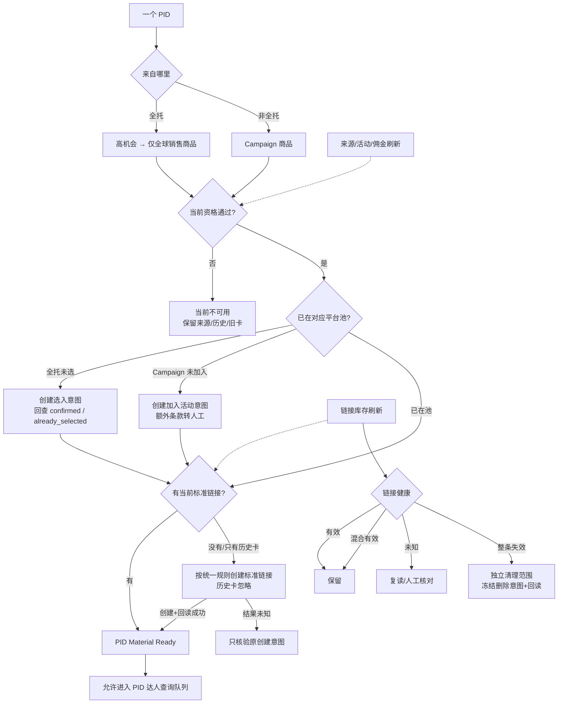

# PID 生命周期树

状态：业务方案草案 v1。数据快照：2026-09-19 只读台账。

本文件只讨论 PID，不讨论达人排序、冷却或发送执行。PID 主链只有三个业务结果：

- `material_ready`：当前合格、已在对应平台池、精确 TapLink 可用；可以查询达人线索。
- `waiting_action`：等待选入/加入活动、建链、重建或原意图核验。
- `inactive`：当前商品不合格或失效；历史事实保留，后续刷新可恢复。



## 当前数据快照

### 来源和筛选

- 全托：10,000 个来源 PID；当前门槛筛出 2,291，筛除 7,709。
- Campaign：当前快照 2,697 个去重 PID；选中 449，held 2,248。
- 全托已选池建链台账：3,450 个 PID，包含历史已选商品，因此不等于当前 2,291 个合格 PID。
- Campaign 新加入台账：18 条 joined；既有已加入活动来源另由当前 Campaign 快照体现。

### 链接准备

- 全托：已核验 1,098；可复用 1,193；复读中 1,154；缺链 4；待判断 1。
- Campaign：已核验 420；可复用 152 个 PID；缺链 259；读取不完整 2；待判断 6。
- 已核验新建链接意图：1,519。

这些状态是现有技术台账快照；其中历史 `reuse` 在新规则下不再直接等于可发送。面向业务仍只映射为：标准链接已就绪的 `material_ready`、等待标准链接的 `waiting_action` 或 `inactive`。

## 刷新规则

刷新不增加新的业务状态。它只更新事实，然后让同一个 PID 重新回答资格与链接两个问题：

```text
PID Material Ready
  = 当前 Offer 仍合格
  + 当前标准 listId 已核验
```

### 来源刷新

- 全托主动采集或可选定时生成完整新快照；不完整快照不切换当前 head。
- Campaign 设计为每日完整刷新，也允许手动触发。
- 每次刷新都重新回答“当前资格通过吗”，不是生成一套新的永久状态。
- Campaign 加入时剩余期限大于 45 天不形成永久资格；刷新到 `<=45` 天时退出 `material_ready`。

### 方案与链接刷新

- 活动、佣金、期限变化后重新选择当前 Offer；当前标准链接按同一规则版本生成。
- 历史卡不再参与复用或“佣金是否一致”判断。只有同时匹配 `commission-1-to-2-v1`、`link-naming-v1`、PID、来源、Campaign 和当前分佣结果的卡，才是当前标准链接。
- 当前合格方案没有标准链接时，无论是否存在其他历史卡，都按统一规则创建新卡。完全相同且已由本系统核验的标准卡才可幂等复用。
- 链接刷新时必须证明：正确账号/市场可见冻结的 `listId`；成员中存在精确 PID；来源与 Campaign 绑定匹配；卡上达人佣金等于当前 Offer 且高于公开佣金；商品可用、未治理、`unavailable_type` 可接受；Campaign 库存规则通过。
- 新建链接后立即回读一次，用于取得 `listId` 和结算原写入意图。此后不在达人查询、组批或发送前逐项复读。
- Campaign 每日刷新来源时同时核验对应 TapLink；全托已选商品的 TapLink 每周统一核验一次。两次刷新之间、任务延迟或失败时，以上次成功结果为准，不阻塞流程。
- `unknown/result_unknown` 只核验原意图，不换账号、不新建替代卡。

### 刷新时钟

| 时钟 | 触发与周期 | 结果 |
| --- | --- | --- |
| 事实变化 | 选入、加入 Campaign、建卡或删除后立即回读；Offer/规则变化立即重算 | 成功读回才推进；未知保留原意图 |
| 日常来源 | 全托当前手动主动采集，可选定时；Campaign 设计为每日完整刷新 | 完整快照切换后重算资格 |
| 时间门槛 | Campaign 剩余期限在每次读取时按当前时间计算，至少每日重算 | 到 `<=45` 天立即退出未发送范围，不必等远端字段变化 |
| 新建链接 | 每次创建后立即回读一次 | 取得确定 `listId`；未知只核验原意图 |
| Campaign TapLink | Campaign 来源每日刷新时一并核验 | 更新对应活动、商品和链接结果；确认失效则清理 |
| 全托已选 TapLink | 每周统一核验一次 | 更新链接状态；确认失效则清理，其他链接继续保留 |
| 发送遇到明确拒卡 | 不做事前复读；按真实返回处理 | 只将对应 PID 转为等待刷新，其他成员继续 |

Campaign 每日随来源核验、全托已选每周核验已由本机材料维护调度器实现，但当前 `config/jobs.json` 的两个周期均关闭，调度器进程也未启动；页面必须分别展示周期开关和调度器运行状态，不能把“能力已实现”说成“后台正在运行”。

### 核验效率

一次严格 PID 核验通常需要两次平台读取：按 PID 搜索链接列表，再读取命中 `listId` 的成员。现有顺序 1 QPS 实测中，5 个已存在卡的 PID 共 10 次读取，约 10 秒量级，即约 2 秒/PID。搜索分页、多个候选卡、验证挑战或远端错误会增加时间。

批量路径不能简单乘以 2 秒：

- 现有 9 路批量复读记录中，300 个 claimed PID 用时 110.71–299.94 秒，约 1.9–5 分钟；远端状态和可结算比例不同，因此只作为容量量级，不作为 SLA。
- 完整库存扫描 1,908 张列表实测 497.74 秒，约 8 分 18 秒；一次扫描的结果可被多个 PID 与多个达人复用。
- 发送执行使用聚合 3 QPS 请求预算；同一个 Offer + `listId` 的严格核验结果只在同一短批内缓存 10 秒，不能替代下一批或未来发送的现场核验。

因此不设置 24 小时或 48 小时门禁，也不在组批或发送前逐 PID 远程核验。Campaign 链接随来源刷新（当前每 2 天）核验；全托已选链接每周核验一次。其余时间以上次成功结果继续运行，用户接受刷新窗口内的偶发失效，以换取更简单、更高吞吐的流程。

## 选入与加入活动

- 全托 `selected pool` 与当前业务资格分开。已选商品后来不合格时仍留在平台已选池，但不进入 `material_ready`。
- Campaign `joined` 与当前活动资格分开。活动失效、库存不足、期限不足或佣金不合格时退出 `material_ready`。
- 写入前保存唯一意图；回执和平台读回共同决定完成。重复点击沿用原意图。

## 链接清理旁路

当前链接库存：2,067 张列表 / 2,067 个成员记录。历史清理快照扫描 1,908 张，其中 1,786 有效、122 整条失效；历史台账有 122 条已核验删除记录。

清理只处理周期刷新中已确认失效的链接；可用旧卡、佣金不同但仍可用的旧卡、混合有效和未知链接继续保留。删除满足：

1. 明确清理范围；
2. 完整读取列表及成员；
3. 健康分类有证据；
4. 冻结删除意图；
5. 删除后读回确认；
6. 未知删除不重复执行。

有效、混合有效和未知链接不进入清理。确认失效的链接完成删除后回读；删除结果未知时不重复提交。

## 当前实现差距

- 真实 `lead_pool` 尚未把 `material_ready` 作为位置入口，历史线索可能绕过当前 PID 树进入池子。
- 当前 `catalog_prepare_item` 的 `ready/reuse/reading/missing/review` 仍直接暴露为状态，后续应统一投影成三个业务结果。
- Campaign 与全托的当前 Offer、TapLink 和刷新证据仍分散在多个 SQLite 表，需要一个 PID Material 投影作为单一读取合同。
- 当前 `preserveExistingLinks=true` 且读链会复用旧卡；需要改为只认标准规则指纹，并为当前合格方案执行一次标准链接补齐。
- 发送前远程 `fresh_card()` 门禁已移除；冻结批次只读核对本地当前绑定，平台明确拒卡只影响对应 PID，unknown 仍停批核验。
