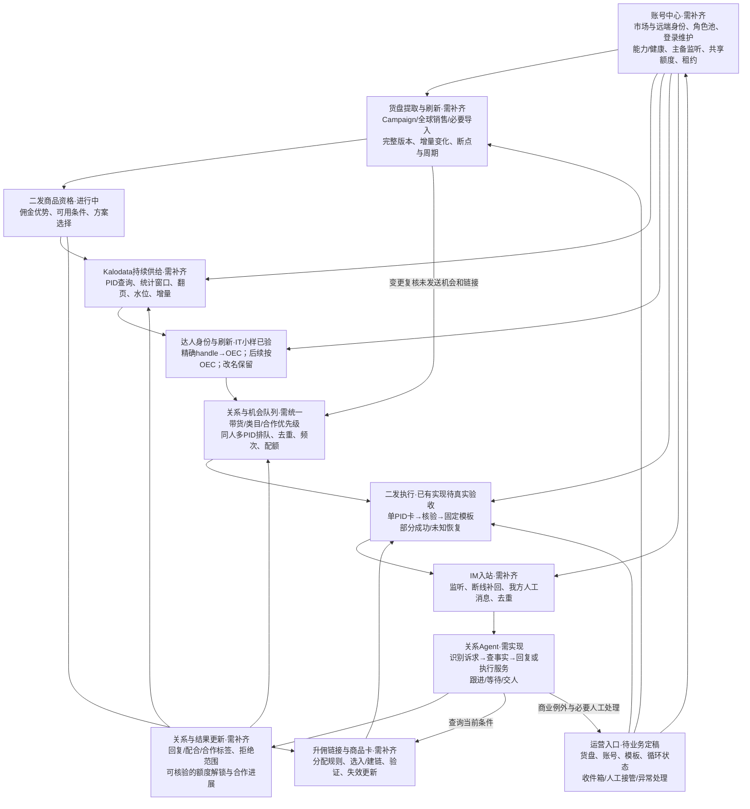

# 二发自循环与IM回复：第二轮产品校准

日期：2026-09-13。依据：使用者第一轮11项答复。本文覆盖上一轮架构中对应的未决口径；仅更新设计，不启用任何真实任务。

## 已确认的版本范围

- V1：持续扩大二发有效覆盖，同时接收TikTok IM并由AI回复。V2：一发主动推品、找合适达人；保留现有代码，不继续扩大一发开发。
- 二发定义：在Kalodata找已经带过精确PID商品的达人，给新的升佣链接邀请再次推广。不是“第二条消息”，也不泛指所有未回复催促。
- 二发池可有上千至上万PID。PID→历史带货线索→稳定达人身份→二发队列是主链；先选品还是先全面采线索、AI介入位置仍待讨论。
- 达人优先级考虑整体带货能力、类目表现与已有互动/合作；新市场没有关系记录时不得因此排除全部新达人。具体权重未定。
- 二发一次一张PID商品卡加一条固定话术；同达人其他PID留为独立机会，下一次何时联系未定。一发多品组织方式留V2。
- 二发品必须有佣金优势；模板由运营设置少量版本并批量复用，不再要求复杂的逐条推广理由或逐达人模型生成。佣金比较与分配须区分。
- 目标是持续找线索、扩大达人池、持续触达与接续回复；运营不应逐条介入正常二发。“持续”是持久计划自动续跑，不是无配额时重复请求或无条件重试未知发送。
- 用户提供的平台口径：每日最多新触达500达人；新达人在未解锁前最多5条消息；回复或添加商品卡进橱窗后，不再受这两个新联系限制。此处是用户业务输入，尚未独立验证平台计数主体、重置时区、卡片计数与解锁证据。
- 预算暂不讨论，不把尚未填写预算作为本轮设计依赖；不等于无限调用模型或授权新增费用。保留实际用量记录。
- 账号管理、货盘提取/刷新、达人数据更新是V1闭环必需模块，不能留成“未来系统设置”。首页工作组织方式仍未定。

## 修订后的完整循环

共享底座：自控数据库、标准事件、持久任务与唤醒、关系控制、账号协调、原始证据、模板/规则版本、结果记录、故障聚合及备份恢复。上述多数目前分散或未实现，不以单个接口成功宣布闭环完成。

## 旧BDHub必要模块核对

| 必需能力 | 已核对旧入口 | 新系统应保留的事实/语义 | 新系统缺口 |
|---|---|---|---|
| 账号管理 | docs/operations/account-pools.md；dashboard/account_readiness.py | 采集/发送/监听/建链/样品等角色；能力与登录、租约分开；维护收尾与主备；实际远端身份可能共享 | 统一账号中心、维护与新系统资源调度未接通；旧48小时维护是旧规则，是否沿用另确认 |
| 两来源货盘 | bdhub/research/commerce_sources.py | Campaign完整版本未完成前保留上个完整版本；全球销售单独来源；PID同源方案与账号关联；分页恢复 | 当前新系统主要5商品切片，尚无持续全货盘链 |
| 筛选与方案 | campaign_catalog.py、catalog_rules.py、commerce_selection.py | 全量采集不等于全部合格；总佣金/公开佣金/达人佣金区分；筛选可配置 | 新版资格、分成、有效期等需要明确业务规则 |
| 升佣链接 | commerce_links.py；send/taplink | Campaign与全球销售的创建路线分开，全球销售可能先选入；绑定核验、失效与未知结果保留 | 目前只核验Freegrin既有卡；未接自动准备/更新 |
| Kalodata | bdhub/research/kalodata.py；dashboard/kalodata_api.py | PID与历史带货来源、查询窗口、翻页及采集身份独立 | 当前固定导入50边；未做持续新增供应 |
| 身份/画像 | profile采集及新creator_identity/profile_refresh | 新handle精确发现，已知OEC直接刷新，缺字段与改名不丢身份 | IT小样已验；生产刷新频次及与二发队列联动待定 |
| 发送/监听/回复 | send、imbase、monitor、reply | 统一消息与对方身份、送达核验、入站补回、人工消息、唯一执行归属 | 本地试点执行与只读IM已有；持续收信及AI回复未接通 |
| 服务与结果 | sample_review、share_link、消息与合作记录 | 解释、查询、申请/审批/建链是不同动作；达人陈述与平台事实分开 | 第一批自动回复场景及可执行动作待用户确认 |

旧代码只读，表中入口不等于该市场当前生产权限。较新货盘方案见旧docs/operations/single-catalog-two-sources-20260910.md，较早多页面方案不自动继承。旧catalog_rules默认正佣金差、可用状态、剩余超过两个月是代码默认，不等于新系统已批准参数；实际配置可能覆盖默认。

## AI与程序的分工建议（未定案）

程序负责货盘同步、明确资格、精确PID查线索、OEC解析、已有结构字段排序、去重、额度、发送与回执；这些工作不要求为每条PID×达人调用模型。

商品语义分类可按商品版本复用；关系标签从真实回复事件增量更新；只有规则难以判断的候选才考虑AI分析。回复Agent按当前消息、相关历史、未结事项和必要商品事实工作。不能把“预算暂不考虑”解释成对全部线索反复做模型审核。

供给任务与发送任务解耦：发送额度耗尽进入等待，不丢队列；货盘或线索是否继续采集由缓存需求和来源限制调度。刷新使未发任务重核条件，不覆盖已发送内容或未知回执。没有新消息时不持续唤醒模型。

## 第二轮10问（待答）

1. 每日500新达人按市场、机构远端IM身份还是登录账号计算，何时重置？旧记录存在不同ACC共享远端IM身份，不能默认账号数乘500。
2. 五条是回复/加橱窗前累计上限吗？一张卡加一条文字是否占两条？添加橱窗在现有后台哪里能确认？无法核实时不能仅凭发送成功标解锁。
3. 升佣分配沿用旧版哪套规则？商品总佣金/公开佣金/最终给达人佣金不同；是否保留期限、库存、评分等二发硬筛条件？请给常用规则或指定旧界面配置入口。
4. 货盘自循环允许自动做到哪一步：刷新已加入活动、加入新活动、选入商品、按规则创建/更新升佣链接？哪些属于日常自动处理，哪些需要人决定？此问题是产品权限定义，不在本轮执行这些动作。
5. Kalodata首期采用多长历史窗口、每PID什么抓取范围及重采条件？是全量合格PID轮转，还是先满足待发队列再补长尾？如旧版有认可设置可直接指定沿用。
6. 同达人命中多个PID、或同PID已发未回复，后续分别何时可发？达人正与AI沟通时，新二发机会应等待还是继续？两类重复不得共用简单永久去重。
7. AI收到回复的首要目标是什么：推动加入橱窗/再次创作、解决链接样品问题、引导其他渠道或其他？请给最常见三种原话及你的理想答复。
8. AI可自行处理哪些实际业务：查条件/给已有链接、补卡、查样品、创建新链接、申请/审批样品、改佣、承诺寄样或费用？请区分可以自动、只能解释查询、必须交人。
9. 哪些回复属于拒绝当前商品、暂时不做、停止全部营销？“积极/已合作”标签分别以什么事实为依据；人工回复后AI何时接回？先明确几个典型例子。
10. 墨西哥历史哪些会话最值得先作为回复参考：哪段时间、哪些运营人员、哪些成功或失败场景？可先由助手只读抽样，再由用户选认可/不认可答案，不自动学旧报价或恢复旧会话。

## 实施约束

先确认影响实际业务的答案，再落地统一二发主循环。当前一发功能保留作为V2资产；旧被否定的二发批次仍暂停，新模板与真实试点不因本次设计答复自动启动。上一轮问题6“是否需要佣金优势”已解决，撤销其未决状态；未解决的是具体分配/比较和筛选参数。
