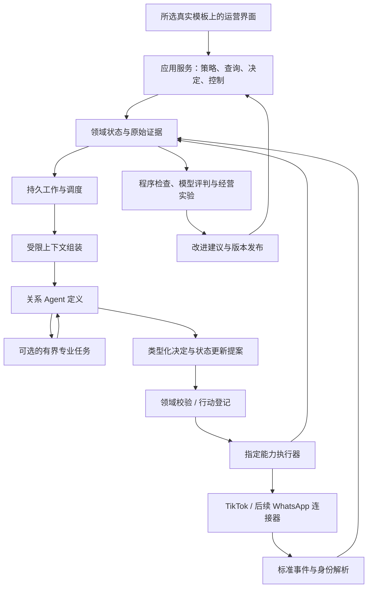

# BDHub-Agent 系统架构与取舍

本设计以独立新系统为目标，先定义业务合同，再通过对照验证选择具体框架。当前产品基线见[项目文档](../PROJECT.md)，当前实现结构见[技术文档](../TECHNICAL.md)，历史未决项见[决策登记](../DECISIONS.md)。旧 BDHub 只读，现阶段没有迁移或执行真人操作。

## 1. 对旧方案的复盘

公开原始资料支持保留持续关系、证据来源、执行意图、暂停/接管和结果核验；它们解决业务正确性，与选什么模型无关。[案例研究](../research/agent-cases-review.md)同时支持撤销“固定三个自主 Agent”“必须自建 PostgreSQL 调度”“因为旧项目用了 Pydantic AI 所以新项目继续用”的预设。

关系 Agent 可以是一个可复用定义，为不同达人加载独立状态；机会分析可以是批任务；评估可以是持续测试流水线。复杂专业任务是否委派，要比较完整结果、费用、延迟和人工介入，而不追求框图上角色多。

## 2. 不依赖框架的责任结构

已确认以关系 Agent＋程序调度/执行＋按需专业任务为基线，效果验证后再增加Agent；评估按流水线组织。长期关系、原消息和业务状态保留自控数据库，模型只接收当前必要上下文。

界面是工作入口，不能持有唯一合作状态。模型可以选择下一步，但执行服务负责市场身份、规则、频次、资源和结果语义。运行时负责恢复与调度，不能把恢复成功当平台动作成功。

## 3. 独立部署边界

新系统最终拥有自己的应用服务、业务数据库、Agent 定义和连接器。旧代码/接口仅用于查明已验证协议与事实，不作为长期远程页面依赖，也不整仓复制后改名。

建议先以模块化应用评估：领域服务、Agent 适配、连接器、事件/工作、评估分别有边界，可以独立 worker 运行。只有资源、故障域或部署职责证据要求拆分时，才拆微服务。模块化建议不等于已决定 Python/TypeScript 或持久框架。

领域代码不依赖具体 LLM SDK。模型框架实现统一 `plan(context, tools, budget) -> Decision`；执行器实现指定业务能力，不给模型任意 SQL、shell、远端账号对象或浏览器上下文。可替换性通过两个候选适配器和同一套评估证明，不能只在图上画抽象层。

## 4. 待比较的运行方案

| 方案 | 成本与收益 | 何时胜出 | 尚须证明 |
| --- | --- | --- | --- |
| A 类型化 Agent＋轻量持久工作 | Pydantic AI 或 Agents SDK＋自有事件/工作表；依赖少、领域数据可控 | 单次判断短、分支有限，团队能承担调度与恢复实现 | 租约、版本、在途写入、到期与重启的真实维护成本 |
| B 类型化 Agent＋Temporal 等成熟持久层 | 模型/工具为活动，跨天等待和恢复由成熟平台承载 | 跨天长流程、上线恢复、可靠定时显著减少自建代码 | 私有连接器接入、活动重试策略、工作流版本和运维/托管费用 |
| C LangGraph 状态图 | 图与checkpoint/interrupt可显式观察分支 | 多分支状态、人审、回放明显复杂且可读性更好 | 节点重入、副作用幂等、持久存储、长期事项归属 |
| D 托管 Agent 运行时 | 供应商管理循环/会话，应用响应受限工具 | 当前不采用托管长期业务会话；只有符合自控状态边界的短任务方式才可另行研究 | 账号可用性、数据保留、事件补回、费用、私有工具连接与服务承诺 |

这些方案有可组合关系：Pydantic AI 与 Temporal 并不互斥。当前官方 Pydantic 文档推荐 `TemporalDurability`，旧 `TemporalAgent` 已弃用；仅 attach capability 而在普通 Web 请求里运行仍不耐久。OpenAI 当前文档中的托管 Agents API是可研究候选，文档存在不证明当前账户可用或达到本业务SLA。[原始来源](../research/agent-cases-review.md)

不能只把模板里的 AI Chat 接上模型就作为系统：多数模板只有前端会话演示，不提供领域事项、执行门禁、长期等待与结果核验。

## 5. 数据与行动合同

### 领域对象

新数据模型最少需要：关系与身份绑定、商品/Offer 引用及版本、策略/计划、发现暂存与机会、合作事项及事件、控制状态、工作项/模型运行、行动及尝试、执行结果、参考案例/Skill版本、实验分组。

原始事实、派生摘要、经营状态三类分开。业务资料保存来源时间、适用范围及置信来源；可检索摘要过期能重建，不能作为拒联或商业承诺唯一依据。长期业务数据自控已经确认，不使用供应商长期会话作为关系/事项真值。模型服务的数据保留与控制能力须按所选供应商核实；只发送必要工作集不等于承诺供应商零留存。

### 输入合同

标准事件至少有 `event_id/source/ref/revision/type/market/relationship_ref/occurred_at/observed_at/mode/correlation_id`；mode区分当前事件、历史导入和评估回放。原始消息先耐久保存再调模型，历史事件不能直接成为真实外发触发。

上下文由宿主绑定稳定身份、当前控制/事项版本、入站序号和政策版本。工具只返回本任务所需事实及 `ref/status/observed_at/valid_until/facts`。空、缺失、过期、不可用和冲突不能混成零。

### 决策合同

Decision 表达主要下一步（邀请、回复、补问、等待、交接、关闭）以及受限 `state_updates`；一次可以更新多个已提供事项，但外联统一协调。所有目标和证据必须来自输入或真实工具返回。时间/事件条件使用声明式结构，不允许模型任意创建系统任务或脚本。

### 执行合同

新的逻辑行动 ID 关联冻结参数、期望版本、策略、证据、过期时间和执行范围。每个文字/商品卡组件拥有自己的执行尝试和回执；逻辑触达完成由所需组件结果聚合，不能用文字成功覆盖卡片未知。

本地行动登记与执行组创建应同事务或有持久幂等桥。SDK 请求提交前记录尝试；不跨任何模型、工具或平台网络调用长持数据库事务或行锁；先用短事务记意图，释放后调用，再用短事务回写结果。收到当前原始回执后更新状态。超时或进程消失只能进入 unknown，再只读核验；任务框架重试不包住无幂等保证的外部写入。

## 6. 并发、恢复与接管

领取工作使用短租约和 fencing token；同关系版本串行提交，独立关系可并行。模型调用期间释放数据库事务，完成后比较 control/case/inbox/policy版本；任一不匹配则作废旧稿并重新判断。

人工接管和最后提交资格由同一关系临界区判定。接管取消未提交行动，已提交网络请求不能物理撤回，应向运营展示并核验。新消息可以触发当前服务，但不能被用来盲重发旧营销内容。

必须覆盖的故障点：重复事件、回执先后乱序、工作租约到期、旧worker迟到、模型超时、行动已建未回填、远端成功但回执丢失、整机重启、策略收紧、账号不可用、历史导入与旧回复引擎同时触发。

框架checkpoint代表“恢复到哪里”，领域账本代表“实际上做了什么”。二者有引用关系但不能争夺真值。Temporal Activity和LangGraph节点都可能重执行；外部动作不因此成为 exactly-once。

## 7. 先比较什么，再选框架

不立即做四套完整系统。先用相同的少量核心场景测试单 Agent 基线，场景包括：同款链接、样品入口故障、同人多事项、旧事实过期、明确拒联、人工中途接管、等待唤醒和外部结果未知。

比较至少两个“完整小闭环”候选，记录：

- 正确下一步与事实/权限错误。
- 重启、暂停、版本变化和重复事件的处理结果。
- P95延迟、模型/工具成本、人工介入和维护步骤。
- 为耐久行为新增了多少必要领域代码，哪些由框架可靠承担。
- 连接器能否在当前 Mac 运行，未来如何迁到自控服务器或混合部署。

只有这些证据才用于最终架构选择。角色数量、代码行数、GitHub star、厂商研究中的其他任务提升，不能直接决定 BDHub 的方案。

## 8. 从旧系统迁入

1. 从[接口清单](../contracts/legacy-interface-inventory.md)整理协议、身份、参数、错误与结果语义，保留源码指纹和取证日期。
2. 在新库用模拟夹具实现领域合同，不复制旧库表结构的全部历史包袱。
3. 为少量已明确范围的历史数据设计只读导出/导入，区分身份、原消息、旧执行事实与当前待办。导入可重复运行且不触发发送。
4. 为平台连接器使用新项目独立配置/合法认证，不能复制设备指纹或把旧账号权限视为新环境已验收。
5. 受控试点前逐项核对原系统暂停、sending/unknown、账号租约和关系外联归属；切换必须另有明确范围与授权。
6. 验证新链路后扩大接管；最后保留旧系统只读查阅或正式退役，是否清理历史另行决定。

本轮未授权改变旧系统，因此切换流程只设计，不执行。将旧 API 名称复制到新项目不能代替副作用、认证和幂等合同的验证。

## 9. 选择与开放顺序

UI 已选 TailAdmin Next.js 免费 MIT 版，缺页自建；七路由前端原型位于 `apps/web`，只验证界面和模拟状态，未连接真实业务。已增加[本地持久运行切片](../implementation/local-runtime-v1.md)，用独立 SQLite、确定性判断及模拟平台验证恢复合同；尚未做两种正式框架的对照。前端技术栈和 PoC 存储不锁定 Agent 运行框架。关系协作形态与长期业务数据自控已明确；框架通过小闭环对照选择。部署以当前持续开机 Mac 为现状，服务器规格依据[容量研究](deployment-capacity.md)和负载测量决定。

研究、界面、业务策略和运行代码分别有发布状态。可以完成详细 PRD 和合同而不提前启用生产动作；也不能因为原型精美就跳过真实消息、账号和业务验收。
