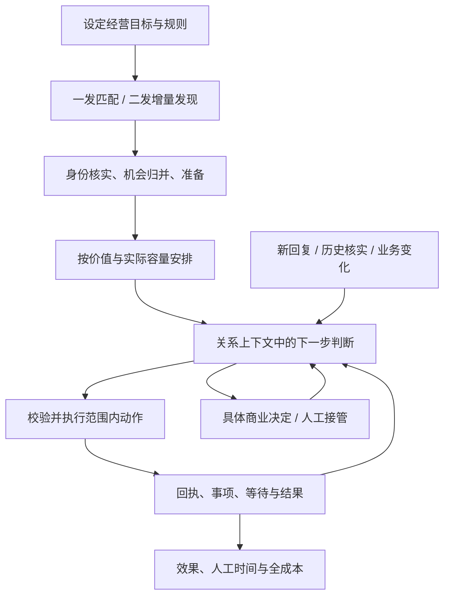

> 历史研究版本，仅用于追溯。当前规则见 ../PROJECT.md。

# BDHub-Agent 产品需求文档

> 当前确认规则汇总（2026-09-13最新问答）：[二发自循环规则](../architecture/second-cycle-confirmed-policy.md)。覆盖下文早期未决口径；产品规则确认不等于已上线。

本文件是独立新系统的需求基线。已确认的经营目标与尚待选择的技术/UI 方案分开记录；未决项集中见 [DECISIONS](batch-era/DECISIONS-20260913.md)。研究截至 2026-09-11，当前没有生产功能上线。

## 2026-09-13 产品经理校准：V1二发自循环与IM回复

V1首要结果为二发持续扩大有效覆盖，同时接收TikTok IM并由AI回复；一发主动推品与匹配移至V2，已有实现保留。二发明确为Kalodata精确PID历史带货达人接收新的升佣链接，每次单PID商品卡加一条可复用固定模板。佣金优势是商品筛选条件，不要求逐达人生成推广理由。

账号中心、货盘提取与周期刷新、Kalodata持续供给、稳定身份与画像更新、升佣链接准备/更新、共享联系额度、IM监听补回、关系Agent与合作记录均是V1闭环必要能力。当前尚未贯通。运营目标是持续计划自行运行，正常二发不逐条人工干预；具体重新联系规则、账号配额归属及回复可执行动作待确认。预算暂不作为本轮讨论或设计前置条件。

使用者提供每日500新达人、未解锁新达人最多5条消息、回复或加入橱窗后解除这两类限制的业务口径；计数主体、重置时间、卡片占条和解锁证据待核实，不把该口径写成所有账号/市场已经验证的事实。

最新已确认内容、旧版必要模块、循环图与第二轮问题见[二发自循环产品校准](../architecture/second-cycle-product-review-20260913.md)。本节覆盖下文早期版本中冲突的优先级和未决描述；不是当前生产已完成或真实发送启动记录。

## 1. 问题与目标

机构拥有大量商品、达人资料和已积累沟通，人工难以持续完成找品找人、逐人组织消息、接续回复及核验合作结果。单次批量任务和固定话术容易重复覆盖同一达人，遗漏明确需求；单次 AI 建议又无法承担跨天推进责任。

系统应从经营目标和事件出发，持续寻找有价值的机会，核对事实，执行范围内行动，并根据回复与业务变化继续推进。运营只管理方向、重要关系、商业例外和少量系统问题。设计必须能够解释行动依据、恢复中断、识别重复/未知结果，并证明降低人工负担或扩大有效合作。

### 目标

- G01：二发持续增加去重后的有效达人覆盖；一发匹配合适的新合作。
- G02：范围内自动选品、选人、生成个性化消息、发送、接续常见回复。
- G03：一位达人跨商品、跨计划共享真实关系上下文，避免相互冲突的外联。
- G04：墨西哥历史回复成为场景/风格/评估资产，并在核实后接续仍有效的未结事项。
- G05：1–2 位运营能管理持续工作，人工队列不会与消息量等比例增长。
- G06：新项目独立运行，按能力迁入和验收，最终可以替代旧 BDHub。

### 边界

首期市场为 MX/BR/IT，语言为 es-MX/pt-BR/it-IT，币种分别 MXN/BRL/EUR；先 TikTok IM，后 WhatsApp。日触达没有固定业务硬上限；平台额度、账号、联系频次、费用和回复/履约承载量仍约束执行。

首期不接管完整 MCN 签约、付费商单、视频制作、广告投放、财务结算、网站发布。发现这些诉求时保存上下文并交接。样品查询和有效链接交付进入主干；新建链接、选入/加入活动、样品批准或修改商业条件各自有独立启用范围。

旧 BDHub 在本轮保持只读。新系统建设不隐式授权恢复其暂停任务、复制认证身份、切换生产账号或修改旧库。

## 2. 使用者与日常任务

| 角色 | 主要任务 | 产品应减少的负担 |
| --- | --- | --- |
| 经营负责人 | 选择市场/货盘/商业条件、确定优先级、处理特殊报价 | 逐人选品、每日反复建批次、靠表格拼凑结果 |
| 达人运营 | 重要会话接管、明确商业决定、校订参考案例与抽查 | 查状态、反复解释、记到期、重复催促、排查大量同因故障 |
| 系统维护责任 | 连接器、数据同步、容量、模型质量与版本发布 | 人工盯所有任务、重启后手动重放、无法追踪失败来源 |

1 人时三类责任可以兼任，但职责、费用和时间仍应计量。负责人字段表示业务责任，正式多人使用需要真实身份认证和访问控制。

## 3. 产品对象与事实

| 对象 | 定义与约束 |
| --- | --- |
| 关系 | 首期以 market+已核实 OEC 标识达人；Handle 可变，昵称与号码不能单独证明同一身份 |
| 商品 | 市场+精确 PID，对款式/SKU有必要时另核验；相似名称不能替代同款 |
| Offer | 具体商品、活动/列表、佣金、样品路线、有效期和来源版本；不同活动条件不能拼接 |
| 经营策略 | 市场、人群、货盘、允许动作、商业条件、时段/频次与资源的版本化规则 |
| 经营计划 | 策略下持续推进的目标，可无固定结束日；不是平台 Campaign |
| 发现信号 | 画像匹配、具体带货记录、原消息等有时间和范围的证据 |
| 机会 | 一位达人与商品/目标的待考虑合作，能合并多个来源，不自动变成人工任务 |
| 事项 | 已决定推进或来自实际咨询的事务；一位达人可有多个，无具体商品时允许先建立咨询事项 |
| 行动 | 某一时点的具体外发、准备或等待意图，带版本和依据；与实际结果分开 |
| 结果 | 发送接收、方案采用、样品状态、内容发布和收入等各自可核验的事实 |

平台事实、达人陈述、人工确认、模型推断分开存储。摘要是索引，不替代原消息；历史人工回复不自动成为正确公司政策。

2026-09-12 用户明确的身份规则：新名单允许输入 handle，精确 Find 后以市场/OEC 归并正式达人；尚未取得 OEC 的输入留在发现线索区。已知 OEC 的刷新只按 OEC 请求，handle 改名不改变 creatorId 或业务归属，原名字保留为历史。旧 handle 被其他 OEC 使用时不得迁移原关系；响应不返回名字或请求失败也不删除达人。实现、重复来源与名字复用验收见[身份与改名方案](../architecture/creator-identity-and-rename.md)。

## 4. 主流程

这张图定义责任，不要求每个框使用一个模型或服务。Agent 数量由实际能力隔离和评测决定，不能由页面数量决定。

## 5. 功能需求与验收

### F01 经营策略与计划

运营可用自然语言或结构化字段表达目标，系统将其整理成可审阅的策略草案。草案必须列出明确值、引用的市场规则、缺项和预计影响范围；没有说出的商业数值不由模型补造。

必需字段：名称、市场、货盘与人群范围、目标、动作集合、商业规则引用、时段与频次、费用/服务预算、负责人、版本。二发优先和一发探索可配置；不预设未经效果验证的比例。

验收：同一请求重复保存不产生多份计划；修改有版本冲突提示；暂停可以区分停止新获客与停止全部自动外发；已发送事实和已作承诺不被批量改写。缺某动作规则只阻止依赖它的部分，其余查询/准备可继续。

### F02 货盘与合作方案

统一查询各市场可用商品，但保留来源和具体 Offer。可按类目、价格、销量、评分、佣金条件、有效期、样品路线及准备状态筛选。数据缺失展示未知，不用0补齐。商品可见、匹配合格、可准备、可发送是不同状态。

验收：同 PID 多活动条件不混合；方案变化只重评受影响机会/未提交行动；过期或不明链接不可用于确定性交付；MX、BR、IT 的样品与创建规则独立适配，不用网站样品额度规则替代所有推广资格。

### F03 一发匹配

依据用户最新要求重新设计，不沿用未实用的旧 first_eligible、固定粗筛或打分。规模为约1k–10k商品、上万达人；详细方案和 token 合同以[匹配设计](../architecture/matching-and-token-budget.md)为准。

从商品找达人，也从明确达人需求找商品。先使用结构化索引和硬资格召回，再按少量候选进行语义判断。比较类目、价格带、视频/直播形式、有效画像、明确偏好、近期联系及在途合作；内容风格只有取得实际内容证据时才使用。

验收：候选召回不消耗聊天模型 token；规则/索引先缩小到有限候选，最终按关系合并选方案与话术，记录实际 token、重工与费用；候选身份来自允许范围；推荐理由可回到证据；过期资料进入按需刷新，不把缺资料判为无价值；同达人命中多个商品时一次组织适量机会，不分别创建冲突外联。样品方案尚未准备时不能承诺已经寄出或必然批准。

新画像按市场/OEC增量进入既有画像匹配数据集，已有记录保留业务身份、控制和初始来源，新增达人建立精确注册表映射。统计指标取同一次观察，历史类别可附原时点使用；不同统计截止日分组，不把缺值当0。受影响的最新查询有界重算，旧结果/包/人工判断不改写，页面明确选择切换新结果。见[新画像同步](../implementation/registry-profile-matching-sync.md)。

### F04 二发持续发现

复用精确商品关系边与证据，按商品/关系变化增量重评，不为每条已有关系重新调用模型做相似度判断。不要把二发理解为第二条消息或仅限无样品商品。

2026-09-13使用者确认：二发使用少量固定模板，不逐达人调用模型；一发保留个性化。二发文案以使用者提供的墨西哥实际模板为基准：先BJN商品卡，确认后发一次固定话术，引导加入橱窗并用于下一视频/LIVE；样品只作“页面有入口时可申请”的条件说明。其他国家不携带MX的WhatsApp和邮箱，不把返校季、八月或销量复苏写死。完整实现与真实读取记录见[意大利二发系统](../implementation/italy-second-system.md)。

按精确 PID 查带货记录，保存来源、统计窗口、分页/游标和已覆盖范围。系统按可准备机会库存补充新任务，统计新增唯一达人率、合格率与重复覆盖；低新增商品减少资源，保留长尾探索与合理回访。

验收：重启从已保存范围继续；同人跨商品/计划去重；带货记录不推定现在仍有实物，也不把窗口内销售当作窗口内新发布视频。明确“比原方案更高”需可比较的个人实际条件；仅知道公开佣金时只陈述我方已核实条件。平台覆盖有限时不称全量。

人工与其他来源名单可批量输入handle、@handle或TikTok主页链接：本机预览去重和错误，明确提交后逐项核验当前OEC并归并入池；Find已取得OEC但画像不完整时保留身份。批次支持持久状态、暂停和只继续未处理项，已有档案仍按OEC刷新。见[批量入池实现](../implementation/creator-discovery.md)。

### F05 机会池与关系协调

未核实身份先进入发现暂存，核实后形成关系机会；同关系+商品+目标的活动机会合并来源。大量候选留在机会池，只有当前值得推进或真实咨询才关联事项。控制权按关系协调，事项阶段按商品/目标分别保存。

验收：同人一发二发并发命中只经过一个外联协调点；拒绝某商品不关闭全部关系；明确停止营销作用于所有相关队列；新主动服务请求不自动解除营销拒联。身份绑定撤销后，错误历史不继续进入该人的模型上下文。

### F06 个性化话术

一发提供固定正文、固定骨架+AI表达、按策略生成三模式；二发仅使用版本化固定模板和已核实字段填充。可设置语气、长度、沟通目标、必要条款、CTA、可声明事实和认可/不认可案例。生成输入包括本次商品、当前需求、相关历史及有效规则，而不只是替换名字。

支持三语言原文与标注的中文辅助理解，日期/币种按市场格式化。金额和链接由业务事实填充，生成结果带策略/模型/证据版本。已经提供的信息不重复追问，没有内容证据不说看过或喜欢某条视频。

验收：修改单条草稿不自动成为全局模板；改策略对未发内容重新评估；预览不发送；本地语言与事实分别评测，不能用流畅度掩盖错商品或错条件。

当前实现切片（2026-09-12）：`italy-profiles` 的有效关系资料包可进入独立意语草稿服务。首期要求已关联稳定意大利身份、具有同口径类目适配依据；支持自然友好、简短直接、适度详细及最多 500 字的表达要求。三市场、三种生成模式仍是完整产品目标，`/agents` 的模拟配置不自动迁为真实策略。

当前未接入已核验 Offer，生成目标限定为探询合作意向；不把用户的表达要求当成佣金、寄样、品牌或商品卡的已核验事实。writer 与独立 reviewer 按同一份冻结事实分别生成与检查，展示意语原文、中文辅助理解、引用事实和检查问题；机器检查不产生发送授权。

该切片保留多版草稿、资料/策略指纹及每阶段服务商实际返回的 usage，成本按报价估算并与当前预留分开显示；未返回的用量或费用保持未知。旧版本过期后正文及原依据保留，新版本另建；未确认提交恢复原请求，模型调用结果未知不自动再生成。当前页面只能查看、复制原文，没有发送或采用动作，不覆盖已冻结二发稿件。9月12日曾完成3条真实Flash实验，原记录保留；9月13日按使用者要求停用二发新模型请求，一发保留能力及独立预算。使用与历史验证见[个性化意语草稿](../implementation/italy-outreach-drafts.md)。

### F07 实时回复与合作事项

标准消息进入持久事件，关系 Agent 读取当前工作集，提出回复、补问、等待、交接或结束，以及受限状态更新。原生人工消息、新入站、业务变化都能使旧未发稿失效。

验收：无 PID 咨询可建立事项，确认后归并绑定；一条消息多诉求可更新多个事项，但不会产生互不协调的多条回复；正常等待自动管理；仅致谢或没有必要下一步时可不追加消息。关闭事项有结束原因，聊天结束不等于合作成功。

### F08 商品卡、链接与样品服务

常见场景包括已有实物索链接、申请入口不可用、样品待审/未收到、链接过期、佣金未生效。工具先区分用户陈述与平台事实，再返回准确路径/状态。官方处理路线可以自动解释和等待，不因机构不能代批就转人工。

验收：同市场、账号、PID、列表和 Offer 绑定一致；查询不隐式创建；新建/改佣/审批是独立行动范围；文字和卡片分别核验，部分成功不能重发整个组合。样品状态答复完成与实物收到分开记录。

### F09 墨西哥历史知识与接续

按稳定关系和需求拆分历史事项，形成已解决、已过期、仍可行动、状态不明四类，保留原时间与来源。可提炼场景/风格候选，由运营校订成参考案例。

当前接续需要重查最近消息、已在其他渠道完成的交接、今天的商品/申请/方案、拒联和人工控制。历史导入不直接进入真实外发；核实仍有效后产生新的当前判断。

验收：最后发言方、未读或旧 pending 标记不作为唯一未结依据；旧报价不当今天有效条件；评估回放仅提供当时信息，今天接续使用当前事实；一份历史消息不因重复导入产生多次行动。

### F10 人工决定、接管与交还

决定卡必须包含请求、已核事实、具体选项、费用/交付影响、建议、负责人和作用范围。共同技术原因可以聚合，商业条件不同的个案不能仅按关键词批量批准。

接管先持久改变控制版本，取消未提交动作；已在途动作展示状态并收口，不能承诺撤回。交还后从最新事实重判，不继续发送旧草稿。记忆和上下文整理可辅助人工，但不能自行夺回外联。

验收：生成中接管、原生我方消息、重启、重复事件和新旧系统切换都不双回；对特定报价的批准只用于其明确范围，不扩成公司通用规则。

### F11 调度、容量和运行

以确定性队列管理事件、优先级、到期、资源和退避。优先服务已有明确需求和承诺，再安排二发与一发探索。等待期间不持续调用模型；单关系外联串行，不同关系和独立查询可并行。

分别计量唯一达人、逻辑触达、消息组件、网络请求、模型 tokens、费用、人工分钟。无业务日上限不代表无模型预算或平台限制。未知额度不当无限，平台拒绝不触发换号规避。

验收：积压超阈时减少新获客，保留已有服务；恢复采用稳定窗口防抖；临时读取错误有界重试，认证/验证问题聚合处理；退出/重启保留工作与暂停意图；系统可解释“为什么没有继续发”。

### F12 Agent 与 Skills 管理

界面管理业务目标、指令/场景/工具/模型配置、发布版本和测试案例。不是为每个达人显示一台常驻机器人。按需专家必须有任务范围、资源预算、返回合同和完成条件；评估可以是独立流水线。

产品 Skills 元数据包含适用场景、市场、所需事实/工具、策略键、允许动作、完成证据和测试引用。Skill 不增加权限；过时规则、冲突案例或不可用工具阻止相关能力发布。开发用 Codex Skills 与产品业务 Skills 不混用。

验收：按需加载、版本锁定、失效重评、回滚；编辑后能用正反例检查实际决定与工具参数；历史学习只能提出版本变更，不自改商业权限。

### F13 效果、费用与质量

核心结果是单位人工时间内有证据的有效合作进展，并逐步观察可归属机构贡献。过程指标包括新增合格覆盖、有效回复、方案采用、样品/内容状态、兑现承诺、重复联系、未知结果年龄、费用和人工积压。

验收：每个指标有分母、窗口、来源和去重单位；触达/发送/采用/发布/收入分开；共享链接无个体归属时只报告聚合，不强行归因。模型建议分数不是成交概率。改进策略经过对照验证后发布。

### F14 跨系统迁入与未来渠道

新项目持有自己的业务状态和执行能力。旧系统只读导入必须有明确范围、源水位、映射、校验和重跑去重；不拷贝活跃 Cookie、设备指纹或签名种子。执行能力逐项独立验证，迁入代码不等于迁入了真实平台权限。

正式切换时按市场/账号/关系定义唯一执行归属，核实旧在途和 unknown 后再接管。当前旧系统不能改，因此本阶段仅形成切换合同与离线回放，不借建设新项目旁路触达同一批真人。

WhatsApp 后续必须验证身份关联、共用号码、我方原生消息、回执与断线补回；共享关系和联系频次，不自动补发 TikTok 未知消息。

## 6. 代表性场景验收表

| 场景 | 正确结果 | 不能作为完成的结果 |
| --- | --- | --- |
| 已有实物要同款链接 | 确认商品，交付有效方案/卡片，分别记录实际接收与采用 | 再要求无关寄样；编造更高佣金 |
| 加橱窗后无样品入口 | 查询具体路线/条件，提供可行步骤或准确原因 | 重复已失败指引 |
| 商品坏了或用完 | 保存当前实物/障碍，停止不适合催拍，查允许支持 | 把历史带货当仍可拍摄 |
| 下周再联系 | 记录范围、时区和明确时间，届时先核验 | 每日自动催促或编造逾期 |
| 同人命中五款商品 | 归并关系，选择本次值得谈的少量机会 | 五个 Agent 分别外发 |
| 回复生成时人接管 | 控制先变更，未提交稿取消，在途透明收口 | 接管按钮成功但旧稿继续发送 |
| 一张卡未知、一段文字成功 | 逐组件核验，保留原意图 | 重发整个消息组合 |
| 历史问题可能已在 WhatsApp 解决 | 先核对交接，保持状态不明直到足够事实 | 批量补发迟到回复 |
| 高等级达人问基础问题 | 按实际需求服务，等级只影响资源优先级 | 按等级跳过正常服务 |
| 询问固定费用/MCN/投流 | 整理条件并交具体负责人；保留已有商品合作 | 自动签约、付款或花投放预算 |

## 7. 界面验收要求

视觉方向已选择 T03 TailAdmin Next.js 免费 MIT 版 2.3.0，所缺业务页面自建，见 D15。`apps/web` 已实现七路由交互原型，覆盖目标配置、机会/商品列表、关系会话、具体决定、知识/案例、结果和运行状态；原七页数据与执行为本机模拟；匹配工作台另有意大利真实历史数据的独立离线测试集，未连接真实发送或模型。遵循免费模板的真实基础组件与视觉，不复用之前生成图或另定一套视觉风格。PRD 的真实模型、连接器、业务数据库和执行能力仍须分阶段实现与验收。

主流程要能从目标追到机会、消息、事项与结果；少量常用入口，证据与技术细节按需展开。说明已处理、等待和需要决定，避免把后台候选堆成人工待办。输入框、过滤、分页、批量范围、暂停/恢复、接管/交還、草稿版本冲突、空态、错误态与未知状态均有明确反馈。

首期以桌面效率为主，窄屏至少能查看决定和接管关键事项。中文操作和本地语言原文同时可读；键盘焦点、可达名称、对比度与表单校验要满足实际使用。模板 Demo 本身不代表这些功能已经实现。

## 8. 非功能需求

- 耐久性：页面关闭、worker 重启、重复/乱序事件后可恢复；不丢承诺和拒联，不产生未知结果重发。
- 性能：按机会和关系分页，不全量达人×商品组合；索引、队列与事件读取有界。候选压测规模与服务时效先定基线，禁止用模拟队列速度推导平台实发容量。
- 成本：模型、工具、数据服务、人工及运维分别计量；常规工作和复杂调查可用不同预算，未评测模型不静默替换。
- 可观测：能从目标/关系追到事件、判断、工具证据、行动及实际结果；不展示或依赖隐藏推理。
- 数据：长期事实、权限和原始证据的归属明确，敏感认证不进入模型或日志。长期业务数据保留自控数据库已确认；模型调用的数据保留能力按供应商与账户配置核实，不承诺客户端设置等于零留存。
- 维护：版本化策略、提示、Skills、连接器与评估；回滚不撤销真实业务事实，不重发旧动作。

## 9. 实施门槛与完成定义

1. 调查与选择：清理登记、真实模板、案例反证、旧接口与设备容量；不清理旧文件、不先选视觉/框架。
2. 合同与离线基线：冻结核心场景、策略字段、数据/事件/行动合同，比较候选运行时；不调用真实外部写入。
3. 单关系完整闭环：历史/新消息→查事实→决定→模拟执行→等待/恢复；包括多事项和人工接管。
4. 一发二发闭环：持续发现、去重、排序、个性化内容与执行桥，证明大数据下仍有界。
5. 市场受控试点：明确账号/人群/动作/预算，验证真实接收、补回、恢复和经营质量；三个市场独立开放。
6. 持续运行与替代：有监测、备份恢复、责任排班和新旧切换证据，再扩大经营范围。

完整上线必须有正确性、实际业务进展、全口径人工时间与成本证据。高自动回复比例、页面可打开、代码构建通过和模型能聊天，不能单独代表产品完成。

## 10. 来源

- [必要旧接口及代码指纹](../contracts/legacy-interface-inventory.md)：已存在能力与读写边界。
- [公开 Agent 案例复核](../research/agent-cases-review.md)：单 Agent、委派、持久性和评估的原始资料。
- [模板候选](../research/ui-template-options.md)：视觉/组件选型资料。
- [清理登记](../research/cleanup-register.md)：不带入的旧入口、历史产物及自定义 Skills 候选。
- [运行合同](../architecture/agent-runtime.md)与[系统设计](../architecture/system-design.md)：本 PRD 的实现约束与待验证方案。

2026-09-13第三轮用户确认覆盖前述未决口径：配额按机构×市场，与登录账号无关；新达人我方最多5条，卡占1条；回复或加橱窗后解除这两类新联系限制，重置窗口未知。Campaign剩余>45天、库存>100是硬条件，评分>4是软偏好；佣金沿用旧分配思路。货盘刷新、加入活动、选入、规则建链/更新可日常自动化，周期链接清理纳入设计；本轮未执行平台写入。线索按实际容量分批PID动态补充，不穷举全部。加橱窗标积极、明确拒绝打扰排除营销。真实问题与工具边界校准见 docs/architecture/third-round-mx-evidence-and-replies-20260913.md（路径相对仓库根）；同达人频次是建议未启用。

2026-09-13第四轮回复业务方向：二发索样/预批准邀请解释复推、不再由机构给新样；用完或损坏引导联系商家询问补样，不承诺补寄。活动失效、LIVE缺链接、索更多目录/退款样品问题转人工。个人卖家佣金更高不全局停用方案，如实解释个人条件；只对外报达人佣金，不暴露机构总额/差额，Boost暂不解释。商品相同需核对身份，不将历史带货当现在必有样品或无证据保证品质。完整规则、助手拟定西语稿、工具约束和待校准项见 docs/architecture/reply-policy-round4-20260913.md；草案未发布，未真实回复。

最新周期与接管验收：货盘每日全量刷新、发前复核，TAP每日同步并补查近期延迟数据；Kalodata初始窗口14天。人工事项超过24小时仅内部提醒，人工填写处理结果并明确交还后AI才读取最新上下文恢复。GMV按本机构TAP归属区分二发触达与其他达人，单次归因不足时标关联GMV。详见当前确认规则汇总。

## 当前实施拆分

已完成闭环实施蓝图收敛，见[意大利二发闭环](../implementation/italy-second-closed-loop-blueprint.md)。下一段为共享关系控制＋离线/只读容量供给；既有固定来源/ACC6试点需要适配，不直接扩量。用户规则、接口样本、当前实现与未接通能力分开验收。
