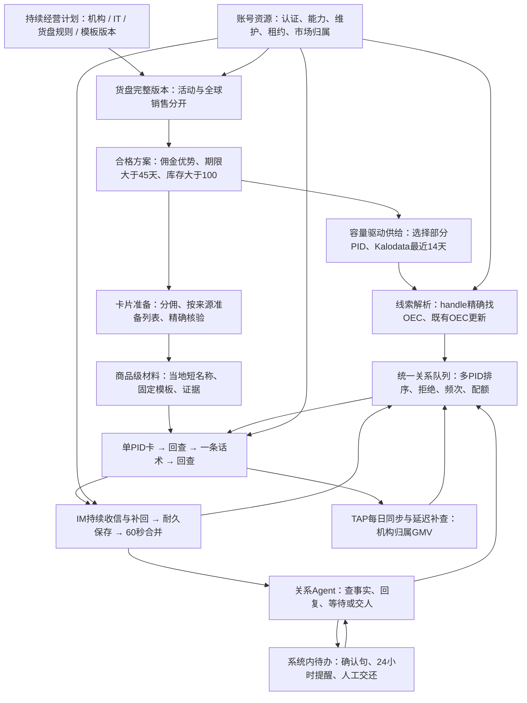

# 意大利二发闭环：实施蓝图

2026-09-13。依据：产品经理已确认规则、接口手册及当前代码8806151。此文完成“收敛实现蓝图”阶段；下文新模块/表/API均是拟实现合同，不声称已接通或已部署。首批运行在当前Mac，继续使用已有Node/Python，不借此锁定最终Agent框架或购买服务器。

权威业务入口：[统一规则](../architecture/second-cycle-confirmed-policy.md)。事实来源：[TikTok接口手册](../contracts/tiktok/README.md)。二发数据来自Kalodata；样品不参与历史持样/二发采用/额度解锁判断。

## 1. 一条主流程

箭头是目标连接。一次性“计划设定”负责授权范围；正常批量不逐条审批。计划暂停不妨碍原结果只读核验，人工接管只限制对应关系；平台未知结果保留原记录，不通过换PID/账号继续冲过。

## 2. 当前模块如何处理

| 现有文件/模块（仓库相对路径） | 决定 | 具体处理 |
|---|---|---|
| scripts/lib/creator_identity.py、creator_discovery.py、profile_refresh.py | 保留并接入 | 保留OEC、别名、来源链与刷新队列；供给协调器调用持久命令，不重建达人身份 |
| scripts/lib/second_outreach_source.py | 改造 | 固定5品/48人/SHA来源降为历史适配；新增CatalogSnapshot和KalodataBatch输入，不能覆盖旧来源证据 |
| scripts/lib/second_outreach.py | 改造 | 机会和模板历史继续留存；暂停、拒绝、营销时钟以统一关系控制为准，不再各表自判可发 |
| scripts/lib/second_templates.py | 改造 | 采用短名称、达人佣金与复推邀请，不强调新链接；仅一次商品级模型预处理，旧稿版本不改 |
| scripts/lib/italy_cards.py | 拆出通用核验 | 固定Freegrin单品作为回归样例；读取参数必须来自已核验方案，不允许任意PID/list混绑 |
| scripts/lib/italy_im_auth.py、italy_im_session.py、italy_im_delivery.py | 保留协议并扩展适配 | 固定ACC6限制不可直接删除：先把机构/市场/账号写成宿主绑定合同，以同类测试证明隔离 |
| scripts/lib/second_live_trial.py、runner/runtime/api | 保留试点审计；提取组件执行 | 不把max3试点改成无限大；新计划有独立活动边界，复用卡/文/unknown协议，旧被否定试点保持暂停 |
| apps/web/src/features/second-outreach | 改造为计划视图 | 保留查看草稿与历史试点；主入口改为计划、供给、待发、进行中、待人工，而非逐人填稿 |
| scripts/lib/draft_provider.py | 有界复用 | 用于商品短名称和回复生成；图片另接，不将文字输入接口冒充支持图片 |
| apps/web/src/server/runtime、second-pilot | 暂存为模拟/回归资产 | 不成为生产关系事实源，不将模拟送达混入真实统计 |
| 一发matching/outreach-drafts | 保留V2资产 | 不继续扩一发功能，不删除已有研究/历史模型结果 |
| 旧BDHub账号/货盘/TAP实现 | 只读提取合同、迁入适配 | 不整包调用旧同步/创建任务，不写旧库；新的作业和状态由新系统持有 |

## 3. 数据归属：避免继续叠加多套事实源

实施建议：在新项目建立一个共享经营控制存储适配，首轮仍可用SQLite；表的职责先固定，最终数据库/框架后续按负载选。现有身份库在迁移前仍是身份唯一来源。下列为逻辑表，不是本轮已建库：

| 逻辑对象 | 唯一键/归属 | 保存内容 |
|---|---|---|
| operation_plan / policy_version | institution、market、plan_id、revision | 生效范围、已认可模板与规则、运行/暂停、计划模式 |
| relationship_control | institution+market+creator_id | OEC引用、auto/human/paused、拒绝范围、入站水位、营销时钟、control_revision |
| catalog_snapshot / offer_observation | institution+market+source+snapshot；PID+Campaign+offer版本 | 完整采集/分页、商品事实、佣金和有效期；不覆盖历史 |
| supply_job / source_edge | plan+PID+14天窗口+来源版本；Kalodata原记录键 | 采集游标、同品证据、来源身份、解析状态、重复与新增统计 |
| product_material | market+PID+实质商品版本+locale+模板策略版本 | 短名称、可用卖点和证据；模型运行与失败，不逐达人重算 |
| relationship_opportunity | institution+market+creator_id+PID+目标/方案版本 | 候选、排队、待条件、已发/失效；不是独立关系owner |
| offer_card_binding | institution+market+账号能力范围+offer版本+list_id | 原生卡、来源Campaign、wire Campaign、核验时点/失效原因 |
| event / job / outbox_command | 来源事件ID；逻辑任务幂等键 | 耐久入站、到期唤醒、租约与fence、待投递命令 |
| delivery / component / attempt | 稳定logical_action_id及每组件ID | 卡文顺序、候选回执、确认、明确未发、部分成功、unknown |
| contact_reservation / contact_fact | institution+market+OEC+逻辑触达 | 新联系预留/确认、5条组件占用与未知、解锁证据；账号切换不重置 |
| human_case / commitment | relationship+未结问题范围 | 原话、处理请求、确认消息意图、24h提醒、处理结果、交还版本 |
| tap_observation / interaction_event | 机构市场+报告维度/日期；IM消息ID | 可归属GMV与覆盖时间、回复/橱窗事件；样品不入二发采用 |

跨现有数据库不假装同一事务：共享控制层短事务登记稳定outbox_command，再交适配器按同一逻辑ID领取；崩溃后先找既有执行引用，不另建试点。执行尝试只有一个事实源，经营层只存引用/投影。迁入真实历史时先校验行数/哈希/身份，切换读入口后禁用旧模块的同职责写入；不在未迁完时双写两个控制源。

## 4. 每一段的输入、接口、状态和完成证据

| 段 | 输入/接口 | 状态流 | 完成证据 / 异常处理 |
|---|---|---|---|
| 账号就绪 | 账号配置引用、info、IM认证、readiness与维护 | unknown→ready / waiting_maintenance / unavailable | 精确机构市场与能力证据；忙碌等待，不能按ACC增加额度 |
| 货盘刷新 | TK-002/004/019/020，指定来源、计划 | scheduled→fetching→complete / interrupted | 分页覆盖完整才发布；中断保留上一完整版本，新增记录不默认为全量 |
| 合格方案 | 分配规则与同一offer事实 | candidate→eligible / missing / excluded | 给达人佣金有优势，期限>45天、库存>100；评分仅排序；缺值不当合格 |
| 线索供给 | 合格PID、小批容量需求、Kalodata14天 | queued→fetching→resolved / unresolved / paused | 精确PID边与统计窗口、游标可恢复；已有身份复用OEC |
| 身份整合 | 精确Find/Profile；mget辅助IM映射 | unresolved→verified / conflict | OEC稳定；当前同名映射不伪证历史所有权；无实物推断 |
| 卡片准备 | TK-003/005/008/015/021，精确offer | required→preparing→verified / unknown / invalid | 同账号范围回查PID/list/点位/来源；发送前复查，不能用普通卡冒充新方案 |
| 材料准备 | 商品名/语言/允许事实、固定模板 | needed→preparing→ready / failed | 每商品版本复用；只报达人佣金，缺模型结果不填长标题硬发 |
| 发送排队 | 关系、资格、时钟、配额、卡/材料版本 | ready→reserved→executing / waiting | 原子预留至少两条组件空间；新消息和接管使旧稿失效；未知预留不轻易释放 |
| 卡文执行 | TK-024/032/031/029 | card_pending→card_confirmed→text_pending→confirmed；任一步可unknown | 全组件回查一致才触达完成；卡确认后文失败保留部分投递，不重发卡 |
| 收信 | TK-033/029及监听，持久水位 | received→coalescing→ready | 真人消息落库去重、最后一条后60秒；系统通知不无限延后真人回复 |
| 回复 | 关系工作集、已注册只读工具、认可场景 | planning→reply / wait / human / record_only | 无歧义且有事实才答；普通致谢可不回；图片未接/失败交人 |
| 人工接续 | R04/R08/R10等、事实与问题 | open→human_owned→resolved_and_returned | 待办与确认意图先落库；24h内部提醒；人工明确交还再加载最新会话 |
| 效果 | IM交互＋本机构TAP | observed→reconciled / partial | 按稳定身份去重、报告日期与观察日期分开；关联GMV不当因果增量 |

## 5. 供给与调度算法

1. 程序读取可用账号、机构市场新联系余额估计、已解锁可触达人、回复/人工积压及已经准备好的唯一达人库存。平台配额窗口未验证时明确标估计；无法确认安全剩余只阻止真实新外发，不阻止离线准备。
2. 目标库存按可消费能力和补采时延计算，扣除ready/reserved人数；以唯一达人而不是PID边数量计缺口。参数可调整，不将无回复名单无限采满。
3. 从合格商品中选择少量PID，近期有效线索产出高者优先，轮转保留探索；按14天窗口断点查询，积压足够则停止领取新采集，而非清空作业。
4. 线索解析后统一按OEC归并；同人多PID选择近期同品表现，近似时参考佣金提升/方案稳定性。新市场无合作记录不扣成不合格。
5. 未解锁第二轮至少48h、已解锁主动营销每24h最多1组；每次一张卡+一句模板。已有明确诉求优先，拒联/人工接管阻止营销。
6. 供给可以持续准备，发送等配额/时钟/账号唤醒；没有新事件不循环调用LLM。未找到合格品只改变计划状态，不让模型编造方案。

90/10探索比例是助手提出的试验初值，不升级为用户已确认商业阈值；首段实现应可注入并展示配置来源。预算暂不作为用户问题，但保留实际用量与有限调用边界。

## 6. 前端改造目标

- 保留TailAdmin组件。先在当前二发工作台接真实计划状态，不另造一套视觉。
- 主视图按“供给中 / 待发 / 等条件 / 已触达 / 需人工”组织；点击状态可看到具体阻塞原因与下一动作，不要求正常流程逐人填稿。
- 账号中心展示机构市场、资源角色、维护、可用能力及共用额度归属，不显示每ACC各有500。
- 货盘展示来源、当前完整版本、最新刷新、合格原因、关联卡状态；未完成的刷新不覆盖旧版。
- 收件箱同一达人呈现多商品事项，人工接管/交还保持明确；案例模板与内部事实下钻查看，不将全部技术日志塞进主页面。
- 首页新触达、回复、加橱窗、机构TAP关联GMV；演示指标与真实指标标识分离，不混加。

## 7. 下一段开发：先完成共享控制＋离线自动供给

这是下一段明确实施范围，尚未在本轮实现：

1. 实现institution/market/relationship控制、policy版本、事件和持久job/outbox的最小存储适配；用既有身份ID，不重建达人库。
2. 实现货盘快照输入与精确offer资格函数；把既有5品作为fixture，同时接受新只读货盘观察，不固化PID名单。
3. 让容量输入驱动有限PID采集工作；先用可恢复fixture验证Kalodata分页，再在只读范围做真实小样；账户认证接入不触发旧任务。
4. 接身份发现/刷新队列引用，形成可解释候选；卡片/材料未准备时显式waiting，不误标ready_to_send。
5. 页面显示上述真实状态与缺口。模拟外部写入仅在隔离测试库，不生成真实发送/创建命令。

### 完成标准

- 同一来源重复输入无新增重复机会；同人跨PID只有一条关系控制。
- 新市场容量500不随ACC数量变化；库存足够时不继续领取全部PID采集。
- 45天/100库存严格边界正确，评分≤4不被硬排除；缺失商业条件单独显示。
- 进程重启继续原分页/原工作，不重新全量采集；旧完整货盘仍可读取。
- 暂停/人工接管/新回复在执行准备时生效；独立模块不能各自恢复营销。
- 画像改名不丢OEC；未核实历史身份不冒充已核实同品销售。
- 没有平台发送、建链、审批、删除；不新增逐达人二发模型调用。

### 测试只围绕业务断点

覆盖重复事件、同人多PID、两个worker争抢、租约到期、外部成功回执丢失、卡成功文失败、商品条件变更、跨账号共用额度、原消息迟到与人工接管。离线验证通过后再做相应真实读取；不因多跑无关测试宣称商业验收。

## 8. 接续阶段与门槛

| 阶段 | 交付 | 不能跳过的门槛 |
|---|---|---|
| A 本轮 | 实施蓝图、模块取舍、接口映射、验收与问题分层 | 规则可回溯，状态不冒充完成 |
| B 下一段 | 共享控制、货盘资格、容量供给、候选队列 | 上述离线/只读完成标准 |
| C | 卡片与商品材料、真实收信、人工待办 | 绑定回查、入站去重、60秒合并、明确人工交还 |
| D | 第一批回复工具与Agent、图片适配 | 墨西哥认可案例回放，字段来源与办理权限明确 |
| E | 意大利单人卡文真实闭环→有限扩量 | 当前具体文案/卡/对象范围确定、账号执行归属无冲突、未知不重发 |
| F | 周期持续运行、TAP与经营反馈 | 跨刷新/账号维护/重启恢复，统计口径一致 |

## 9. 未解决事项放在依赖边界处理

IM额度重置/剩余额度接口、has_permission枚举与联系限制对照尚未证实；下一段先实现可注入容量与证据状态，不猜平台规则。纯Boost单问处理、旧主动模板索样句的最终去留、周期具体时间及TAP补查跨度仍保留未决，不阻止共享控制和供给开发。

新旧系统并存时读取旧在途只是风险检测，不构成跨系统原子调度。真实运行需有不冲突的账号/市场执行归属或明确切换方案；在旧项目只读约束下不得自动停旧任务。旧试点暂停且未批准，不被新计划或新正文复活。

原生接口33/34等编号用于手册引用，不作为模型任意请求权限。新增历史SDK候选保持未注册，只有实际场景需要且参数/字段/副作用已核实才接入。
